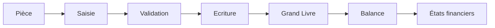

# 11A — Plan Comptable OHADA

## Table des matières

1. Objet
2. Périmètre
3. Références réglementaires
4. Principes comptables
5. Architecture du plan comptable
6. Les classes de comptes
7. Journaux comptables
8. Pièces comptables
9. Cycle comptable
10. Contrôles
11. IA Comptable
12. APIs
13. KPI
14. Règles métier

---

# 1. Objet

Ce document définit le référentiel comptable utilisé par tous les modules financiers d'EduWeb Planner conformément au SYSCOHADA Révisé.

Il constitue la référence unique pour :

- Comptabilité générale
- Comptabilité analytique
- Budget
- Trésorerie
- Immobilisations
- Facturation
- Inventaire
- États financiers
- Reporting

---

# 2. Périmètre

Le référentiel couvre :

- établissements scolaires
- universités
- administrations
- ONG
- entreprises
- collectivités territoriales

---

# 3. Références

Le système respecte notamment :

- Acte Uniforme OHADA relatif au droit comptable
- SYSCOHADA Révisé
- Instructions de la CCJA
- Normes IFRS (interopérabilité)
- ISA (Audit)

---

# 4. Principes comptables

EduWeb applique les principes fondamentaux :

- continuité d'exploitation
- permanence des méthodes
- prudence
- indépendance des exercices
- coût historique
- importance relative
- prééminence de la réalité économique

---

# 5. Architecture générale

```text
ERP Finance

├── Comptabilité Générale
├── Comptabilité Analytique
├── Budget
├── Facturation
├── Immobilisations
├── Trésorerie
├── Fiscalité
├── États Financiers
└── BI Financière
```

---

# 6. Les classes de comptes

## Classe 1

Comptes de ressources durables

Exemples :

- Capital
- Réserves
- Report à nouveau
- Résultat
- Subventions
- Emprunts

---

## Classe 2

Actif immobilisé

- Immobilisations incorporelles
- Immobilisations corporelles
- Immobilisations financières

---

## Classe 3

Stocks

- Fournitures
- Consommables
- Manuels scolaires
- Produits alimentaires
- Pièces détachées

---

## Classe 4

Tiers

- Fournisseurs
- Clients
- Personnel
- État
- Organismes sociaux
- Parents d'élèves
- Étudiants
- Partenaires

---

## Classe 5

Trésorerie

- Banque
- Caisse
- Mobile Money
- Cartes
- Dépôts

---

## Classe 6

Charges

- Personnel
- Eau
- Électricité
- Internet
- Fournitures
- Missions
- Entretien
- Pédagogie

---

## Classe 7

Produits

- Frais de scolarité
- Subventions
- Prestations
- Dons
- Produits financiers
- Divers

---

## Classe 8

Autres comptes

Selon SYSCOHADA.

---

## Classe 9

Comptabilité analytique

Centres de coûts

Centres de profit

Axes analytiques

---

# 7. Journaux

Le système gère notamment :

- Journal des achats
- Journal des ventes
- Banque
- Caisse
- Opérations diverses
- Paie
- Immobilisations
- Clôture

Chaque écriture reçoit :

- identifiant unique
- horodatage
- utilisateur
- validation
- signature numérique

---

# 8. Pièces comptables

Pièces prises en charge :

- facture
- reçu
- bon de commande
- bon de livraison
- fiche de paie
- ordre de mission
- reçu Mobile Money
- reçu bancaire
- décision administrative
- convention

Chaque pièce possède :

- QR Code
- Signature
- Historique
- Archivage électronique

---

# 9. Cycle comptable



---

# 10. Contrôles automatiques

Le moteur vérifie :

- équilibre débit/crédit
- période ouverte
- compte autorisé
- TVA
- cohérence analytique
- doublons
- devise
- budget disponible

---

# 11. IA Comptable

Le Copilot Finance peut :

- proposer les comptes
- générer les écritures
- détecter les anomalies
- rapprocher les opérations
- expliquer les écarts
- prévoir la trésorerie
- produire des tableaux de bord

Toutes les propositions restent soumises à validation humaine.

---

# 12. APIs

## Comptes

GET /api/accounts

POST /api/accounts

PUT /api/accounts/{id}

DELETE /api/accounts/{id}

---

## Écritures

GET /api/journal

POST /api/journal

---

## Balance

GET /api/balance

---

## Grand Livre

GET /api/general-ledger

---

## États Financiers

GET /api/statements

---

# 13. KPI

| KPI | Objectif |
|------|----------|
|Écriture équilibrée|100 %|
|Temps moyen de saisie|< 2 min|
|Anomalies détectées automatiquement|>95 %|
|Clôture mensuelle|< 2 jours|
|Disponibilité du module|99,9 %|

---

# 14. Règles métier

## RM-11A001

Toute écriture doit être équilibrée.

---

## RM-11A002

Toute écriture doit être rattachée à une pièce justificative.

---

## RM-11A003

Aucune écriture ne peut être validée sur un exercice clôturé.

---

## RM-11A004

Toute modification après validation est historisée.

---

## RM-11A005

Les propositions générées par l'IA nécessitent une validation humaine.

---

## RM-11A006

Chaque écriture est traçable de bout en bout.

---

# Documents liés

- 011-Finance.md
- 012-Budget.md
- 013-Trésorerie.md
- 014-Facturation.md
- 015-Immobilisations.md
- 016-Reporting.md
- UX-106-Forms-Guidelines.md
- UX-107-Notifications.md

---

**Fin du document**
