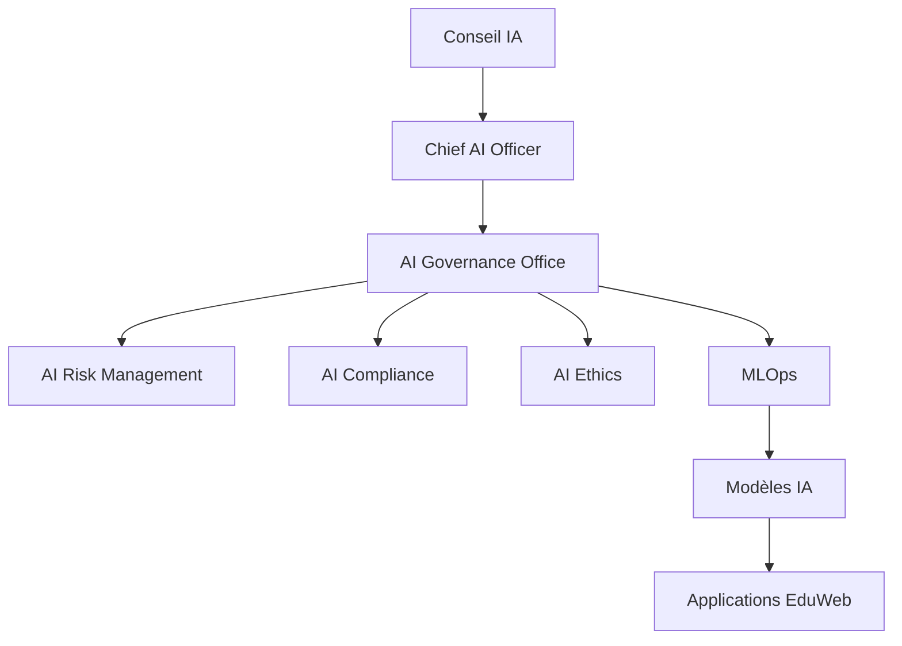

# AI-102 — Enterprise AI Governance

> Référentiel officiel de gouvernance de l'intelligence artificielle pour **EduWeb Planner**.

## Sommaire

1. Vision
2. Objectifs
3. Principes
4. Architecture de gouvernance
5. Organisation
6. Processus
7. Gestion des risques
8. Cycle de vie de gouvernance
9. API conceptuelle
10. KPI
11. Bonnes pratiques
12. Anti-patterns
13. Règles d'architecture
14. Documents associés

---

## 1. Vision

Mettre en place une gouvernance de l'IA garantissant que tous les systèmes d'intelligence artificielle développés ou intégrés dans l'écosystème EduWeb soient éthiques, sécurisés, conformes, explicables et alignés sur les objectifs stratégiques de l'organisation.

---

## 2. Objectifs

- Gouverner l'ensemble des initiatives IA.
- Garantir la conformité réglementaire.
- Maîtriser les risques.
- Encadrer le cycle de vie des modèles.
- Favoriser une IA responsable.

---

## 3. Principes

- Human in the Loop
- Transparency
- Accountability
- Fairness
- Explainability
- Security by Design
- Privacy by Design
- Continuous Monitoring

---

## 4. Architecture de gouvernance



---

## 5. Organisation

### Acteurs

- Conseil de Gouvernance IA
- Chief AI Officer
- Enterprise Architect
- Data Architect
- AI Architect
- AI Engineer
- RSSI
- Responsable Conformité
- Juristes
- Métiers

---

## 6. Processus

1. Identification d'un cas d'usage.
2. Analyse des risques.
3. Validation éthique.
4. Validation juridique.
5. Développement.
6. Déploiement.
7. Surveillance continue.
8. Réévaluation périodique.

---

## 7. Gestion des risques

Les principaux risques sont :

- biais algorithmiques ;
- dérive des modèles ;
- hallucinations ;
- fuites de données ;
- attaques adversariales ;
- non-conformité réglementaire.

Chaque risque possède un plan de traitement et un responsable.

---

## 8. Cycle de vie de gouvernance

Idéation → Validation → Développement → Qualification → Production → Supervision → Décommissionnement.

---

## 9. API conceptuelle

```typescript
interface EnterpriseAIGovernance {
    approveUseCase(): void;
    validateCompliance(): void;
    assessRisk(): void;
    monitorModel(): void;
    retireModel(): void;
}
```

---

## 10. KPI

| KPI | Objectif |
|------|----------|
| Modèles gouvernés | 100 % |
| Revues de conformité | ≥ 95 % |
| Incidents IA critiques | 0 |
| Modèles supervisés | 100 % |
| Cas d'usage documentés | 100 % |

---

## 11. Bonnes pratiques

- Gouverner avant de développer.
- Maintenir un registre des modèles.
- Documenter les décisions.
- Automatiser les contrôles.
- Réaliser des audits réguliers.

---

## 12. Anti-patterns

- Déploiement sans validation.
- Gouvernance uniquement technique.
- Absence de suivi post-production.
- Modèles non documentés.
- Gestion réactive des risques.

---

## 13. Règles d'architecture

- RA-AI102-001 : Tout modèle IA est enregistré dans le registre officiel.
- RA-AI102-002 : Les risques sont évalués avant tout déploiement.
- RA-AI102-003 : Les modèles sont supervisés en permanence.
- RA-AI102-004 : Toute évolution significative est revalidée.
- RA-AI102-005 : Les décisions critiques sont auditables.

---

## 14. Documents associés

- AI-101 — Enterprise Artificial Intelligence Foundation
- DATA-120 — Enterprise Knowledge Graph
- ARCH-148 — Enterprise Artificial Intelligence Architecture
- ARCH-149 — Enterprise Multi-Agent Systems Architecture

---

# Fin du document
