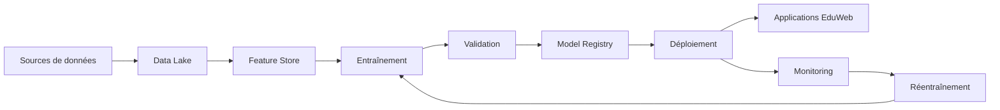

# AI-104 — Enterprise Machine Learning Architecture

> Référentiel officiel de l'architecture Machine Learning d'entreprise pour **EduWeb Planner**.

## Sommaire

1. Vision
2. Objectifs
3. Principes d'architecture
4. Architecture de référence
5. Composants principaux
6. Cycle de vie ML
7. Gouvernance
8. Cas d'usage EduWeb
9. API conceptuelle
10. KPI
11. Bonnes pratiques
12. Anti-patterns
13. Règles d'architecture
14. Documents associés

---

## 1. Vision

Mettre à disposition une plateforme de Machine Learning industrialisée permettant de développer, entraîner, déployer et superviser des modèles prédictifs de manière sécurisée, reproductible et évolutive.

## 2. Objectifs

- Industrialiser les projets ML.
- Garantir la reproductibilité des expériences.
- Faciliter le déploiement continu des modèles.
- Assurer la supervision des performances.
- Intégrer les modèles aux applications EduWeb.

## 3. Principes d'architecture

- ML by Design
- Reproductibilité
- Automatisation
- Traçabilité
- Scalabilité
- Sécurité
- Gouvernance des données et des modèles

## 4. Architecture de référence



## 5. Composants principaux

- Data Lake
- Feature Store
- Pipelines ETL/ELT
- Environnement d'entraînement
- Validation des modèles
- Model Registry
- Service d'inférence
- Monitoring
- Journalisation
- MLOps

## 6. Cycle de vie ML

1. Collecte des données.
2. Préparation des données.
3. Création des variables (features).
4. Entraînement.
5. Validation.
6. Déploiement.
7. Surveillance.
8. Réentraînement.

## 7. Gouvernance

Rôles principaux :

- Chief AI Officer
- Data Scientist
- ML Engineer
- Data Engineer
- Data Steward
- MLOps Engineer
- RSSI
- Experts métier

## 8. Cas d'usage EduWeb

- Prévision des effectifs scolaires.
- Détection d'anomalies administratives.
- Recommandation de ressources pédagogiques.
- Prédiction du risque de décrochage scolaire.
- Optimisation des emplois du temps.
- Analyse des performances des établissements.

## 9. API conceptuelle

```typescript
interface EnterpriseMLPlatform {
    trainModel(): void;
    validateModel(): boolean;
    registerModel(): void;
    deployModel(): void;
    monitorModel(): void;
    retrainModel(): void;
}
```

## 10. KPI

| KPI | Objectif |
|------|----------|
| Modèles en production supervisés | 100 % |
| Temps de déploiement | < 30 min |
| Disponibilité des services ML | ≥ 99,9 % |
| Dérives détectées automatiquement | 100 % |
| Réentraînements documentés | 100 % |

## 11. Bonnes pratiques

- Versionner les jeux de données et les modèles.
- Automatiser les pipelines ML.
- Mesurer systématiquement les performances.
- Détecter les dérives de données et de modèles.
- Centraliser les modèles dans un registre.

## 12. Anti-patterns

- Entraînement manuel non reproductible.
- Déploiement sans validation.
- Absence de surveillance.
- Modèles orphelins.
- Données d'entraînement non tracées.

## 13. Règles d'architecture

- RA-AI104-001 : Tout modèle est enregistré dans le Model Registry.
- RA-AI104-002 : Les pipelines ML sont automatisés.
- RA-AI104-003 : Les modèles sont surveillés en production.
- RA-AI104-004 : Les dérives déclenchent une alerte.
- RA-AI104-005 : Les données d'entraînement sont entièrement traçables.

## 14. Documents associés

- AI-101 — Enterprise Artificial Intelligence Foundation
- AI-102 — Enterprise AI Governance
- AI-114 — Enterprise MLOps
- DATA-103 — Enterprise Master Data Management
- DATA-120 — Enterprise Knowledge Graph

# Fin du document
