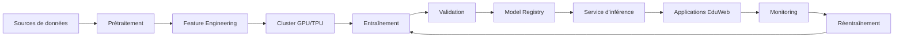

# AI-105 — Enterprise Deep Learning Architecture

> Référentiel officiel de l'architecture Deep Learning d'entreprise pour **EduWeb Planner**.

## Sommaire

1. Vision
2. Objectifs
3. Principes d'architecture
4. Architecture de référence
5. Composants principaux
6. Types de réseaux de neurones
7. Cycle de vie
8. Gouvernance
9. Cas d'usage EduWeb
10. API conceptuelle
11. KPI
12. Bonnes pratiques
13. Anti-patterns
14. Règles d'architecture
15. Documents associés

---

## 1. Vision

Mettre à disposition une plateforme de Deep Learning capable d'entraîner, de déployer et de superviser des modèles neuronaux complexes pour répondre aux besoins de l'écosystème EduWeb, tout en garantissant la performance, la fiabilité, la sécurité et la gouvernance.

---

## 2. Objectifs

- Industrialiser les modèles de Deep Learning.
- Exploiter les infrastructures GPU/TPU.
- Optimiser les performances d'entraînement et d'inférence.
- Garantir la reproductibilité des expériences.
- Intégrer les modèles aux applications métiers.

---

## 3. Principes d'architecture

- Deep Learning by Design
- Scalabilité horizontale
- Accélération matérielle
- Versionnement des modèles
- Traçabilité des expériences
- Sécurité des traitements
- Observabilité continue

---

## 4. Architecture de référence



---

## 5. Composants principaux

- Stockage des jeux de données
- Pipeline de préparation
- Cluster GPU/TPU
- Frameworks (TensorFlow, PyTorch, JAX)
- Model Registry
- Service d'inférence
- Monitoring
- MLOps
- Journalisation
- Observabilité

---

## 6. Types de réseaux de neurones

- Perceptrons multicouches (MLP)
- Réseaux convolutifs (CNN)
- Réseaux récurrents (RNN, LSTM, GRU)
- Transformers
- Autoencodeurs
- GAN (Generative Adversarial Networks)
- Graph Neural Networks (GNN)

---

## 7. Cycle de vie

1. Acquisition des données.
2. Prétraitement.
3. Conception du modèle.
4. Entraînement.
5. Validation.
6. Déploiement.
7. Supervision.
8. Optimisation continue.

---

## 8. Gouvernance

Acteurs principaux :

- Chief AI Officer
- AI Architect
- Data Scientist
- Deep Learning Engineer
- ML Engineer
- MLOps Engineer
- Data Steward
- RSSI

---

## 9. Cas d'usage EduWeb

- Reconnaissance automatique de documents.
- OCR intelligent.
- Analyse d'images pédagogiques.
- Génération de contenus.
- Classification documentaire.
- Analyse prédictive avancée.
- Assistants conversationnels.

---

## 10. API conceptuelle

```typescript
interface EnterpriseDeepLearningPlatform {
    buildModel(): void;
    trainModel(): void;
    validateModel(): boolean;
    optimizeModel(): void;
    deployModel(): void;
    monitorInference(): void;
}
```

---

## 11. KPI

| KPI | Objectif |
|------|----------|
| Temps moyen d'entraînement | En diminution |
| Disponibilité des services | ≥ 99,9 % |
| Modèles supervisés | 100 % |
| Expériences reproductibles | 100 % |
| Réduction des temps d'inférence | Continue |

---

## 12. Bonnes pratiques

- Utiliser des jeux de données équilibrés.
- Exploiter les GPU/TPU de manière optimale.
- Versionner les modèles et les hyperparamètres.
- Surveiller la dérive des performances.
- Tester régulièrement les capacités d'inférence.

---

## 13. Anti-patterns

- Modèles non documentés.
- Hyperparamètres non tracés.
- Absence de supervision.
- Entraînements non reproductibles.
- Utilisation inefficace des ressources matérielles.

---

## 14. Règles d'architecture

- RA-AI105-001 : Tous les modèles sont versionnés.
- RA-AI105-002 : Les expériences sont traçables.
- RA-AI105-003 : Les modèles sont validés avant déploiement.
- RA-AI105-004 : Les performances sont surveillées en continu.
- RA-AI105-005 : Les ressources GPU/TPU sont optimisées.

---

## 15. Documents associés

- AI-104 — Enterprise Machine Learning Architecture
- AI-106 — Enterprise Large Language Models
- AI-114 — Enterprise MLOps
- DATA-120 — Enterprise Knowledge Graph
- ARCH-148 — Enterprise Artificial Intelligence Architecture

---

# Fin du document
