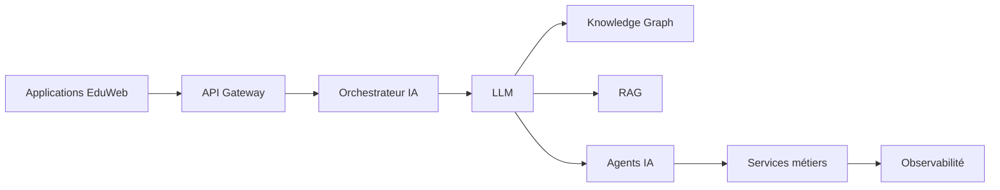

# AI-106 — Enterprise Large Language Models (LLM)

> Référentiel officiel de l'architecture des **Large Language Models (LLM)** pour **EduWeb Planner**.

## Sommaire

1. Vision
2. Objectifs
3. Définition
4. Principes d'architecture
5. Architecture de référence
6. Composants
7. Stratégies de personnalisation
8. Gouvernance
9. Cas d'usage EduWeb
10. API conceptuelle
11. KPI
12. Bonnes pratiques
13. Anti-patterns
14. Règles d'architecture
15. Documents associés

---

## 1. Vision

Mettre en œuvre une plateforme de LLM sécurisée, évolutive et gouvernée afin d'améliorer la productivité, l'assistance aux utilisateurs, la génération de contenus et l'automatisation intelligente dans l'ensemble de l'écosystème EduWeb.

---

## 2. Objectifs

- Intégrer des LLM dans les applications métiers.
- Garantir la sécurité et la confidentialité des données.
- Optimiser les coûts et les performances d'inférence.
- Faciliter la personnalisation des modèles.
- Assurer une gouvernance complète des usages.

---

## 3. Définition

Un **Large Language Model (LLM)** est un modèle d'intelligence artificielle fondé sur l'architecture Transformer, entraîné sur de vastes corpus de données afin de comprendre et générer du langage naturel.

---

## 4. Principes d'architecture

- LLM by Design
- Séparation des modèles et des données
- Sécurité des prompts
- Traçabilité des interactions
- Observabilité
- Gouvernance des modèles
- Optimisation des coûts

---

## 5. Architecture de référence



---

## 6. Composants

- API Gateway
- Orchestrateur IA
- Modèles propriétaires ou open source
- Service d'inférence
- Gestionnaire de prompts
- Cache sémantique
- Journalisation
- Monitoring
- Contrôle des accès
- Connecteurs métiers

---

## 7. Stratégies de personnalisation

- Prompt Engineering
- Few-shot Learning
- Fine-tuning
- LoRA / PEFT
- RAG (Retrieval-Augmented Generation)
- Adaptation par domaine métier

---

## 8. Gouvernance

Acteurs principaux :

- Chief AI Officer
- AI Architect
- LLM Engineer
- Prompt Engineer
- MLOps Engineer
- RSSI
- Data Steward
- Experts métier

---

## 9. Cas d'usage EduWeb

- Assistant pédagogique.
- Génération de documents administratifs.
- Assistance aux chefs d'établissement.
- Aide à la planification.
- Recherche documentaire intelligente.
- Résumé automatique de rapports.
- Génération de contenus de formation.

---

## 10. API conceptuelle

```typescript
interface EnterpriseLLMPlatform {
    generateText(): Promise<string>;
    summarize(): Promise<string>;
    answerQuestion(): Promise<string>;
    classifyDocument(): Promise<void>;
    monitorUsage(): void;
    auditInteractions(): void;
}
```

---

## 11. KPI

| KPI | Objectif |
|------|----------|
| Temps moyen de réponse | < 3 s |
| Disponibilité du service | ≥ 99,9 % |
| Coût moyen par requête | Optimisé |
| Traçabilité des interactions | 100 % |
| Satisfaction des utilisateurs | ≥ 90 % |

---

## 12. Bonnes pratiques

- Limiter les données sensibles transmises aux modèles.
- Journaliser les interactions critiques.
- Tester systématiquement les prompts.
- Mettre en cache les réponses fréquentes.
- Utiliser le RAG pour les connaissances métier.
- Surveiller les hallucinations.

---

## 13. Anti-patterns

- Prompts non sécurisés.
- Utilisation de données non autorisées.
- Déploiement sans surveillance.
- Dépendance à un fournisseur unique.
- Absence de stratégie de repli.

---

## 14. Règles d'architecture

- RA-AI106-001 : Les modèles sont versionnés et documentés.
- RA-AI106-002 : Les interactions sont auditables.
- RA-AI106-003 : Les données sensibles sont protégées avant toute inférence.
- RA-AI106-004 : Les performances sont supervisées en continu.
- RA-AI106-005 : Les LLM sont intégrés via des interfaces standardisées.

---

## 15. Documents associés

- AI-101 — Enterprise Artificial Intelligence Foundation
- AI-104 — Enterprise Machine Learning Architecture
- AI-105 — Enterprise Deep Learning Architecture
- AI-107 — Enterprise Prompt Engineering
- AI-108 — Enterprise Retrieval-Augmented Generation
- DATA-120 — Enterprise Knowledge Graph

---

# Fin du document
