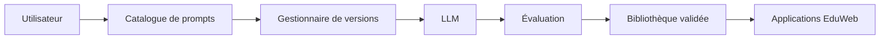

# AI-107 — Enterprise Prompt Engineering

> Référentiel officiel du **Prompt Engineering** pour l'écosystème **EduWeb Planner**.

## Sommaire

1. Vision
2. Objectifs
3. Définition
4. Principes directeurs
5. Architecture de référence
6. Bibliothèque de prompts
7. Cycle de vie des prompts
8. Gouvernance
9. Cas d'usage EduWeb
10. API conceptuelle
11. KPI
12. Bonnes pratiques
13. Anti-patterns
14. Règles d'architecture
15. Documents associés

---

## 1. Vision

Établir un cadre d'entreprise pour concevoir, tester, versionner, partager et gouverner les prompts utilisés avec les modèles d'intelligence artificielle afin d'assurer des réponses fiables, cohérentes et sécurisées.

---

## 2. Objectifs

- Standardiser la conception des prompts.
- Améliorer la qualité des réponses.
- Réduire les hallucinations.
- Favoriser la réutilisation.
- Assurer la traçabilité et le versionnement.

---

## 3. Définition

Le **Prompt Engineering** est l'ensemble des méthodes permettant de concevoir, structurer, tester et optimiser les instructions destinées aux modèles d'intelligence artificielle générative.

---

## 4. Principes directeurs

- Clarté
- Contexte suffisant
- Réutilisabilité
- Sécurité
- Versionnement
- Mesure de la qualité
- Documentation

---

## 5. Architecture de référence



---

## 6. Bibliothèque de prompts

La bibliothèque d'entreprise comprend notamment :

- Prompts système
- Prompts métier
- Modèles de conversation
- Prompts RAG
- Prompts d'agents IA
- Modèles de validation
- Jeux de tests
- Historique des versions

---

## 7. Cycle de vie des prompts

1. Conception.
2. Revue métier.
3. Tests.
4. Validation.
5. Publication.
6. Utilisation.
7. Mesure des performances.
8. Amélioration continue.

---

## 8. Gouvernance

Acteurs :

- Chief AI Officer
- AI Architect
- Prompt Engineer
- Experts métier
- Data Steward
- RSSI
- Équipe Qualité IA

---

## 9. Cas d'usage EduWeb

- Génération de documents administratifs.
- Production de contenus pédagogiques.
- Assistance aux établissements scolaires.
- Planification des emplois du temps.
- Résumé automatique de rapports.
- Génération de courriers réglementaires.
- Support conversationnel.

---

## 10. API conceptuelle

```typescript
interface PromptRepository {
    createPrompt(): void;
    versionPrompt(): void;
    validatePrompt(): boolean;
    publishPrompt(): void;
    evaluatePrompt(): void;
    archivePrompt(): void;
}
```

---

## 11. KPI

| KPI | Objectif |
|------|----------|
| Prompts versionnés | 100 % |
| Prompts validés | ≥ 95 % |
| Réutilisation des prompts | ≥ 80 % |
| Réduction des hallucinations | En amélioration continue |
| Satisfaction des utilisateurs | ≥ 90 % |

---

## 12. Bonnes pratiques

- Définir clairement le rôle du modèle.
- Fournir le contexte métier nécessaire.
- Employer des exemples lorsque pertinent.
- Tester les prompts sur plusieurs scénarios.
- Documenter chaque évolution.
- Réutiliser les modèles validés.

---

## 13. Anti-patterns

- Prompts ambigus.
- Instructions contradictoires.
- Absence de tests.
- Duplication inutile des prompts.
- Utilisation de données sensibles sans protection.

---

## 14. Règles d'architecture

- RA-AI107-001 : Tout prompt est versionné.
- RA-AI107-002 : Les prompts critiques sont validés avant publication.
- RA-AI107-003 : Les performances sont mesurées régulièrement.
- RA-AI107-004 : Les prompts sont centralisés dans un référentiel unique.
- RA-AI107-005 : Les évolutions sont documentées et auditables.

---

## 15. Documents associés

- AI-106 — Enterprise Large Language Models
- AI-108 — Enterprise Retrieval-Augmented Generation
- AI-109 — Enterprise AI Agents
- AI-102 — Enterprise AI Governance
- DATA-120 — Enterprise Knowledge Graph

---

# Fin du document
