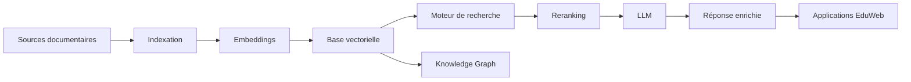

# AI-108 — Enterprise Retrieval-Augmented Generation (RAG)

> Référentiel officiel de l'architecture **Retrieval-Augmented Generation (RAG)** pour **EduWeb Planner**.

## Sommaire

1. Vision
2. Objectifs
3. Définition
4. Principes
5. Architecture de référence
6. Composants
7. Flux de traitement
8. Gouvernance
9. Cas d'usage EduWeb
10. API conceptuelle
11. KPI
12. Bonnes pratiques
13. Anti-patterns
14. Règles d'architecture
15. Documents associés

---

## 1. Vision

Mettre en œuvre une plateforme RAG d'entreprise permettant aux modèles d'IA d'accéder à des connaissances fiables, actualisées et gouvernées afin d'améliorer la précision des réponses et de réduire les hallucinations.

---

## 2. Objectifs

- Fournir des réponses fondées sur les connaissances de l'entreprise.
- Réduire les hallucinations des LLM.
- Garantir la traçabilité des sources.
- Centraliser les connaissances documentaires.
- Faciliter la recherche sémantique.

---

## 3. Définition

Le **Retrieval-Augmented Generation (RAG)** combine un moteur de recherche documentaire avec un modèle de langage afin d'enrichir les réponses générées par des informations pertinentes extraites d'une base de connaissances.

---

## 4. Principes

- Knowledge First
- Source de vérité unique
- Recherche hybride
- Traçabilité des références
- Sécurité des données
- Gouvernance documentaire

---

## 5. Architecture de référence



---

## 6. Composants

- Pipeline d'ingestion
- Nettoyage documentaire
- Découpage (chunking)
- Génération d'embeddings
- Base vectorielle
- Recherche hybride (vectorielle + lexicale)
- Reranker
- Orchestrateur RAG
- LLM
- Observabilité

---

## 7. Flux de traitement

1. Ingestion des documents.
2. Prétraitement.
3. Découpage en segments.
4. Génération des embeddings.
5. Indexation.
6. Recherche des passages pertinents.
7. Reranking.
8. Génération de la réponse.
9. Journalisation et supervision.

---

## 8. Gouvernance

Acteurs principaux :

- Chief AI Officer
- Knowledge Engineer
- Data Steward
- AI Architect
- Prompt Engineer
- RSSI
- Experts métier

---

## 9. Cas d'usage EduWeb

- Recherche dans les textes réglementaires.
- Assistance pédagogique.
- Support aux établissements scolaires.
- Recherche documentaire avancée.
- Génération de rapports contextualisés.
- Aide à la rédaction administrative.
- Assistant métier institutionnel.

---

## 10. API conceptuelle

```typescript
interface EnterpriseRAGPlatform {
    ingestDocuments(): void;
    generateEmbeddings(): void;
    searchKnowledge(): Promise<void>;
    rerankResults(): void;
    generateAnswer(): Promise<string>;
    monitorRetrieval(): void;
}
```

---

## 11. KPI

| KPI | Objectif |
|------|----------|
| Précision de récupération | ≥ 95 % |
| Temps moyen de recherche | < 500 ms |
| Temps de réponse global | < 3 s |
| Sources citées | 100 % |
| Hallucinations détectées | En diminution continue |

---

## 12. Bonnes pratiques

- Mettre à jour régulièrement les index.
- Utiliser un découpage documentaire cohérent.
- Combiner recherche lexicale et vectorielle.
- Conserver les métadonnées des documents.
- Évaluer périodiquement la qualité des réponses.

---

## 13. Anti-patterns

- Documents non gouvernés.
- Embeddings obsolètes.
- Recherche vectorielle seule lorsque la recherche hybride est requise.
- Réponses sans référence documentaire.
- Base de connaissances non versionnée.

---

## 14. Règles d'architecture

- RA-AI108-001 : Toute réponse critique s'appuie sur des sources documentées.
- RA-AI108-002 : Les embeddings sont régénérés après chaque mise à jour majeure.
- RA-AI108-003 : Les documents sont versionnés et gouvernés.
- RA-AI108-004 : Les performances du moteur de recherche sont supervisées.
- RA-AI108-005 : Le RAG est interconnecté au Knowledge Graph lorsque pertinent.

---

## 15. Documents associés

- AI-106 — Enterprise Large Language Models
- AI-107 — Enterprise Prompt Engineering
- AI-109 — Enterprise AI Agents
- DATA-120 — Enterprise Knowledge Graph
- DATA-106 — Enterprise Data Catalog
- DATA-118 — Enterprise Semantic Model

---

# Fin du document
