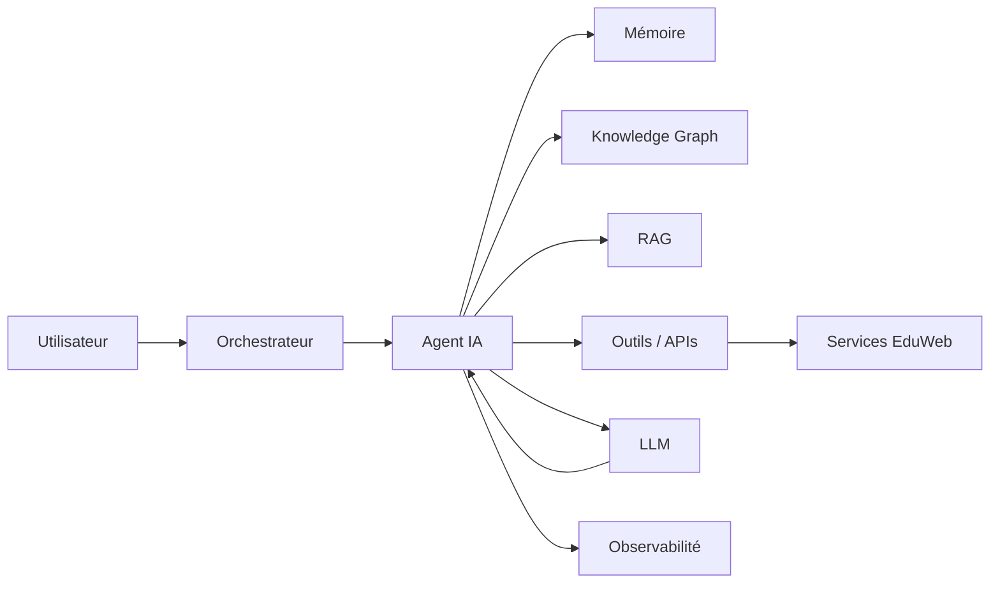

# AI-109 — Enterprise AI Agents

> Référentiel officiel de l'architecture des **Agents IA** pour **EduWeb Planner**.

## Sommaire

1. Vision
2. Objectifs
3. Définition
4. Principes
5. Architecture de référence
6. Composants
7. Capacités d'un agent IA
8. Gouvernance
9. Cas d'usage EduWeb
10. API conceptuelle
11. KPI
12. Bonnes pratiques
13. Anti-patterns
14. Règles d'architecture
15. Documents associés

---

## 1. Vision

Déployer des agents IA autonomes, sécurisés et gouvernés capables d'assister les utilisateurs, d'automatiser des processus métier et de collaborer avec les applications de l'écosystème EduWeb.

## 2. Objectifs

- Automatiser les tâches répétitives.
- Améliorer l'assistance aux utilisateurs.
- Coordonner des processus complexes.
- Exploiter les connaissances d'entreprise.
- Garantir un contrôle humain des actions critiques.

## 3. Définition

Un **agent IA** est un système logiciel capable de percevoir un contexte, raisonner, planifier, utiliser des outils et exécuter des actions afin d'atteindre un objectif défini.

## 4. Principes

- Agent by Design
- Human in the Loop
- Sécurité par défaut
- Mémoire contrôlée
- Traçabilité
- Explicabilité
- Modularité

## 5. Architecture de référence



## 6. Composants

- Orchestrateur d'agents
- Mémoire (court et long terme)
- LLM
- RAG
- Knowledge Graph
- Registre d'outils (Tools)
- Planificateur
- Moteur de raisonnement
- Observabilité
- Journal d'audit

## 7. Capacités d'un agent IA

- Compréhension du contexte
- Planification
- Raisonnement
- Utilisation d'outils
- Mémoire
- Collaboration avec d'autres agents
- Apprentissage à partir des retours
- Escalade vers un humain lorsque nécessaire

## 8. Gouvernance

Acteurs :

- Chief AI Officer
- AI Architect
- Agent Engineer
- Prompt Engineer
- RSSI
- Data Steward
- Experts métier

## 9. Cas d'usage EduWeb

- Assistant des chefs d'établissement.
- Génération d'emplois du temps.
- Support administratif.
- Assistance réglementaire.
- Accompagnement pédagogique.
- Analyse documentaire.
- Automatisation des workflows.

## 10. API conceptuelle

```typescript
interface EnterpriseAIAgent {
    perceiveContext(): void;
    plan(): void;
    useTool(tool: string): void;
    execute(): Promise<void>;
    escalate(): void;
    logActivity(): void;
}
```

## 11. KPI

| KPI | Objectif |
|------|----------|
| Tâches automatisées avec succès | ≥ 95 % |
| Temps moyen d'exécution | En diminution |
| Interventions humaines nécessaires | Optimisées |
| Disponibilité des agents | ≥ 99,9 % |
| Actions auditables | 100 % |

## 12. Bonnes pratiques

- Limiter les privilèges des agents.
- Valider les actions critiques.
- Journaliser toutes les décisions.
- Utiliser des outils officiellement approuvés.
- Tester les scénarios d'échec.

## 13. Anti-patterns

- Agent sans supervision.
- Accès illimité aux systèmes.
- Mémoire non maîtrisée.
- Actions irréversibles sans validation.
- Outils non sécurisés.

## 14. Règles d'architecture

- RA-AI109-001 : Chaque agent possède une identité et un périmètre définis.
- RA-AI109-002 : Les actions critiques nécessitent une validation humaine.
- RA-AI109-003 : Les interactions sont journalisées.
- RA-AI109-004 : Les outils sont gérés dans un registre centralisé.
- RA-AI109-005 : Les agents utilisent des interfaces standardisées.

## 15. Documents associés

- AI-106 — Enterprise Large Language Models
- AI-107 — Enterprise Prompt Engineering
- AI-108 — Enterprise Retrieval-Augmented Generation
- AI-110 — Enterprise Multi-Agent Systems
- DATA-120 — Enterprise Knowledge Graph

# Fin du document
