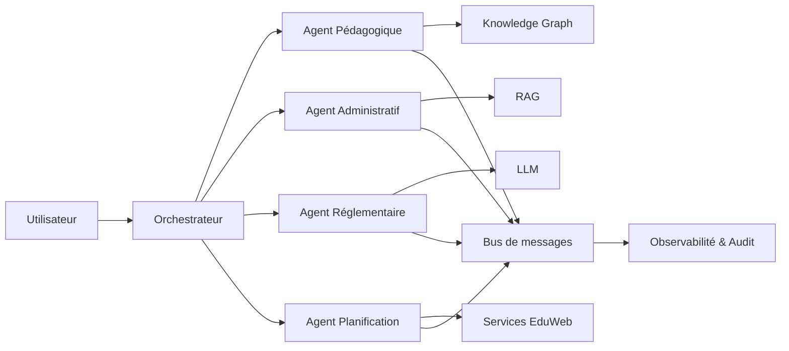

# AI-110 — Enterprise Multi-Agent Systems

> Référentiel officiel de l'architecture des **Systèmes Multi-Agents (MAS)** pour **EduWeb Planner**.

## Sommaire

1. Vision
2. Objectifs
3. Définition
4. Principes
5. Architecture de référence
6. Composants
7. Modes de collaboration
8. Gouvernance
9. Cas d'usage EduWeb
10. API conceptuelle
11. KPI
12. Bonnes pratiques
13. Anti-patterns
14. Règles d'architecture
15. Documents associés

---

## 1. Vision

Déployer un écosystème d'agents IA spécialisés capables de collaborer de manière coordonnée pour résoudre des problèmes complexes, automatiser des processus métier et assister les utilisateurs à grande échelle.

## 2. Objectifs

- Distribuer les responsabilités entre plusieurs agents.
- Accroître la robustesse et la résilience.
- Optimiser les performances par spécialisation.
- Faciliter l'orchestration de processus complexes.
- Garantir une gouvernance centralisée.

## 3. Définition

Un **système multi-agents** est un ensemble d'agents autonomes qui coopèrent, communiquent et coordonnent leurs actions afin d'atteindre des objectifs communs ou complémentaires.

## 4. Principes

- Spécialisation des agents
- Coordination centralisée ou distribuée
- Communication standardisée
- Human in the Loop
- Sécurité des échanges
- Observabilité complète
- Traçabilité

## 5. Architecture de référence



## 6. Composants

- Orchestrateur
- Agents spécialisés
- Registre des capacités
- Bus de communication
- Mémoire partagée
- Knowledge Graph
- Services RAG
- Journal d'audit
- Supervision

## 7. Modes de collaboration

1. Coopération.
2. Délégation.
3. Négociation.
4. Coordination.
5. Validation humaine.
6. Escalade.
7. Consensus.

## 8. Gouvernance

- Chief AI Officer
- AI Architect
- Multi-Agent Engineer
- MLOps Engineer
- RSSI
- Data Steward
- Experts métier

## 9. Cas d'usage EduWeb

- Génération collaborative d'emplois du temps.
- Assistance réglementaire multi-domaines.
- Gestion des établissements scolaires.
- Analyse documentaire.
- Préparation de rapports.
- Support décisionnel.

## 10. API conceptuelle

```typescript
interface MultiAgentPlatform {
    registerAgent(name: string): void;
    dispatchTask(task: string): void;
    coordinateAgents(): void;
    resolveConflict(): void;
    monitorExecution(): void;
    auditWorkflow(): void;
}
```

## 11. KPI

| KPI | Objectif |
|------|----------|
| Tâches distribuées avec succès | ≥ 95 % |
| Disponibilité de la plateforme | ≥ 99,9 % |
| Temps moyen de coordination | < 500 ms |
| Conflits résolus automatiquement | ≥ 90 % |
| Flux auditables | 100 % |

## 12. Bonnes pratiques

- Définir clairement les responsabilités de chaque agent.
- Limiter les privilèges.
- Standardiser les protocoles de communication.
- Prévoir des mécanismes de reprise.
- Superviser toutes les interactions.

## 13. Anti-patterns

- Agents aux responsabilités redondantes.
- Communication non sécurisée.
- Orchestration absente.
- Boucles de décisions infinies.
- Absence de journalisation.

## 14. Règles d'architecture

- RA-AI110-001 : Chaque agent possède un rôle clairement défini.
- RA-AI110-002 : Les échanges utilisent des interfaces standardisées.
- RA-AI110-003 : Les conflits sont détectés et traités.
- RA-AI110-004 : Les workflows sont entièrement auditables.
- RA-AI110-005 : Toute action critique reste soumise à une supervision humaine.

## 15. Documents associés

- AI-109 — Enterprise AI Agents
- AI-111 — Enterprise Model Context Protocol
- AI-108 — Enterprise Retrieval-Augmented Generation
- DATA-120 — Enterprise Knowledge Graph
- ARCH-149 — Enterprise Multi-Agent Systems Architecture

# Fin du document
