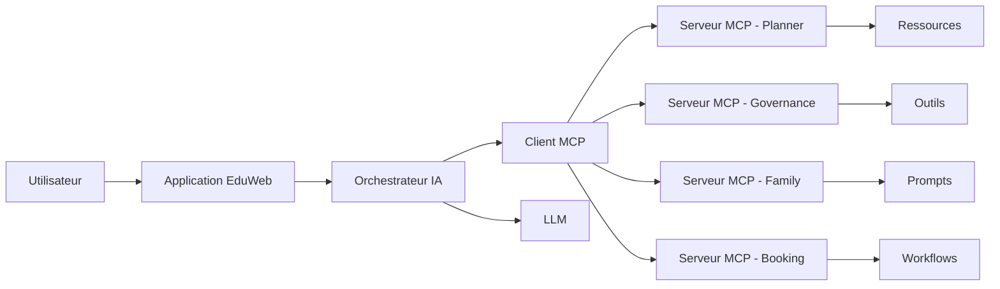

# AI-111 — Enterprise Model Context Protocol (MCP)

> Référentiel officiel de l'architecture **Model Context Protocol (MCP)** pour **EduWeb Planner**.

## Sommaire

1. Vision
2. Objectifs
3. Définition
4. Principes
5. Architecture de référence
6. Composants
7. Flux d'interaction
8. Gouvernance
9. Cas d'usage EduWeb
10. API conceptuelle
11. KPI
12. Bonnes pratiques
13. Anti-patterns
14. Règles d'architecture
15. Documents associés

---

## 1. Vision

Fournir une architecture standardisée permettant aux modèles d'intelligence artificielle de communiquer de manière sécurisée avec les outils, applications, bases de connaissances et services métiers d'EduWeb Planner grâce au **Model Context Protocol (MCP)**.

---

## 2. Objectifs

- Standardiser les échanges entre IA et systèmes métiers.
- Réduire les intégrations spécifiques.
- Faciliter l'accès sécurisé aux ressources.
- Garantir l'interopérabilité.
- Simplifier l'évolution de l'écosystème IA.

---

## 3. Définition

Le **Model Context Protocol (MCP)** est un protocole ouvert qui permet à un modèle d'IA de découvrir, interroger et utiliser des ressources, outils et services externes via une interface normalisée.

---

## 4. Principes

- Standardisation des interfaces.
- Découverte dynamique des ressources.
- Sécurité par défaut.
- Authentification forte.
- Gouvernance centralisée.
- Traçabilité des interactions.
- Extensibilité.

---

## 5. Architecture de référence



---

## 6. Composants

- Client MCP
- Serveurs MCP
- Ressources
- Outils (Tools)
- Prompts
- Workflows
- Authentification
- Journalisation
- Observabilité
- Registre de services

---

## 7. Flux d'interaction

1. Découverte du serveur MCP.
2. Authentification.
3. Découverte des ressources.
4. Sélection des outils.
5. Appel des services.
6. Exploitation de la réponse.
7. Journalisation.
8. Audit.

---

## 8. Gouvernance

Acteurs principaux :

- Chief AI Officer
- Enterprise Architect
- AI Architect
- MCP Engineer
- RSSI
- API Manager
- Data Steward
- Experts métier

---

## 9. Cas d'usage EduWeb

- Consultation des emplois du temps.
- Accès aux règlements.
- Recherche documentaire.
- Création de rapports.
- Gestion administrative.
- Assistance pédagogique.
- Intégration avec les plateformes EduWeb.

---

## 10. API conceptuelle

```typescript
interface MCPClient {
    discoverServers(): void;
    listResources(): void;
    invokeTool(tool: string): Promise<void>;
    executePrompt(prompt: string): Promise<string>;
    auditRequest(): void;
}
```

---

## 11. KPI

| KPI | Objectif |
|------|----------|
| Disponibilité des serveurs MCP | ≥ 99,9 % |
| Temps moyen d'appel | < 300 ms |
| Ressources découvertes automatiquement | 100 % |
| Transactions journalisées | 100 % |
| Échanges sécurisés | 100 % |

---

## 12. Bonnes pratiques

- Publier des interfaces documentées.
- Versionner les serveurs MCP.
- Limiter les privilèges des outils.
- Utiliser OAuth/OpenID Connect lorsque possible.
- Journaliser toutes les opérations sensibles.
- Superviser les performances.

---

## 13. Anti-patterns

- Serveurs non documentés.
- Outils sans contrôle d'accès.
- Absence de journalisation.
- Multiplication de protocoles propriétaires.
- Ressources non gouvernées.

---

## 14. Règles d'architecture

- RA-AI111-001 : Tout serveur MCP est enregistré dans un catalogue.
- RA-AI111-002 : Les outils exposés sont authentifiés et autorisés.
- RA-AI111-003 : Les échanges sont chiffrés.
- RA-AI111-004 : Les appels sont auditables.
- RA-AI111-005 : Les serveurs respectent les spécifications officielles du protocole MCP.

---

## 15. Documents associés

- AI-109 — Enterprise AI Agents
- AI-110 — Enterprise Multi-Agent Systems
- AI-108 — Enterprise Retrieval-Augmented Generation
- AI-106 — Enterprise Large Language Models
- DATA-120 — Enterprise Knowledge Graph

---

# Fin du document
