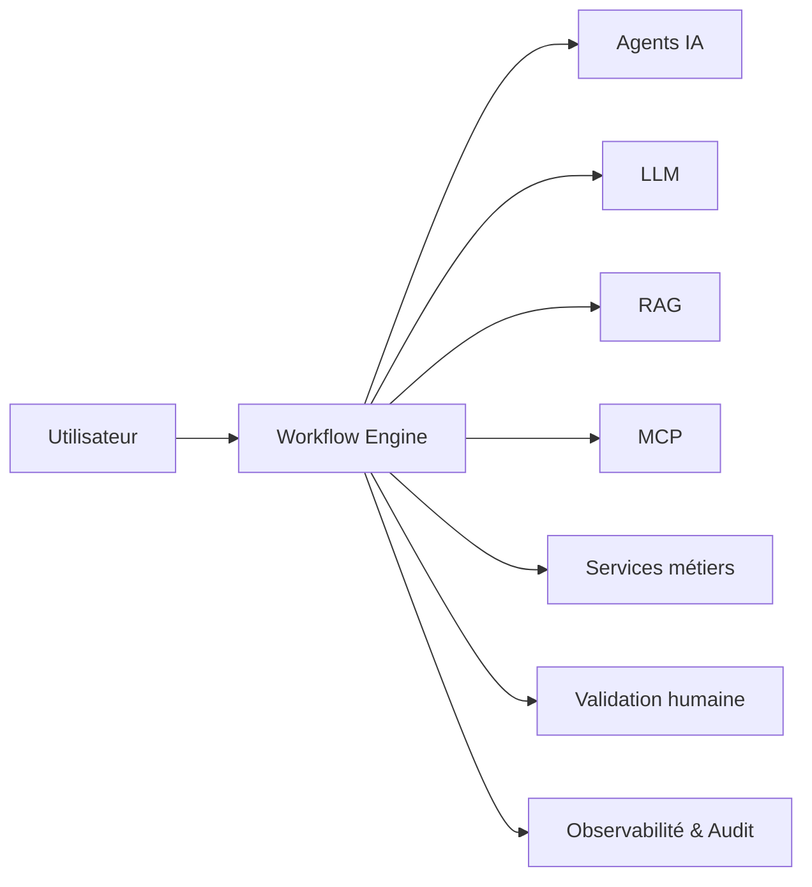

# AI-112 — Enterprise AI Workflows

> Référentiel officiel de l'architecture des **workflows IA** pour **EduWeb Planner**.

## Sommaire

1. Vision
2. Objectifs
3. Définition
4. Principes
5. Architecture de référence
6. Composants
7. Cycle d'exécution
8. Gouvernance
9. Cas d'usage EduWeb
10. API conceptuelle
11. KPI
12. Bonnes pratiques
13. Anti-patterns
14. Règles d'architecture
15. Documents associés

---

## 1. Vision

Mettre en place une architecture standardisée permettant d'orchestrer des chaînes de traitements IA combinant modèles, agents, outils et processus métier afin d'automatiser des activités complexes de manière fiable, traçable et sécurisée.

## 2. Objectifs

- Orchestrer les traitements IA.
- Intégrer les workflows aux processus métier.
- Garantir la reprise sur erreur.
- Faciliter la supervision.
- Assurer la traçabilité complète des exécutions.

## 3. Définition

Un **workflow IA** est un enchaînement structuré d'étapes faisant intervenir des modèles d'IA, des agents, des services, des validations humaines et des applications métier pour atteindre un objectif opérationnel.

## 4. Principes

- Orchestration by Design
- Modularité
- Réutilisation
- Résilience
- Observabilité
- Sécurité
- Human in the Loop

## 5. Architecture de référence



## 6. Composants

- Workflow Engine
- Orchestrateur
- Agents IA
- LLM
- Services MCP
- Outils métier
- Gestionnaire d'états
- File de messages
- Journal d'audit
- Tableau de supervision

## 7. Cycle d'exécution

1. Déclenchement.
2. Validation des prérequis.
3. Exécution des tâches.
4. Appels aux agents et outils.
5. Validation humaine si nécessaire.
6. Gestion des erreurs.
7. Clôture.
8. Archivage et audit.

## 8. Gouvernance

- Chief AI Officer
- AI Architect
- Workflow Engineer
- MLOps Engineer
- RSSI
- Data Steward
- Responsables métier

## 9. Cas d'usage EduWeb

- Génération d'emplois du temps.
- Validation de documents administratifs.
- Création de contenus pédagogiques.
- Assistance réglementaire.
- Traitement automatisé des demandes.
- Production de tableaux de bord.

## 10. API conceptuelle

```typescript
interface EnterpriseAIWorkflow {
  startWorkflow(id: string): void;
  executeStep(step: string): Promise<void>;
  pauseWorkflow(): void;
  resumeWorkflow(): void;
  handleFailure(): void;
  auditExecution(): void;
}
```

## 11. KPI

| KPI | Objectif |
|------|----------|
| Workflows automatisés | En croissance |
| Exécutions réussies | ≥ 98 % |
| Temps moyen d'exécution | En diminution |
| Reprises automatiques | ≥ 95 % |
| Exécutions auditables | 100 % |

## 12. Bonnes pratiques

- Concevoir des étapes indépendantes.
- Prévoir des mécanismes de reprise.
- Journaliser chaque transition.
- Définir des validations humaines pour les décisions critiques.
- Superviser les performances en continu.

## 13. Anti-patterns

- Workflows monolithiques.
- Absence de reprise sur erreur.
- Étapes non documentées.
- Dépendances circulaires.
- Absence d'audit.

## 14. Règles d'architecture

- RA-AI112-001 : Chaque workflow possède un propriétaire métier.
- RA-AI112-002 : Les transitions d'état sont journalisées.
- RA-AI112-003 : Les erreurs critiques déclenchent une alerte.
- RA-AI112-004 : Les étapes sont réutilisables lorsque possible.
- RA-AI112-005 : Les workflows sont versionnés.

## 15. Documents associés

- AI-109 — Enterprise AI Agents
- AI-110 — Enterprise Multi-Agent Systems
- AI-111 — Enterprise Model Context Protocol
- AI-113 — Enterprise AI Orchestration
- DATA-120 — Enterprise Knowledge Graph

# Fin du document
