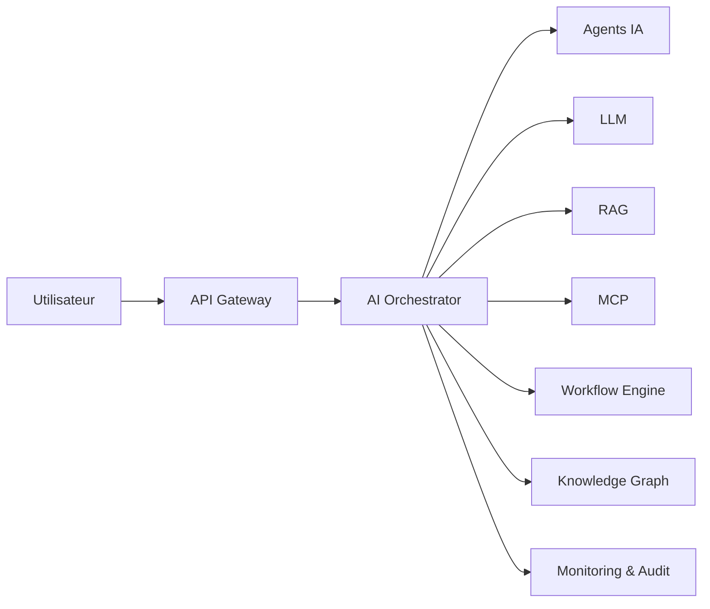

# AI-113 — Enterprise AI Orchestration

> Référentiel officiel de l'architecture d'**orchestration de l'intelligence artificielle** pour **EduWeb Planner**.

## Sommaire

1. Vision
2. Objectifs
3. Définition
4. Principes
5. Architecture de référence
6. Composants
7. Processus d'orchestration
8. Gouvernance
9. Cas d'usage EduWeb
10. API conceptuelle
11. KPI
12. Bonnes pratiques
13. Anti-patterns
14. Règles d'architecture
15. Documents associés

---

## 1. Vision

Coordonner de manière centralisée les modèles d'IA, agents, workflows, outils et services afin de fournir une plateforme intelligente, évolutive, résiliente et gouvernée pour l'ensemble des solutions EduWeb.

## 2. Objectifs

- Piloter les traitements IA de bout en bout.
- Optimiser l'utilisation des ressources.
- Répartir intelligemment les charges.
- Garantir la continuité de service.
- Superviser les performances en temps réel.

## 3. Définition

L'orchestration IA consiste à coordonner automatiquement plusieurs composants d'intelligence artificielle (LLM, agents, workflows, outils, bases de connaissances et services) afin d'exécuter efficacement un processus métier.

## 4. Principes

- Orchestration by Design
- Découplage des composants
- Scalabilité
- Tolérance aux pannes
- Observabilité
- Sécurité
- Gouvernance centralisée

## 5. Architecture de référence



## 6. Composants

- AI Orchestrator
- API Gateway
- Workflow Engine
- Agent Manager
- LLM Manager
- MCP Client
- Policy Engine
- Monitoring
- Audit
- Journalisation

## 7. Processus d'orchestration

1. Réception de la demande.
2. Analyse du contexte.
3. Sélection des capacités IA.
4. Coordination des traitements.
5. Gestion des erreurs.
6. Validation humaine si nécessaire.
7. Restitution des résultats.
8. Journalisation et supervision.

## 8. Gouvernance

- Chief AI Officer
- Enterprise Architect
- AI Architect
- MLOps Engineer
- Workflow Engineer
- RSSI
- Responsables métier

## 9. Cas d'usage EduWeb

- Coordination d'assistants pédagogiques.
- Génération automatisée de documents.
- Orchestration des emplois du temps.
- Analyse réglementaire.
- Automatisation administrative.
- Tableaux de bord décisionnels.

## 10. API conceptuelle

```typescript
interface EnterpriseAIOrchestrator {
    routeRequest(): void;
    selectCapabilities(): void;
    executeWorkflow(): Promise<void>;
    monitorExecution(): void;
    recoverFailure(): void;
    auditExecution(): void;
}
```

## 11. KPI

| KPI | Objectif |
|------|----------|
| Disponibilité de l'orchestrateur | ≥ 99,9 % |
| Temps moyen de routage | < 200 ms |
| Exécutions réussies | ≥ 98 % |
| Détection automatique des erreurs | 100 % |
| Exécutions auditables | 100 % |

## 12. Bonnes pratiques

- Centraliser les politiques d'orchestration.
- Utiliser des composants faiblement couplés.
- Prévoir des mécanismes de reprise.
- Mesurer les performances de chaque étape.
- Versionner les workflows et orchestrations.

## 13. Anti-patterns

- Orchestrations codées en dur.
- Dépendances circulaires.
- Supervision insuffisante.
- Absence de reprise automatique.
- Multiplication d'orchestrateurs concurrents.

## 14. Règles d'architecture

- RA-AI113-001 : Toute orchestration est versionnée.
- RA-AI113-002 : Les composants communiquent via des interfaces standardisées.
- RA-AI113-003 : Les erreurs sont détectées et journalisées.
- RA-AI113-004 : Les politiques d'accès sont appliquées avant toute exécution.
- RA-AI113-005 : Les métriques sont collectées en continu.

## 15. Documents associés

- AI-109 — Enterprise AI Agents
- AI-110 — Enterprise Multi-Agent Systems
- AI-111 — Enterprise Model Context Protocol
- AI-112 — Enterprise AI Workflows
- AI-114 — Enterprise MLOps
- DATA-120 — Enterprise Knowledge Graph

# Fin du document
