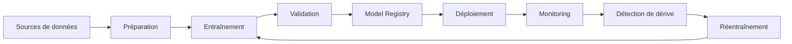

# AI-114 — Enterprise MLOps

> Référentiel officiel de l'architecture **MLOps** pour **EduWeb Planner**.

## Sommaire

1. Vision
2. Objectifs
3. Définition
4. Principes
5. Architecture de référence
6. Composants
7. Cycle de vie MLOps
8. Gouvernance
9. Cas d'usage EduWeb
10. API conceptuelle
11. KPI
12. Bonnes pratiques
13. Anti-patterns
14. Règles d'architecture
15. Documents associés

---

## 1. Vision

Industrialiser le cycle de vie des modèles d'intelligence artificielle afin d'assurer leur développement, leur déploiement, leur supervision et leur amélioration continue avec un haut niveau d'automatisation, de qualité et de gouvernance.

---

## 2. Objectifs

- Automatiser les pipelines ML.
- Réduire le délai entre développement et production.
- Garantir la reproductibilité.
- Superviser les performances des modèles.
- Faciliter le réentraînement continu.

---

## 3. Définition

Le **MLOps** est l'ensemble des pratiques, processus et outils permettant de gérer le cycle de vie complet des modèles de Machine Learning, depuis la préparation des données jusqu'au retrait des modèles de production.

---

## 4. Principes

- Automation by Design
- CI/CD/CT (Continuous Training)
- Reproductibilité
- Versionnement
- Observabilité
- Sécurité
- Gouvernance

---

## 5. Architecture de référence



---

## 6. Composants

- Pipeline CI/CD/CT
- Feature Store
- Environnement d'entraînement
- Model Registry
- Validation automatique
- Déploiement continu
- Monitoring
- Détection de dérive
- Journalisation
- Tableau de bord opérationnel

---

## 7. Cycle de vie MLOps

1. Collecte des données.
2. Préparation.
3. Entraînement.
4. Validation.
5. Enregistrement du modèle.
6. Déploiement.
7. Surveillance.
8. Réentraînement.
9. Décommissionnement.

---

## 8. Gouvernance

Acteurs :

- Chief AI Officer
- MLOps Engineer
- Data Scientist
- ML Engineer
- Data Engineer
- RSSI
- Data Steward
- Responsables métier

---

## 9. Cas d'usage EduWeb

- Déploiement continu des modèles de prédiction.
- Supervision des assistants IA.
- Détection des dérives des modèles pédagogiques.
- Automatisation des mises à jour.
- Gestion centralisée des modèles.
- Amélioration continue des performances.

---

## 10. API conceptuelle

```typescript
interface EnterpriseMLOpsPlatform {
    trainModel(): void;
    validateModel(): boolean;
    registerModel(): void;
    deployModel(): void;
    monitorModel(): void;
    detectDrift(): void;
    retrainModel(): void;
    retireModel(): void;
}
```

---

## 11. KPI

| KPI | Objectif |
|------|----------|
| Déploiements automatisés | ≥ 95 % |
| Temps moyen de mise en production | < 30 min |
| Modèles surveillés | 100 % |
| Détection automatique des dérives | 100 % |
| Disponibilité de la plateforme | ≥ 99,9 % |

---

## 12. Bonnes pratiques

- Versionner les modèles, données et pipelines.
- Automatiser les tests avant déploiement.
- Superviser les performances en continu.
- Définir des critères objectifs de réentraînement.
- Documenter chaque version du modèle.

---

## 13. Anti-patterns

- Déploiement manuel des modèles.
- Absence de registre des modèles.
- Réentraînement sans validation.
- Manque de surveillance.
- Données non reproductibles.

---

## 14. Règles d'architecture

- RA-AI114-001 : Tous les modèles sont enregistrés dans un registre officiel.
- RA-AI114-002 : Les pipelines sont automatisés.
- RA-AI114-003 : Les modèles en production sont supervisés en permanence.
- RA-AI114-004 : Les dérives déclenchent une réévaluation.
- RA-AI114-005 : Chaque version est traçable et auditée.

---

## 15. Documents associés

- AI-104 — Enterprise Machine Learning Architecture
- AI-105 — Enterprise Deep Learning Architecture
- AI-113 — Enterprise AI Orchestration
- AI-115 — Enterprise AI Observability
- DATA-120 — Enterprise Knowledge Graph

---

# Fin du document
