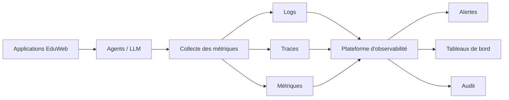

# AI-115 — Enterprise AI Observability

> Référentiel officiel de l'**observabilité de l'intelligence artificielle** pour **EduWeb Planner**.

## Sommaire

1. Vision
2. Objectifs
3. Définition
4. Principes
5. Architecture de référence
6. Composants
7. Cycle d'observabilité
8. Gouvernance
9. Cas d'usage EduWeb
10. API conceptuelle
11. KPI
12. Bonnes pratiques
13. Anti-patterns
14. Règles d'architecture
15. Documents associés

---

## 1. Vision

Assurer une visibilité complète sur le fonctionnement des modèles, agents et workflows d'intelligence artificielle afin de détecter rapidement les anomalies, mesurer les performances et garantir la fiabilité des services IA.

## 2. Objectifs

- Superviser les modèles en production.
- Détecter les dérives de données et de modèles.
- Mesurer la qualité des réponses.
- Réduire les temps d'investigation.
- Renforcer la confiance dans les systèmes IA.

## 3. Définition

L'**AI Observability** regroupe les pratiques, outils et processus permettant de surveiller en continu les performances, la qualité, les coûts, les risques et le comportement des systèmes d'intelligence artificielle.

## 4. Principes

- Observability by Design
- Traçabilité complète
- Surveillance continue
- Alertes proactives
- Auditabilité
- Sécurité
- Amélioration continue

## 5. Architecture de référence



## 6. Composants

- Collecteur de métriques
- Gestionnaire de logs
- Tracing distribué
- Détection de dérive
- Analyse des coûts
- Alertes
- Dashboards
- Audit
- Data Catalog
- Knowledge Graph

## 7. Cycle d'observabilité

1. Collecte.
2. Agrégation.
3. Analyse.
4. Détection d'anomalies.
5. Notification.
6. Remédiation.
7. Capitalisation.

## 8. Gouvernance

- Chief AI Officer
- AI Architect
- MLOps Engineer
- SRE
- RSSI
- Data Steward
- Responsables métier

## 9. Cas d'usage EduWeb

- Surveillance des assistants IA.
- Détection des hallucinations.
- Analyse des performances des LLM.
- Suivi des coûts d'inférence.
- Contrôle des workflows IA.
- Tableaux de bord exécutifs.

## 10. API conceptuelle

```typescript
interface EnterpriseAIObservability {
    collectMetrics(): void;
    detectAnomaly(): void;
    analyzeDrift(): void;
    generateDashboard(): void;
    triggerAlert(): void;
    exportAudit(): void;
}
```

## 11. KPI

| KPI | Objectif |
|------|----------|
| Modèles supervisés | 100 % |
| Détection automatique des dérives | ≥ 95 % |
| Temps moyen de détection | < 5 min |
| Alertes traitées | ≥ 99 % |
| Disponibilité de la plateforme | ≥ 99,9 % |

## 12. Bonnes pratiques

- Instrumenter tous les composants IA.
- Centraliser les journaux.
- Définir des seuils d'alerte.
- Mesurer les coûts et la latence.
- Conserver un historique des incidents.

## 13. Anti-patterns

- Absence de métriques.
- Alertes non qualifiées.
- Journaux dispersés.
- Supervision uniquement technique.
- Absence d'audit.

## 14. Règles d'architecture

- RA-AI115-001 : Toute interaction IA est traçable.
- RA-AI115-002 : Les modèles en production sont surveillés.
- RA-AI115-003 : Les dérives déclenchent une alerte.
- RA-AI115-004 : Les tableaux de bord sont mis à jour en temps réel.
- RA-AI115-005 : Les journaux sont conservés selon la politique de rétention.

## 15. Documents associés

- AI-114 — Enterprise MLOps
- AI-113 — Enterprise AI Orchestration
- AI-109 — Enterprise AI Agents
- AI-106 — Enterprise Large Language Models
- DATA-120 — Enterprise Knowledge Graph

# Fin du document
