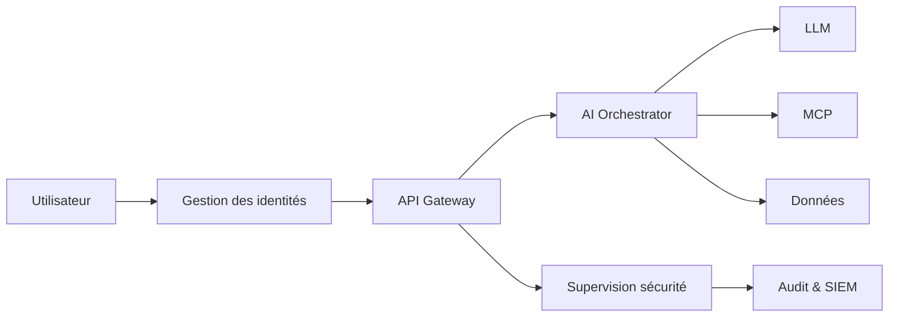

# AI-116 — Enterprise AI Security

> Référentiel officiel de la **sécurité des systèmes d'intelligence artificielle** pour **EduWeb Planner**.

## Sommaire

1. Vision
2. Objectifs
3. Définition
4. Principes
5. Architecture de référence
6. Composants
7. Cycle de sécurité
8. Gouvernance
9. Cas d'usage EduWeb
10. API conceptuelle
11. KPI
12. Bonnes pratiques
13. Anti-patterns
14. Règles d'architecture
15. Documents associés

---

## 1. Vision

Garantir la confidentialité, l'intégrité, la disponibilité et la résilience des capacités d'intelligence artificielle d'EduWeb Planner tout au long de leur cycle de vie.

## 2. Objectifs

- Protéger les modèles et les données.
- Sécuriser les interactions avec les LLM.
- Prévenir les attaques ciblant l'IA.
- Assurer une gouvernance des accès.
- Réduire les risques opérationnels.

## 3. Définition

La sécurité de l'IA regroupe les politiques, processus, contrôles techniques et mesures organisationnelles destinés à protéger les modèles, les données, les infrastructures et les utilisateurs contre les menaces.

## 4. Principes

- Security by Design
- Zero Trust
- Least Privilege
- Defense in Depth
- Chiffrement
- Traçabilité
- Amélioration continue

## 5. Architecture de référence



## 6. Composants

- IAM
- API Gateway
- Gestion des secrets
- Chiffrement
- Journalisation
- SIEM
- Détection d'intrusion
- Filtrage des prompts
- Gestion des vulnérabilités
- Plan de réponse aux incidents

## 7. Cycle de sécurité

1. Analyse des risques.
2. Conception sécurisée.
3. Déploiement.
4. Surveillance.
5. Détection.
6. Réponse.
7. Retour d'expérience.

## 8. Gouvernance

- RSSI
- Chief AI Officer
- AI Architect
- MLOps Engineer
- SOC
- Data Steward
- Responsables métier

## 9. Cas d'usage EduWeb

- Protection des assistants pédagogiques.
- Contrôle des accès aux données scolaires.
- Sécurisation des appels MCP.
- Filtrage des requêtes malveillantes.
- Journalisation des opérations sensibles.
- Gestion des incidents IA.

## 10. API conceptuelle

```typescript
interface EnterpriseAISecurity {
  authenticate(): Promise<boolean>;
  authorize(resource: string): boolean;
  encrypt(payload: object): object;
  detectThreat(): void;
  audit(event: string): void;
  respondIncident(): void;
}
```

## 11. KPI

| KPI | Objectif |
|------|----------|
| Ressources protégées | 100 % |
| Chiffrement des flux sensibles | 100 % |
| Détection des incidents critiques | < 5 min |
| Revues des accès | Trimestrielles |
| Disponibilité des services IA | ≥ 99,9 % |

## 12. Bonnes pratiques

- Authentification multifacteur.
- Rotation des secrets.
- Segmentation des environnements.
- Tests réguliers de sécurité.
- Journalisation centralisée.

## 13. Anti-patterns

- Secrets dans le code.
- Comptes partagés.
- Absence de filtrage des entrées.
- Modèles exposés sans contrôle d'accès.
- Correctifs non appliqués.

## 14. Règles d'architecture

- RA-AI116-001 : Tout accès est authentifié et autorisé.
- RA-AI116-002 : Les données sensibles sont chiffrées.
- RA-AI116-003 : Les événements de sécurité sont journalisés.
- RA-AI116-004 : Les vulnérabilités critiques sont corrigées selon les SLA.
- RA-AI116-005 : Les composants IA sont soumis à des revues de sécurité.

## 15. Documents associés

- AI-114 — Enterprise MLOps
- AI-115 — Enterprise AI Observability
- AI-113 — Enterprise AI Orchestration
- AI-117 — Enterprise AI Compliance
- DATA-120 — Enterprise Knowledge Graph

# Fin du document
