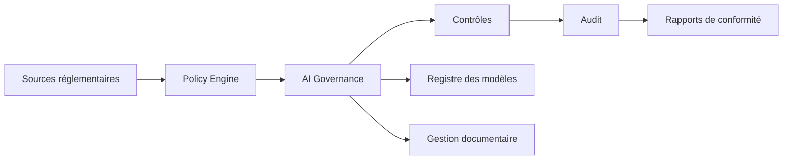

# AI-117 — Enterprise AI Compliance

> Référentiel officiel de la **conformité des systèmes d'intelligence artificielle** pour **EduWeb Planner**.

## Sommaire

1. Vision
2. Objectifs
3. Définition
4. Principes
5. Architecture de référence
6. Composants
7. Cycle de conformité
8. Gouvernance
9. Cas d'usage EduWeb
10. API conceptuelle
11. KPI
12. Bonnes pratiques
13. Anti-patterns
14. Règles d'architecture
15. Documents associés

---

## 1. Vision

Garantir que les systèmes d'IA d'EduWeb Planner respectent les exigences réglementaires, contractuelles, éthiques et organisationnelles tout au long de leur cycle de vie.

## 2. Objectifs

- Assurer la conformité réglementaire.
- Réduire les risques juridiques.
- Renforcer la confiance des utilisateurs.
- Garantir la traçabilité des décisions.
- Faciliter les audits.

## 3. Définition

La conformité IA regroupe les politiques, contrôles et mécanismes permettant de démontrer que les systèmes d'IA respectent les normes, lois, politiques internes et exigences de gouvernance applicables.

## 4. Principes

- Compliance by Design
- Transparence
- Responsabilité
- Traçabilité
- Protection des données
- Auditabilité
- Amélioration continue

## 5. Architecture de référence



## 6. Composants

- Registre des obligations
- Policy Engine
- Gestion documentaire
- Registre des modèles
- Gestion des preuves
- Moteur d'audit
- Tableaux de bord
- Gestion des risques
- Workflow de validation
- Archivage

## 7. Cycle de conformité

1. Identification des exigences.
2. Évaluation des risques.
3. Mise en œuvre des contrôles.
4. Vérification.
5. Audit.
6. Correction.
7. Revue continue.

## 8. Gouvernance

- Chief Compliance Officer
- Chief AI Officer
- RSSI
- Data Protection Officer
- AI Architect
- Responsables métier
- Auditeurs internes

## 9. Cas d'usage EduWeb

- Vérification des traitements de données scolaires.
- Contrôle des accès aux services IA.
- Audit des décisions automatisées.
- Gestion des preuves de conformité.
- Production de rapports réglementaires.
- Revue des modèles avant mise en production.

## 10. API conceptuelle

```typescript
interface EnterpriseAICompliance {
  validatePolicy(): boolean;
  registerEvidence(): void;
  launchAudit(): void;
  generateComplianceReport(): void;
  trackCorrectiveActions(): void;
}
```

## 11. KPI

| KPI | Objectif |
|------|----------|
| Contrôles automatisés | ≥ 90 % |
| Audits réalisés dans les délais | 100 % |
| Plans d'actions clôturés | ≥ 95 % |
| Non-conformités critiques | 0 |
| Traçabilité des décisions | 100 % |

## 12. Bonnes pratiques

- Documenter les contrôles.
- Conserver les preuves d'audit.
- Réviser régulièrement les politiques.
- Intégrer la conformité dès la conception.
- Former les équipes.

## 13. Anti-patterns

- Contrôles uniquement manuels.
- Documentation incomplète.
- Absence de registre des décisions.
- Audits ponctuels sans suivi.
- Dérogations non approuvées.

## 14. Règles d'architecture

- RA-AI117-001 : Les contrôles de conformité sont documentés.
- RA-AI117-002 : Les preuves sont archivées.
- RA-AI117-003 : Les audits sont planifiés et tracés.
- RA-AI117-004 : Les écarts font l'objet d'un plan d'action.
- RA-AI117-005 : Les rapports sont disponibles pour les autorités habilitées.

## 15. Documents associés

- AI-103 — Enterprise Responsible AI
- AI-114 — Enterprise MLOps
- AI-115 — Enterprise AI Observability
- AI-116 — Enterprise AI Security
- AI-118 — Enterprise AI Evaluation

# Fin du document
