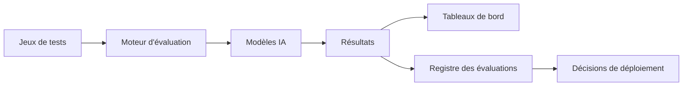

# AI-118 — Enterprise AI Evaluation

> Référentiel officiel de l'**évaluation des systèmes d'intelligence artificielle** pour **EduWeb Planner**.

## Sommaire

1. Vision
2. Objectifs
3. Définition
4. Principes
5. Architecture de référence
6. Composants
7. Cycle d'évaluation
8. Gouvernance
9. Cas d'usage EduWeb
10. API conceptuelle
11. KPI
12. Bonnes pratiques
13. Anti-patterns
14. Règles d'architecture
15. Documents associés

---

## 1. Vision

Établir un cadre homogène permettant d'évaluer en continu les performances, la qualité, la robustesse, l'équité et l'utilité des systèmes d'IA déployés au sein d'EduWeb Planner.

## 2. Objectifs

- Mesurer objectivement les performances.
- Vérifier la qualité des réponses.
- Détecter les biais et les dérives.
- Comparer différentes versions de modèles.
- Soutenir l'amélioration continue.

## 3. Définition

L'évaluation de l'IA regroupe les méthodes, jeux de tests, indicateurs et processus permettant de vérifier qu'un système d'IA satisfait aux exigences fonctionnelles, techniques, éthiques et métier.

## 4. Principes

- Evaluation by Design
- Reproductibilité
- Jeux de tests versionnés
- Transparence
- Comparabilité
- Traçabilité
- Amélioration continue

## 5. Architecture de référence



## 6. Composants

- Jeux de tests
- Benchmarks
- Moteur d'évaluation
- Comparateur de modèles
- Registre des résultats
- Tableau de bord qualité
- Gestion des versions
- Audit

## 7. Cycle d'évaluation

1. Définition des critères.
2. Préparation des jeux de tests.
3. Exécution des évaluations.
4. Analyse des résultats.
5. Validation métier.
6. Publication.
7. Réévaluation périodique.

## 8. Gouvernance

- Chief AI Officer
- AI Architect
- Data Scientist
- MLOps Engineer
- Responsables métier
- Qualité
- Auditeurs

## 9. Cas d'usage EduWeb

- Évaluation des assistants pédagogiques.
- Comparaison de LLM.
- Validation des moteurs de recommandation.
- Tests des workflows IA.
- Qualification avant mise en production.
- Mesure de la satisfaction utilisateur.

## 10. API conceptuelle

```typescript
interface EnterpriseAIEvaluation {
  runBenchmark(): void;
  compareModels(): void;
  calculateMetrics(): void;
  publishResults(): void;
  approveRelease(): boolean;
}
```

## 11. KPI

| KPI | Objectif |
|------|----------|
| Modèles évalués avant production | 100 % |
| Jeux de tests versionnés | 100 % |
| Couverture fonctionnelle | ≥ 95 % |
| Temps moyen d'évaluation | En diminution |
| Rapports disponibles | 100 % |

## 12. Bonnes pratiques

- Utiliser des jeux de tests représentatifs.
- Automatiser les campagnes d'évaluation.
- Conserver l'historique des résultats.
- Associer les experts métier aux validations.
- Réévaluer après chaque évolution majeure.

## 13. Anti-patterns

- Évaluation ponctuelle uniquement.
- Jeux de tests non documentés.
- Comparaisons sans critères communs.
- Validation subjective.
- Absence de suivi dans le temps.

## 14. Règles d'architecture

- RA-AI118-001 : Chaque modèle est évalué avant déploiement.
- RA-AI118-002 : Les critères d'évaluation sont documentés.
- RA-AI118-003 : Les résultats sont archivés.
- RA-AI118-004 : Les benchmarks sont versionnés.
- RA-AI118-005 : Les décisions de mise en production sont justifiées.

## 15. Documents associés

- AI-103 — Enterprise Responsible AI
- AI-114 — Enterprise MLOps
- AI-115 — Enterprise AI Observability
- AI-117 — Enterprise AI Compliance
- AI-119 — Enterprise AI Knowledge Systems

# Fin du document
