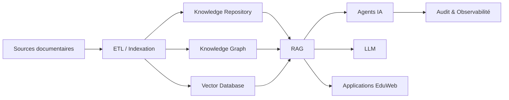

# AI-119 — Enterprise AI Knowledge Systems

> Référentiel officiel de l'architecture des **systèmes de connaissances pour l'intelligence artificielle** au sein d'**EduWeb Planner**.

## Sommaire

1. Vision
2. Objectifs
3. Définition
4. Principes directeurs
5. Architecture de référence
6. Composants
7. Cycle de vie des connaissances
8. Gouvernance
9. Cas d'usage EduWeb
10. API conceptuelle
11. KPI
12. Bonnes pratiques
13. Anti-patterns
14. Règles d'architecture
15. Documents associés

---

## 1. Vision

Construire un patrimoine numérique de connaissances fiable, structuré, gouverné et exploitable par les systèmes d'intelligence artificielle afin d'améliorer la qualité des décisions, des recommandations et des services d'EduWeb Planner.

---

## 2. Objectifs

- Centraliser les connaissances métier.
- Structurer les contenus institutionnels.
- Faciliter la réutilisation des informations.
- Alimenter les moteurs RAG et les agents IA.
- Garantir la qualité, la traçabilité et la mise à jour des connaissances.

---

## 3. Définition

Un **AI Knowledge System** est un ensemble organisé de référentiels, bases documentaires, graphes de connaissances, métadonnées et règles métier permettant aux applications d'IA d'accéder à une information fiable, contextualisée et gouvernée.

---

## 4. Principes directeurs

- Knowledge by Design
- Source unique de vérité (Single Source of Truth)
- Gouvernance documentaire
- Qualité des données
- Interopérabilité
- Versionnement
- Traçabilité

---

## 5. Architecture de référence



---

## 6. Composants

- Référentiel documentaire
- Base vectorielle
- Knowledge Graph
- Catalogue de métadonnées
- Moteur d'indexation
- Moteur de recherche sémantique
- Gestionnaire des versions
- Catalogue métier
- Registre des sources
- Tableau de bord qualité

---

## 7. Cycle de vie des connaissances

1. Acquisition.
2. Qualification.
3. Classification.
4. Indexation.
5. Publication.
6. Exploitation.
7. Révision.
8. Archivage.

---

## 8. Gouvernance

Acteurs :

- Chief Knowledge Officer
- Chief AI Officer
- Enterprise Architect
- Data Steward
- Documentalistes
- Experts métier
- Responsables qualité

---

## 9. Cas d'usage EduWeb

- Base réglementaire nationale.
- Référentiel pédagogique.
- Documentation technique.
- Génération assistée par RAG.
- Assistant administratif.
- Recherche intelligente.
- FAQ institutionnelle.

---

## 10. API conceptuelle

```typescript
interface EnterpriseKnowledgeSystem {
    ingestDocument(): void;
    classifyContent(): void;
    buildEmbeddings(): void;
    searchKnowledge(query: string): Promise<void>;
    updateKnowledge(): void;
    archiveKnowledge(): void;
}
```

---

## 11. KPI

| KPI | Objectif |
|------|----------|
| Documents indexés | 100 % |
| Qualité des métadonnées | ≥ 98 % |
| Temps moyen de recherche | < 1 seconde |
| Sources gouvernées | 100 % |
| Contenus révisés selon le planning | ≥ 95 % |

---

## 12. Bonnes pratiques

- Maintenir une source unique de vérité.
- Versionner les connaissances.
- Utiliser des métadonnées normalisées.
- Vérifier la qualité avant publication.
- Mettre à jour régulièrement les référentiels.

---

## 13. Anti-patterns

- Documents dupliqués.
- Sources non vérifiées.
- Métadonnées incomplètes.
- Connaissances obsolètes.
- Référentiels non gouvernés.

---

## 14. Règles d'architecture

- RA-AI119-001 : Toute connaissance possède un propriétaire.
- RA-AI119-002 : Les sources sont qualifiées avant indexation.
- RA-AI119-003 : Les modifications sont historisées.
- RA-AI119-004 : Les référentiels sont versionnés.
- RA-AI119-005 : Les accès sont contrôlés selon les rôles.

---

## 15. Documents associés

- AI-108 — Enterprise Retrieval-Augmented Generation
- AI-109 — Enterprise AI Agents
- AI-111 — Enterprise Model Context Protocol
- AI-118 — Enterprise AI Evaluation
- DATA-120 — Enterprise Knowledge Graph

---

# Fin du document
