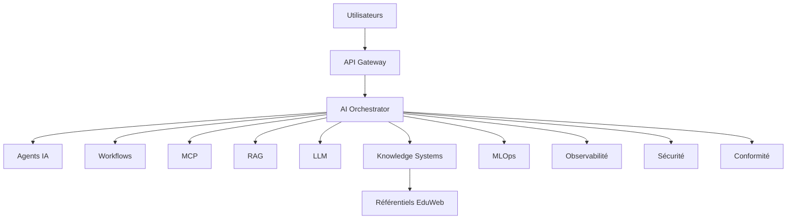

# AI-120 — Enterprise Autonomous AI Platform

> Référentiel officiel de la **plateforme d'intelligence artificielle autonome** d'**EduWeb Planner**.

## Sommaire

1. Vision
2. Objectifs
3. Définition
4. Principes directeurs
5. Architecture de référence
6. Capacités de la plateforme
7. Cycle opérationnel
8. Gouvernance
9. Cas d'usage EduWeb
10. API conceptuelle
11. KPI
12. Bonnes pratiques
13. Anti-patterns
14. Règles d'architecture
15. Documents associés

---

## 1. Vision

Mettre à disposition une plateforme unifiée capable de coordonner de manière autonome les modèles, agents, workflows, bases de connaissances et services métier afin de soutenir les activités pédagogiques, administratives et décisionnelles d'EduWeb Planner.

## 2. Objectifs

- Centraliser toutes les capacités IA.
- Automatiser les processus métier.
- Garantir sécurité, conformité et observabilité.
- Faciliter l'évolution de l'écosystème.
- Offrir une expérience utilisateur cohérente.

## 3. Définition

Une **Enterprise Autonomous AI Platform** est une plateforme intégrée réunissant modèles, agents, orchestrateurs, workflows, services, connaissances et mécanismes de gouvernance afin d'exécuter des tâches complexes avec un niveau élevé d'automatisation et de contrôle.

## 4. Principes directeurs

- Platform by Design
- Modularité
- Interopérabilité
- Gouvernance intégrée
- Sécurité native
- Scalabilité
- Résilience

## 5. Architecture de référence



## 6. Capacités de la plateforme

- Orchestration intelligente
- Agents spécialisés
- Recherche augmentée (RAG)
- Intégration MCP
- Gestion documentaire
- Déploiement MLOps
- Supervision temps réel
- Gouvernance centralisée
- Automatisation des processus
- Tableaux de bord décisionnels

## 7. Cycle opérationnel

1. Réception de la demande.
2. Analyse du contexte.
3. Sélection des ressources IA.
4. Exécution orchestrée.
5. Validation métier si nécessaire.
6. Restitution.
7. Journalisation.
8. Amélioration continue.

## 8. Gouvernance

- Chief AI Officer
- Enterprise Architect
- AI Architect
- MLOps Engineer
- RSSI
- Data Steward
- Responsables métier
- Comité de gouvernance IA

## 9. Cas d'usage EduWeb

- Génération d'emplois du temps.
- Assistance réglementaire.
- Production de contenus pédagogiques.
- Pilotage administratif.
- Analyse décisionnelle.
- Assistance aux établissements scolaires.
- Automatisation documentaire.

## 10. API conceptuelle

```typescript
interface EnterpriseAutonomousAIPlatform {
  authenticate(): Promise<boolean>;
  orchestrate(request: object): Promise<object>;
  executeWorkflow(name: string): Promise<void>;
  invokeAgent(agent: string): Promise<object>;
  queryKnowledge(query: string): Promise<object>;
  monitorPlatform(): void;
  auditExecution(): void;
}
```

## 11. KPI

| KPI | Objectif |
|------|----------|
| Disponibilité de la plateforme | ≥ 99,9 % |
| Processus automatisés | En croissance |
| Temps moyen de réponse | < 2 s |
| Services supervisés | 100 % |
| Décisions auditables | 100 % |

## 12. Bonnes pratiques

- Standardiser les interfaces.
- Versionner tous les composants.
- Automatiser les contrôles qualité.
- Mesurer en continu les performances.
- Documenter les capacités de la plateforme.

## 13. Anti-patterns

- Silos applicatifs.
- Composants non gouvernés.
- Déploiements manuels récurrents.
- Absence d'observabilité.
- Connaissances non maintenues.

## 14. Règles d'architecture

- RA-AI120-001 : Toute capacité IA est enregistrée dans un catalogue.
- RA-AI120-002 : Les échanges sont sécurisés et tracés.
- RA-AI120-003 : Les composants sont supervisés en continu.
- RA-AI120-004 : Les modèles et agents sont versionnés.
- RA-AI120-005 : Les décisions critiques restent auditables.

## 15. Documents associés

- AI-109 — Enterprise AI Agents
- AI-110 — Enterprise Multi-Agent Systems
- AI-111 — Enterprise Model Context Protocol
- AI-113 — Enterprise AI Orchestration
- AI-114 — Enterprise MLOps
- AI-115 — Enterprise AI Observability
- AI-116 — Enterprise AI Security
- AI-117 — Enterprise AI Compliance
- AI-118 — Enterprise AI Evaluation
- AI-119 — Enterprise AI Knowledge Systems

---

# Conclusion

Ce document constitue la vision cible d'une plateforme IA autonome d'entreprise, fédérant l'ensemble des référentiels AI-101 à AI-120 pour fournir une architecture cohérente, gouvernée, évolutive et sécurisée au service d'EduWeb Planner.

# Fin du document
