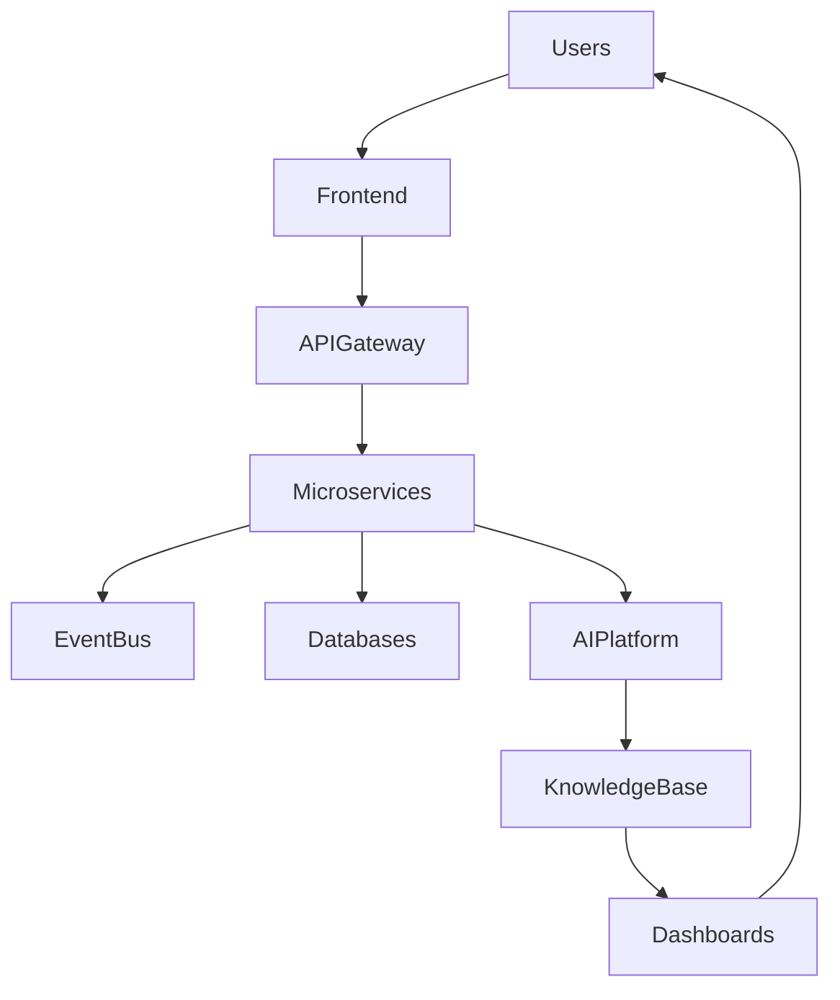

# ARCH-101 — Enterprise Architecture Overview

> Référentiel officiel de l'architecture d'entreprise de la plateforme **EduWeb Planner**.

---

# Sommaire

1. Vision
2. Objectifs
3. Principes d'architecture
4. Architecture globale
5. Couches architecturales
6. Domaines métiers
7. Architecture logique
8. Architecture physique
9. Architecture technique
10. Architecture des données
11. Architecture IA
12. Architecture de sécurité
13. Architecture Cloud
14. Architecture d'intégration
15. Architecture événementielle
16. Architecture documentaire
17. Architecture décisionnelle
18. Architecture DevSecOps
19. Architecture de gouvernance
20. Qualités attendues
21. Technologies
22. KPI
23. Règles d'architecture

---

# 1. Vision

EduWeb Planner est une plateforme **ERP EdTech de nouvelle génération** destinée à gérer l'ensemble de l'écosystème éducatif.

Elle couvre :

- établissements scolaires ;
- universités ;
- centres de formation ;
- académies ;
- ministères ;
- collectivités ;
- organismes de certification.

L'architecture est conçue pour évoluer sur plusieurs décennies.

---

# 2. Objectifs

L'architecture poursuit les objectifs suivants :

- modularité ;
- haute disponibilité ;
- scalabilité horizontale ;
- sécurité ;
- maintenabilité ;
- extensibilité ;
- interopérabilité ;
- intelligence artificielle native.

---

# 3. Principes d'architecture

L'ensemble du système repose sur les principes suivants.

## Modularité

Chaque domaine métier constitue un module indépendant.

---

## Couplage faible

Les modules communiquent par API et événements.

---

## Forte cohésion

Chaque microservice possède une responsabilité clairement définie.

---

## API First

Toutes les fonctionnalités sont exposées par API.

---

## Cloud Native

Tous les composants sont conçus pour fonctionner dans le cloud.

---

## AI Native

L'intelligence artificielle est intégrée dès la conception.

---

## Security by Design

La sécurité est intégrée dès l'architecture.

---

## Event Driven

Les traitements importants produisent des événements.

---

# 4. Architecture globale

```text
Utilisateurs

↓

Applications

↓

API Gateway

↓

Microservices

↓

Event Bus

↓

Databases

↓

Object Storage

↓

Analytics

↓

AI Platform
```

---

# 5. Couches architecturales

## Présentation

- Web
- Android
- iOS
- PWA

---

## API

- REST
- GraphQL
- WebSocket

---

## Services

- microservices
- agents IA
- orchestrateurs

---

## Données

- PostgreSQL
- Redis
- Elastic
- Object Storage

---

## Infrastructure

- Kubernetes
- Docker
- Cloud

---

# 6. Domaines métiers

L'architecture est organisée selon les domaines suivants.

## Administration

---

## Gouvernance

---

## Vie scolaire

---

## Pédagogie

---

## Formation

---

## Examens

---

## Finance

---

## RH

---

## Patrimoine

---

## Communication

---

## Business Intelligence

---

## Intelligence Artificielle

---

Chaque domaine possède :

- ses services ;
- ses API ;
- ses événements ;
- ses données ;
- ses tableaux de bord.

---

# 7. Architecture logique

```text
Domaines

↓

Services

↓

Cas d'utilisation

↓

API

↓

Entités

↓

Base de données
```

---

# 8. Architecture physique

L'infrastructure est distribuée.

```text
Load Balancer

↓

API Gateway

↓

Cluster Kubernetes

↓

Microservices

↓

Databases

↓

Storage

↓

Monitoring
```

Plusieurs zones de disponibilité peuvent être utilisées pour améliorer la résilience.

---

# 9. Architecture technique

Les principaux composants sont :

- API Gateway
- Identity Server
- Notification Service
- Search Engine
- Scheduler
- Workflow Engine
- Reporting Engine
- AI Platform
- Monitoring
- Logging
- Audit

---

# 10. Architecture des données

Les données sont réparties selon leur nature.

## Relationnelles

PostgreSQL

---

## Cache

Redis

---

## Recherche

Elasticsearch

---

## Documents

Object Storage

---

## Historique

Cold Storage

---

# 11. Architecture IA

L'IA repose sur plusieurs couches.

```text
Copilot

↓

Agent Orchestrator

↓

Specialized Agents

↓

Knowledge Base

↓

LLM

↓

Enterprise Data
```

Les modèles peuvent être hébergés ou consommés via des fournisseurs externes selon les besoins et les politiques de l'organisation.

---

# 12. Architecture de sécurité

Composants principaux :

- IAM
- OAuth2
- OpenID Connect
- MFA
- Audit
- SIEM
- Secrets Manager
- Vault

Les mécanismes retenus sont configurables afin de s'adapter aux contraintes des différents déploiements.

---

# 13. Architecture Cloud

Compatible :

- Azure
- AWS
- Google Cloud
- OVH
- Cloud privé

Architecture multi-cloud possible.

---

# 14. Architecture d'intégration

Interfaces :

- REST
- GraphQL
- Webhooks
- Message Broker
- ETL
- API publiques
- API privées

---

# 15. Architecture événementielle

Tous les événements métiers transitent par un bus d'événements.

Exemples :

```
StudentCreated

↓

EnrollmentValidated

↓

TimetableGenerated

↓

InvoicePaid

↓

ReportPublished
```

---

# 16. Architecture documentaire

Gestion :

- GED ;
- OCR ;
- signatures ;
- archivage ;
- versionnement.

---

# 17. Architecture décisionnelle

Pipeline :

```
Production

↓

Data Lake

↓

Data Warehouse

↓

Analytics

↓

Dashboards

↓

AI
```

---

# 18. Architecture DevSecOps

Pipeline :

```text
Code

↓

CI

↓

Tests

↓

Security Scan

↓

Build

↓

Deploy

↓

Monitoring
```

---

# 19. Architecture de gouvernance

Pilotée par :

- Enterprise Architect
- CTO
- RSSI
- Data Architect
- AI Architect
- UX Architect

Un comité d'architecture valide les évolutions majeures.

---

# 20. Qualités attendues

L'architecture doit garantir :

- disponibilité ;
- performance ;
- évolutivité ;
- résilience ;
- observabilité ;
- sécurité ;
- testabilité ;
- maintenabilité.

---

# 21. Technologies

## Front-end

- React
- TypeScript
- Tailwind CSS

---

## Backend

- .NET
- Node.js
- Python

---

## Infrastructure

- Docker
- Kubernetes
- NGINX
- Traefik

---

## Bases de données

- PostgreSQL
- Redis
- Elasticsearch

---

## IA

- LLM
- RAG
- Vector Database
- Multi-Agent System

---

# Diagramme Mermaid



---

# KPI

| KPI | Objectif |
|------|----------|
|Disponibilité plateforme|99,95 %|
|Temps moyen de réponse API|< 300 ms (hors traitements lourds)|
|Temps moyen de déploiement|< 15 min|
|Scalabilité horizontale|Automatique|
|Couverture de monitoring|100 %|
|Journalisation des événements critiques|100 %|

---

# Règles d'architecture

## RA-ARCH101-001

Chaque domaine métier possède ses propres services, modèles de données et API afin de limiter le couplage entre domaines.

---

## RA-ARCH101-002

Toute communication inter-domaines passe par des API documentées ou des événements métier ; les accès directs aux bases de données d'un autre domaine sont interdits.

---

## RA-ARCH101-003

Toute évolution architecturale majeure est soumise à une revue du Comité d'Architecture et fait l'objet d'une documentation versionnée.

---

## RA-ARCH101-004

Les composants critiques doivent être conçus pour fonctionner en haute disponibilité et être observables (logs, métriques, traces).

---

## RA-ARCH101-005

L'architecture privilégie des standards ouverts afin de limiter la dépendance à un fournisseur unique et de faciliter l'interopérabilité.

---

# Documents liés

- UX-101 à UX-109
- ARCH-102 — Microservices Architecture
- ARCH-103 — Domain-Driven Design
- ARCH-104 — Event-Driven Architecture
- ARCH-105 — API Architecture
- SEC-001 — Security Standards
- DEV-001 — Development Standards

---

# Conclusion

L'architecture d'entreprise d'EduWeb Planner constitue le socle stratégique de la plateforme. Elle articule les domaines métiers, les technologies, les flux de données, les services d'intelligence artificielle et les mécanismes de sécurité dans une approche modulaire, évolutive et résiliente, capable d'accompagner le développement de la plateforme à l'échelle nationale et internationale.

# Fin du document
