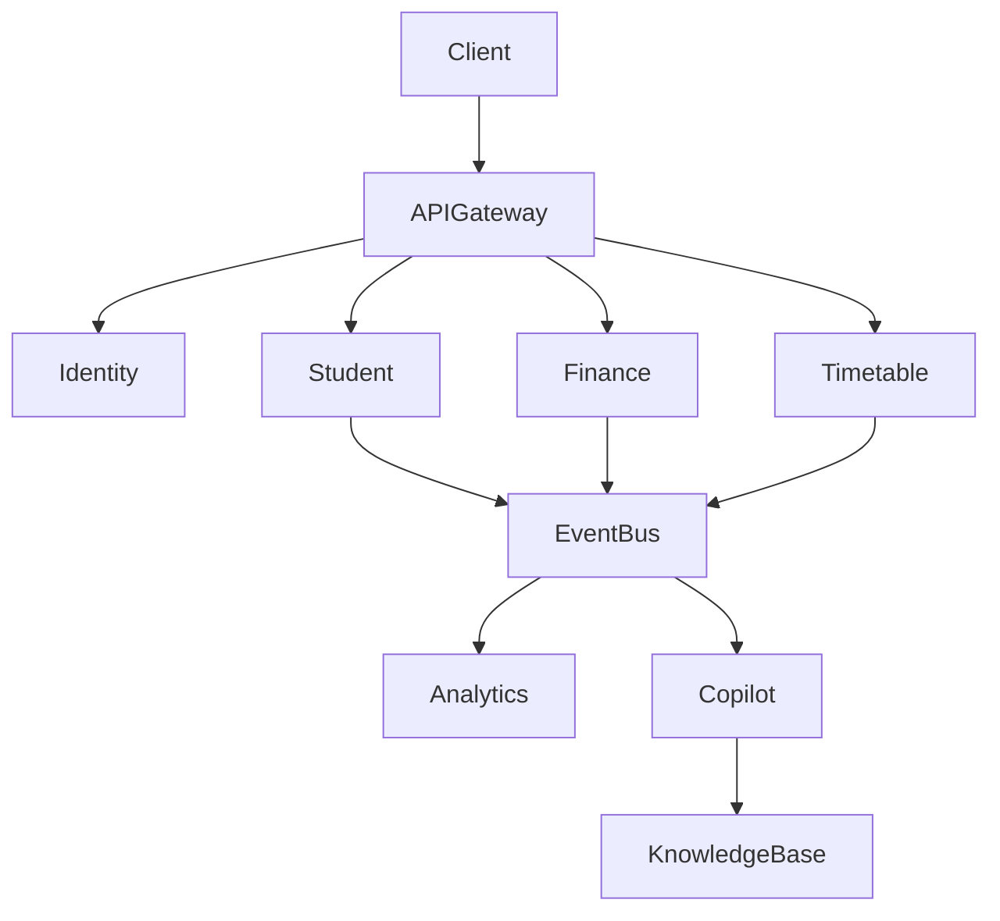

# ARCH-102 — Enterprise Microservices Architecture

> Référentiel officiel de l'architecture microservices de la plateforme **EduWeb Planner**.

---

# Sommaire

1. Vision
2. Objectifs
3. Principes
4. Pourquoi les microservices ?
5. Architecture globale
6. Bounded Contexts
7. Catalogue des microservices
8. Communication inter-services
9. API Gateway
10. Event Bus
11. Service Discovery
12. Configuration centralisée
13. Résilience
14. Transactions distribuées
15. Gestion des données
16. Sécurité
17. Observabilité
18. Scalabilité
19. Déploiement
20. Organisation des équipes
21. API conceptuelle
22. Bonnes pratiques
23. Anti-patterns
24. KPI
25. Gouvernance
26. Règles d'architecture

---

# 1. Vision

EduWeb Planner repose sur une architecture **Cloud Native basée sur les microservices**, afin de permettre :

- une évolution indépendante des domaines métier ;
- une montée en charge progressive ;
- des déploiements fréquents ;
- une résilience élevée ;
- une intégration naturelle avec l'IA.

---

# 2. Objectifs

L'architecture microservices vise à :

- isoler les responsabilités ;
- réduire le couplage ;
- faciliter les évolutions ;
- améliorer la disponibilité ;
- accélérer les développements ;
- permettre le déploiement indépendant des services.

---

# 3. Principes

Chaque microservice :

- possède une responsabilité unique ;
- est propriétaire de ses données ;
- dispose de son API ;
- est versionnable ;
- est déployable indépendamment ;
- est observable.

---

# 4. Pourquoi les microservices ?

Contrairement à une architecture monolithique, les microservices permettent :

| Monolithe | Microservices |
|------------|---------------|
|Déploiement unique|Déploiement indépendant|
|Base de données unique|Base par service|
|Scalabilité globale|Scalabilité ciblée|
|Couplage fort|Couplage faible|
|Évolutions risquées|Évolutions localisées|

---

# 5. Architecture globale

```text
Clients

↓

API Gateway

↓

Microservices

↓

Event Bus

↓

Databases

↓

Analytics

↓

AI Platform
```

---

# 6. Bounded Contexts (DDD)

Chaque domaine métier constitue un **Bounded Context**.

Exemples :

```
Administration

Pédagogie

Vie scolaire

Finance

RH

Examens

Patrimoine

Communication

IA

Business Intelligence
```

Aucun contexte ne partage directement ses modèles internes avec un autre.

---

# 7. Catalogue des microservices

## Administration

- Identity Service
- User Service
- Organization Service
- School Service

---

## Gouvernance

- Decision Service
- Regulation Service
- Workflow Service

---

## Vie scolaire

- Student Service
- Attendance Service
- Discipline Service

---

## Pédagogie

- Timetable Service
- Assessment Service
- Grade Service
- Curriculum Service

---

## Ressources Humaines

- Employee Service
- Leave Service
- Payroll Connector

---

## Finance

- Accounting Service
- Billing Service
- Payment Service
- Budget Service

---

## Communication

- Notification Service
- Email Service
- SMS Service
- Push Service

---

## IA

- Copilot Service
- Agent Orchestrator
- Knowledge Service
- Recommendation Service

---

## Infrastructure

- Search Service
- Audit Service
- Logging Service
- Scheduler
- File Service

---

# 8. Communication inter-services

Deux modes sont utilisés.

## Synchrone

REST

GraphQL

gRPC (si retenu)

Utilisé lorsque la réponse est attendue immédiatement.

---

## Asynchrone

Bus d'événements.

Exemples :

```
StudentCreated

InvoiceValidated

TimetableGenerated

EmployeePromoted

PaymentReceived
```

---

# 9. API Gateway

Toutes les applications clientes passent par une API Gateway.

Fonctions :

- authentification ;
- routage ;
- limitation de débit (*rate limiting*) ;
- journalisation ;
- agrégation de réponses ;
- transformation éventuelle des requêtes.

---

# 10. Event Bus

Tous les événements transitent par un bus.

Exemples de technologies compatibles :

- RabbitMQ
- Apache Kafka
- Azure Service Bus
- NATS

Le choix dépend du contexte de déploiement.

---

# 11. Service Discovery

Le système doit permettre :

- découverte automatique ;
- équilibrage de charge ;
- tolérance aux pannes.

Technologies possibles :

- Kubernetes DNS
- Consul
- Eureka

---

# 12. Configuration centralisée

Chaque service récupère :

- paramètres ;
- secrets ;
- URLs ;
- politiques ;
- clés API.

Aucune valeur sensible n'est codée en dur.

---

# 13. Résilience

Le framework applique les stratégies suivantes.

## Retry

Nouvelle tentative sur erreur temporaire.

---

## Timeout

Arrêt automatique des appels trop longs.

---

## Circuit Breaker

Protection contre les services indisponibles.

---

## Bulkhead

Isolation des ressources.

---

## Fallback

Réponse alternative lorsque cela est pertinent.

---

# 14. Transactions distribuées

Les transactions multi-services privilégient des approches adaptées aux systèmes distribués.

## Saga

Coordination des étapes métier avec compensation si nécessaire.

---

## Outbox Pattern

Publication fiable des événements après validation locale.

---

## Compensation

Annulation logique des traitements déjà exécutés lorsqu'un processus échoue.

Les transactions distribuées de type XA sont évitées.

---

# 15. Gestion des données

Principe fondamental :

> **Database per Service**

Chaque microservice est propriétaire de sa base.

Les échanges passent :

- par API ;
- par événements.

L'accès direct à la base d'un autre service est interdit.

---

# 16. Sécurité

Chaque service applique :

- OAuth2 ;
- OpenID Connect ;
- JWT ;
- contrôle d'accès ;
- chiffrement des communications (TLS).

Les secrets sont stockés dans un gestionnaire sécurisé.

---

# 17. Observabilité

Chaque service expose :

- logs ;
- métriques ;
- traces distribuées ;
- événements.

Outils compatibles :

- Prometheus
- Grafana
- OpenTelemetry
- Jaeger
- ELK / OpenSearch

---

# 18. Scalabilité

Le dimensionnement est horizontal.

Exemple :

```
Timetable Service

↓

1 instance

↓

5 instances

↓

20 instances
```

Chaque service peut évoluer indépendamment.

---

# 19. Déploiement

Pipeline standard :

```text
Git

↓

CI

↓

Tests

↓

Analyse sécurité

↓

Image Docker

↓

Registry

↓

Kubernetes

↓

Monitoring
```

Les mises à jour peuvent être :

- Rolling Update ;
- Blue-Green ;
- Canary.

---

# 20. Organisation des équipes

Chaque équipe est responsable de bout en bout de son domaine.

Responsabilités :

- développement ;
- tests ;
- sécurité ;
- exploitation ;
- documentation ;
- support.

Approche inspirée du principe **"You Build It, You Run It"**.

---

# 21. API conceptuelle

```typescript
EnterprisePlatform {

    IdentityService

    StudentService

    TeacherService

    TimetableService

    FinanceService

    WorkflowService

    SearchService

    CopilotService

    NotificationService

    AuditService

}
```

---

# 22. Bonnes pratiques

✔ Un domaine = un service.

✔ Une base = un service.

✔ API documentées.

✔ Événements versionnés.

✔ Déploiement indépendant.

✔ Surveillance continue.

✔ Automatisation des tests.

---

# 23. Anti-patterns

✘ Base de données partagée entre plusieurs services.

✘ Appels synchrones en cascade excessifs.

✘ Couplage fort entre domaines.

✘ Duplication incontrôlée des modèles métier.

✘ Transactions distribuées bloquantes.

✘ Déploiement simultané obligatoire de plusieurs services.

---

# Diagramme Mermaid



---

# KPI

| KPI | Objectif |
|------|----------|
|Temps moyen de réponse API|< 300 ms (hors traitements complexes)|
|Disponibilité d'un microservice critique|99,95 %|
|Temps moyen de déploiement|< 10 min|
|Couverture de tests automatisés|> 90 %|
|Temps moyen de reprise après incident (MTTR)|< 30 min|

---

# Gouvernance

Chaque microservice possède :

- un propriétaire métier ;
- un responsable technique ;
- une documentation OpenAPI ;
- un contrat d'événements ;
- une politique de versionnement ;
- un plan de supervision.

Toute évolution majeure est revue par le Comité d'Architecture.

---

# Règles d'architecture

## RA-ARCH102-001

Chaque microservice est propriétaire exclusif de ses données et de son schéma de base de données.

---

## RA-ARCH102-002

Les échanges inter-services s'effectuent exclusivement via des API documentées ou des événements métier versionnés.

---

## RA-ARCH102-003

Les microservices doivent pouvoir être développés, testés, déployés et mis à l'échelle indépendamment.

---

## RA-ARCH102-004

Les communications critiques implémentent des mécanismes de résilience adaptés (timeout, retry, circuit breaker, etc.).

---

## RA-ARCH102-005

Chaque microservice expose des informations d'observabilité (logs, métriques et traces) compatibles avec la plateforme de supervision.

---

# Documents liés

- ARCH-101 — Enterprise Architecture Overview
- ARCH-103 — Domain-Driven Design
- ARCH-104 — Event-Driven Architecture
- ARCH-105 — API Architecture
- DEV-001 — Development Standards
- SEC-001 — Enterprise Security Standards
- OPS-001 — Platform Operations

---

# Conclusion

L'architecture microservices d'EduWeb Planner offre un cadre robuste, évolutif et résilient pour le développement de la plateforme. En combinant Domain-Driven Design, communications par API et événements, observabilité avancée et déploiements indépendants, elle favorise une évolution continue des fonctionnalités tout en maintenant un haut niveau de qualité, de sécurité et de disponibilité.

# Fin du document
