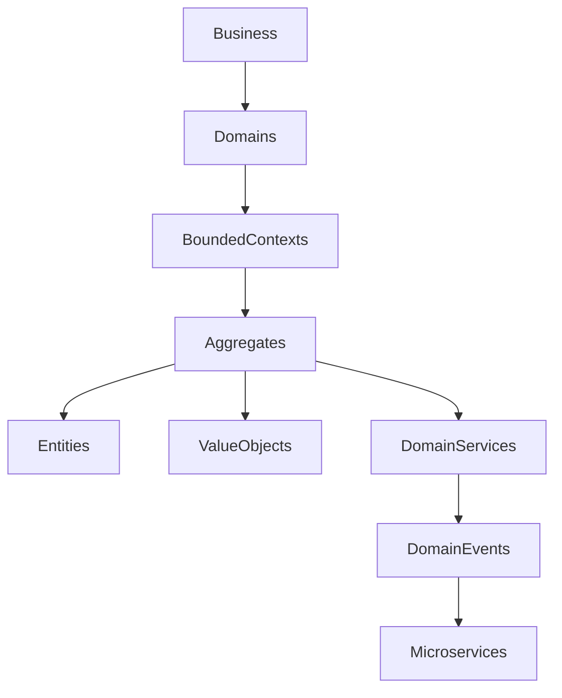

# ARCH-103 — Domain-Driven Design (DDD)

> Référentiel officiel de la conception orientée domaine (DDD) de la plateforme **EduWeb Planner**.

---

# Sommaire

1. Vision
2. Objectifs
3. Principes fondamentaux
4. Architecture DDD
5. Strategic Design
6. Tactical Design
7. Bounded Contexts
8. Context Mapping
9. Ubiquitous Language
10. Domain Model
11. Agrégats
12. Entités
13. Objets Valeur
14. Domain Services
15. Domain Events
16. Repositories
17. Factories
18. Anti-Corruption Layer
19. Intégration avec les microservices
20. Gouvernance
21. API conceptuelle
22. Bonnes pratiques
23. Anti-patterns
24. KPI
25. Règles d'architecture

---

# 1. Vision

EduWeb Planner applique le **Domain-Driven Design (DDD)** afin que l'architecture logicielle reflète fidèlement les métiers de l'éducation.

Le logiciel est construit autour des **processus métiers**, et non autour des technologies.

---

# 2. Objectifs

Le DDD permet de :

- rapprocher les équipes métier et techniques ;
- structurer les domaines fonctionnels ;
- limiter le couplage ;
- améliorer la maintenabilité ;
- faciliter les évolutions réglementaires.

---

# 3. Principes fondamentaux

Le modèle repose sur :

- la compréhension du métier ;
- un langage commun ;
- des domaines indépendants ;
- des responsabilités clairement définies ;
- des règles métier centralisées.

---

# 4. Architecture DDD

```text
Vision Métier

↓

Domaines

↓

Bounded Contexts

↓

Agrégats

↓

Entités

↓

Objets Valeur

↓

Services Domaine

↓

Repositories
```

---

# 5. Strategic Design

Le Strategic Design définit :

- les domaines ;
- les sous-domaines ;
- les limites des responsabilités ;
- les interactions entre domaines.

---

## Classification des domaines

### Core Domain

Le cœur métier.

Exemples :

- Gestion pédagogique
- Génération des emplois du temps
- Gestion scolaire
- Intelligence artificielle pédagogique

---

### Supporting Domains

Fonctions de soutien.

Exemples :

- RH
- Comptabilité
- Documentation

---

### Generic Domains

Fonctions communes.

Exemples :

- Authentification
- Notifications
- Recherche
- Audit

---

# 6. Tactical Design

Le Tactical Design définit :

- Entités
- Agrégats
- Value Objects
- Domain Services
- Repositories
- Domain Events

---

# 7. Bounded Contexts

Chaque contexte possède :

- son vocabulaire ;
- son modèle ;
- ses règles ;
- ses API ;
- ses événements.

---

## Exemple

```
Administration

↓

Utilisateur

Organisation

Établissement
```

---

```
Pédagogie

↓

Cours

Classe

Séance

Progression
```

---

```
Finance

↓

Facture

Paiement

Budget

Écriture
```

---

# 8. Context Mapping

Les contextes communiquent selon des contrats explicites.

Exemple :

```text
Vie scolaire

↓

Enrollment Event

↓

Pédagogie

↓

Création automatique de la classe
```

Relations possibles :

- Customer/Supplier
- Partnership
- Shared Kernel
- Open Host Service
- Published Language
- Conformist
- Anti-Corruption Layer

---

# 9. Ubiquitous Language

Tous les acteurs utilisent les mêmes termes.

Exemple :

Le mot :

```
Classe
```

désigne exactement la même notion :

- développeur ;
- enseignant ;
- inspecteur ;
- administrateur ;
- documentation.

Le glossaire est maintenu de façon centralisée.

---

# 10. Domain Model

Chaque domaine possède son propre modèle.

Exemple :

```
Élève

↓

Inscription

↓

Classe

↓

Bulletin
```

Les modèles internes ne sont jamais exposés directement aux autres domaines.

---

# 11. Agrégats

Les agrégats garantissent la cohérence métier.

Exemple :

```
Bulletin

↓

Notes

↓

Moyennes

↓

Décision
```

Le **Bulletin** est la racine d'agrégat.

Toutes les modifications passent par lui.

---

# 12. Entités

Les entités possèdent :

- une identité ;
- un cycle de vie ;
- des comportements.

Exemples :

- Élève
- Enseignant
- Classe
- Facture
- Paiement
- Employé

---

# 13. Objets Valeur

Les objets valeur ne possèdent pas d'identité.

Exemples :

- Adresse
- Devise
- Coordonnées GPS
- Plage horaire
- Montant
- Note

Ils sont immuables.

---

# 14. Domain Services

Les Domain Services regroupent les traitements ne relevant pas naturellement d'une entité ou d'un objet valeur.

Exemples :

- Génération d'un emploi du temps
- Calcul des moyennes
- Affectation automatique des salles
- Répartition des enseignants

---

# 15. Domain Events

Les événements représentent les faits métiers importants.

Exemples :

```
StudentEnrolled

↓

TimetableGenerated

↓

GradeValidated

↓

InvoicePaid

↓

TeacherAssigned
```

Ils sont immuables et horodatés.

---

# 16. Repositories

Les Repositories assurent l'accès aux agrégats.

Exemple :

```
StudentRepository

GradeRepository

InvoiceRepository
```

Ils masquent les détails de persistance.

---

# 17. Factories

Les Factories créent des objets complexes.

Exemple :

```
BulletinFactory

↓

Bulletin complet

↓

Notes

↓

Moyennes

↓

Décisions
```

---

# 18. Anti-Corruption Layer

Lorsqu'un domaine communique avec un système externe :

```text
ERP externe

↓

ACL

↓

EduWeb Planner
```

L'ACL :

- traduit les données ;
- protège le modèle métier ;
- limite les dépendances.

---

# 19. Intégration avec les microservices

Chaque **Bounded Context** correspond généralement à un microservice ou à un ensemble cohérent de microservices.

```text
Bounded Context

↓

Microservice

↓

API

↓

Events
```

Chaque contexte est propriétaire de son modèle métier.

---

# 20. Gouvernance

Le modèle métier est validé conjointement par :

- experts métier ;
- architectes ;
- responsables fonctionnels ;
- équipes de développement.

Les évolutions sont versionnées et documentées.

---

# 21. API (concept)

```typescript
Domain {

    Entities

    ValueObjects

    Aggregates

    DomainServices

    Repositories

    DomainEvents

    Factories

}
```

---

# 22. Bonnes pratiques

✔ Concevoir à partir du métier.

✔ Maintenir un langage commun.

✔ Limiter les responsabilités de chaque contexte.

✔ Préserver les invariants métier dans les agrégats.

✔ Utiliser des événements métier pour les interactions inter-domaines.

✔ Isoler les systèmes externes via une Anti-Corruption Layer.

---

# 23. Anti-patterns

✘ Modèle de données partagé entre plusieurs domaines.

✘ Langage métier incohérent.

✘ Services contenant des règles métier dispersées.

✘ Entités anémiques sans comportement.

✘ Accès direct aux données d'un autre contexte.

✘ Mélange des responsabilités métier et techniques.

---

# Diagramme Mermaid



---

# KPI

| KPI | Objectif |
|------|----------|
|Couverture des domaines documentés|100 %|
|Utilisation du langage métier commun|100 % des projets|
|Réutilisation des modèles métier|> 90 %|
|Événements métier documentés|100 %|
|Évolutions nécessitant plusieurs domaines|Réduction continue|

---

# Règles d'architecture

## RA-ARCH103-001

Chaque Bounded Context possède un modèle métier indépendant, un vocabulaire propre et une responsabilité clairement définie.

---

## RA-ARCH103-002

Les invariants métier sont protégés par les racines d'agrégats ; aucune modification ne peut les contourner.

---

## RA-ARCH103-003

Les échanges entre contextes utilisent exclusivement des contrats explicites (API, événements ou ACL) sans partage direct des modèles internes.

---

## RA-ARCH103-004

Le langage ubiquitaire est documenté, versionné et partagé entre les équipes métier, fonctionnelles et techniques.

---

## RA-ARCH103-005

Toute évolution du modèle métier est validée par les experts du domaine concerné avant son intégration dans la plateforme.

---

# Documents liés

- ARCH-101 — Enterprise Architecture Overview
- ARCH-102 — Enterprise Microservices Architecture
- ARCH-104 — Event-Driven Architecture
- ARCH-105 — API Architecture
- DDD-001 — Enterprise Glossary
- GOV-001 — Enterprise Governance
- DEV-002 — Coding Standards

---

# Conclusion

Le **Domain-Driven Design** constitue le socle conceptuel d'EduWeb Planner. En structurant l'application autour des métiers de l'éducation, il favorise une architecture cohérente, évolutive et compréhensible, où les modèles métier restent la référence commune entre les experts fonctionnels, les architectes et les équipes de développement. Son articulation avec les microservices, l'architecture événementielle et la gouvernance garantit une plateforme robuste et durable.

# Fin du document
