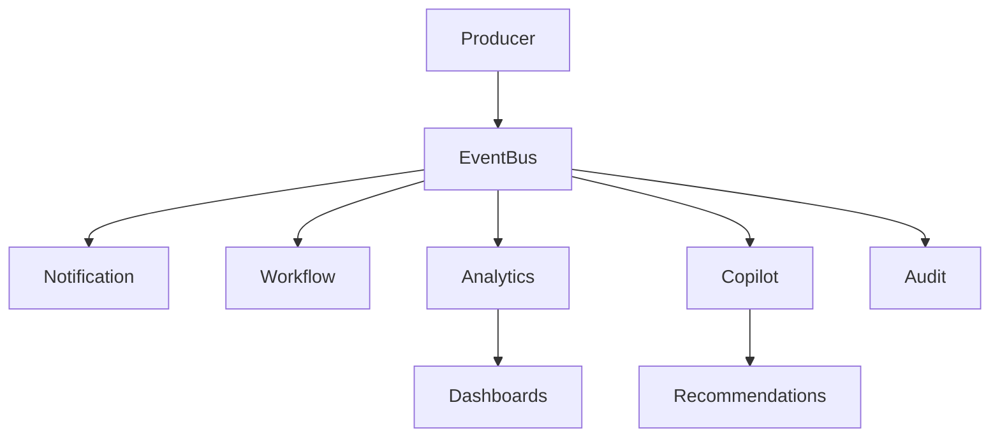

# ARCH-104 — Event-Driven Architecture (EDA)

> Référentiel officiel de l'architecture orientée événements de la plateforme **EduWeb Planner**.

---

# Sommaire

1. Vision
2. Objectifs
3. Principes fondamentaux
4. Pourquoi une architecture événementielle ?
5. Architecture générale
6. Typologie des événements
7. Producteurs d'événements
8. Consommateurs d'événements
9. Event Bus
10. Event Streaming
11. Contrats d'événements
12. Versionnement
13. Event Store
14. Event Sourcing
15. CQRS
16. Fiabilité des messages
17. Transactions distribuées
18. Résilience
19. Observabilité
20. Sécurité
21. Gouvernance
22. API conceptuelle
23. Bonnes pratiques
24. Anti-patterns
25. KPI
26. Règles d'architecture

---

# 1. Vision

L'architecture événementielle permet aux différents domaines d'EduWeb Planner de communiquer **sans dépendances fortes**.

Les événements représentent les faits métiers importants survenus dans la plateforme.

---

# 2. Objectifs

L'EDA vise à :

- découpler les domaines ;
- améliorer la scalabilité ;
- faciliter l'intégration ;
- favoriser les traitements asynchrones ;
- améliorer la résilience ;
- alimenter les tableaux de bord et les analyses IA.

---

# 3. Principes fondamentaux

Les événements sont :

- immuables ;
- horodatés ;
- versionnés ;
- publiés une seule fois ;
- consommés par plusieurs services si nécessaire.

---

# 4. Pourquoi une architecture événementielle ?

Une architecture événementielle permet :

| Communication synchrone | Communication événementielle |
|--------------------------|------------------------------|
| Forte dépendance | Faible couplage |
| Réponse immédiate attendue | Traitement asynchrone |
| Cascade d'appels | Diffusion d'événements |
| Scalabilité limitée | Scalabilité élevée |
| Couplage temporel | Découplage temporel |

---

# 5. Architecture générale

```text
Action utilisateur

↓

Microservice

↓

Event Publisher

↓

Event Bus

↓

Subscribers

↓

Traitements

↓

Analytics

↓

IA
```

---

# 6. Typologie des événements

## Événements métier

Exemples :

- StudentEnrolled
- TeacherAssigned
- TimetableGenerated
- InvoicePaid
- DecisionPublished

---

## Événements techniques

Exemples :

- UserAuthenticated
- CacheInvalidated
- BackupCompleted
- DeploymentFinished

---

## Événements système

Exemples :

- HighCpuUsage
- DatabaseReplicationFailed
- NodeUnavailable

---

# 7. Producteurs d'événements

Les producteurs publient les événements.

Exemples :

- Student Service
- Timetable Service
- Finance Service
- Workflow Service
- HR Service
- Copilot Service

---

# 8. Consommateurs d'événements

Plusieurs consommateurs peuvent traiter le même événement.

Exemple :

```
StudentEnrolled

↓

Notification

↓

Analytics

↓

Reporting

↓

AI

↓

Audit
```

Chaque consommateur est indépendant.

---

# 9. Event Bus

Le bus d'événements assure :

- publication ;
- diffusion ;
- persistance selon la configuration ;
- reprise après incident ;
- routage.

Technologies compatibles :

- Kafka
- RabbitMQ
- Azure Service Bus
- NATS
- Google Pub/Sub

---

# 10. Event Streaming

Les événements peuvent être traités en continu.

Exemples :

- statistiques temps réel ;
- suivi des présences ;
- indicateurs financiers ;
- supervision des workflows.

---

# 11. Contrats d'événements

Chaque événement possède un contrat documenté.

Exemple :

```json
{
  "eventId": "...",
  "eventType": "StudentEnrolled",
  "version": "1.0",
  "timestamp": "...",
  "schoolId": "...",
  "studentId": "...",
  "classId": "..."
}
```

Les consommateurs ne doivent dépendre que du contrat publié.

---

# 12. Versionnement

Les événements sont versionnés.

```
StudentEnrolled

↓

v1

↓

v2

↓

v3
```

Les évolutions doivent préserver la compatibilité lorsque cela est possible.

---

# 13. Event Store

Selon les besoins, les événements peuvent être conservés dans un **Event Store** afin de :

- rejouer des traitements ;
- reconstruire des états ;
- auditer les opérations.

La durée de conservation dépend des politiques de gouvernance.

---

# 14. Event Sourcing

Pour certains domaines critiques, l'état peut être reconstruit à partir de la séquence des événements.

Exemple :

```
Compte Budget

↓

BudgetCreated

↓

BudgetUpdated

↓

BudgetValidated

↓

BudgetClosed
```

Cette approche n'est appliquée qu'aux domaines où elle apporte une réelle valeur.

---

# 15. CQRS

Le framework prend en charge le modèle **Command Query Responsibility Segregation**.

```text
Command

↓

Validation

↓

Event

↓

Projection

↓

Read Model
```

Les modèles de lecture et d'écriture peuvent évoluer indépendamment.

---

# 16. Fiabilité des messages

Garanties recherchées :

- livraison fiable ;
- reprise après panne ;
- idempotence des consommateurs ;
- détection des doublons.

La stratégie exacte de livraison dépend de l'infrastructure choisie.

---

# 17. Transactions distribuées

Les transactions réparties utilisent :

- Saga Pattern ;
- Outbox Pattern ;
- événements compensatoires.

Les transactions distribuées bloquantes sont évitées.

---

# 18. Résilience

Le système prévoit :

- Retry ;
- Dead Letter Queue (DLQ) ;
- Circuit Breaker ;
- Reprise automatique ;
- Supervision des files.

---

# 19. Observabilité

Chaque événement est traçable.

Informations minimales :

- identifiant ;
- producteur ;
- consommateur ;
- horodatage ;
- durée de traitement ;
- statut.

Les métriques alimentent les outils de supervision.

---

# 20. Sécurité

Les événements :

- respectent les autorisations d'accès ;
- sont transmis via des canaux sécurisés ;
- peuvent être chiffrés selon leur niveau de sensibilité ;
- sont journalisés.

Les données sensibles sont limitées au strict nécessaire.

---

# 21. Gouvernance

Chaque type d'événement possède :

- un propriétaire métier ;
- une documentation ;
- un contrat ;
- une politique de versionnement ;
- une durée de conservation.

Un catalogue des événements est maintenu à l'échelle de la plateforme.

---

# 22. API (concept)

```typescript
EnterpriseEvents {

    publish()

    subscribe()

    replay()

    acknowledge()

    compensate()

    project()

    archive()

}
```

---

# 23. Bonnes pratiques

✔ Publier uniquement des faits métiers.

✔ Utiliser des noms explicites.

✔ Rendre les consommateurs idempotents.

✔ Documenter tous les contrats.

✔ Prévoir le versionnement dès la conception.

✔ Surveiller les files et les délais de traitement.

---

# 24. Anti-patterns

✘ Modifier un événement après sa publication.

✘ Publier des événements techniques comme événements métier.

✘ Partager des objets internes au lieu de contrats.

✘ Créer des dépendances directes entre producteurs et consommateurs.

✘ Ignorer les événements en erreur sans mécanisme de reprise.

---

# Diagramme Mermaid



---

# KPI

| KPI | Objectif |
|------|----------|
|Temps moyen de publication|< 100 ms|
|Temps moyen de consommation|< 500 ms (hors traitements lourds)|
|Messages perdus|0|
|Consommateurs idempotents|100 % des consommateurs concernés|
|Disponibilité du bus d'événements|99,95 %|

---

# Règles d'architecture

## RA-ARCH104-001

Tout événement métier est immuable après sa publication.

---

## RA-ARCH104-002

Chaque événement possède un contrat versionné, documenté et validé avant sa mise en production.

---

## RA-ARCH104-003

Les consommateurs doivent être conçus pour tolérer les duplications de messages lorsque le mode de livraison le nécessite.

---

## RA-ARCH104-004

Les échanges inter-domaines privilégient les événements métier plutôt que les appels synchrones lorsque les traitements ne nécessitent pas une réponse immédiate.

---

## RA-ARCH104-005

Les événements critiques sont journalisés et conservés conformément aux politiques d'audit et de gouvernance documentaire.

---

# Documents liés

- ARCH-101 — Enterprise Architecture Overview
- ARCH-102 — Enterprise Microservices Architecture
- ARCH-103 — Domain-Driven Design
- ARCH-105 — API Architecture
- ARCH-106 — Integration Architecture
- DATA-001 — Data Architecture
- OPS-002 — Event Platform Operations

---

# Conclusion

L'**Event-Driven Architecture** constitue l'un des piliers techniques d'EduWeb Planner. En favorisant des échanges asynchrones, découplés et évolutifs entre les domaines métiers, elle améliore la résilience, la scalabilité et la réactivité de la plateforme. Associée au Domain-Driven Design, aux microservices et à une gouvernance rigoureuse des événements, elle permet de bâtir un système robuste, capable d'évoluer avec les besoins des établissements, des administrations éducatives et des services d'intelligence artificielle.

# Fin du document
