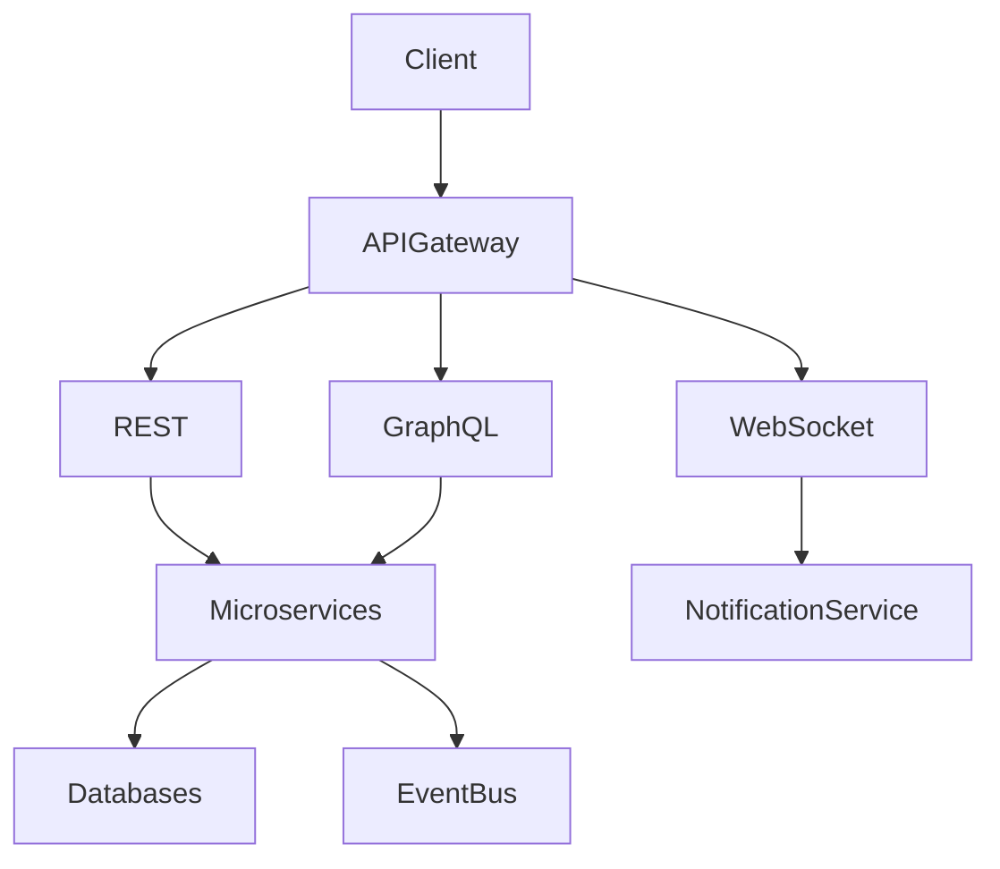

# ARCH-105 — Enterprise API Architecture

> Référentiel officiel de l'architecture des API d'EduWeb Planner.

---

# Sommaire

1. Vision
2. Objectifs
3. Principes
4. API-First Strategy
5. Architecture globale
6. Typologie des API
7. REST Architecture
8. GraphQL
9. WebSockets
10. API Gateway
11. API Versioning
12. API Contracts
13. Authentication
14. Authorization
15. Rate Limiting
16. Idempotence
17. Pagination
18. Filtering
19. Sorting
20. Searching
21. Error Management
22. API Documentation
23. API Lifecycle
24. Monitoring
25. Governance
26. API Concept Model
27. Best Practices
28. Anti-patterns
29. KPI
30. Architecture Rules

---

# 1. Vision

Toutes les fonctionnalités d'EduWeb Planner sont accessibles par des **API standardisées**.

Les API constituent la couche officielle d'intégration entre :

- les applications Web ;
- les applications mobiles ;
- les microservices ;
- les plateformes partenaires ;
- les agents IA ;
- les systèmes institutionnels.

---

# 2. Objectifs

Cette architecture vise à :

- favoriser l'interopérabilité ;
- simplifier les intégrations ;
- réduire le couplage ;
- améliorer la réutilisation ;
- garantir la sécurité ;
- faciliter les évolutions.

---

# 3. Principes

Toutes les API sont :

- documentées ;
- versionnées ;
- sécurisées ;
- testées ;
- observables ;
- gouvernées.

---

# 4. API-First Strategy

Les API sont conçues **avant** les interfaces utilisateur.

Ordre recommandé :

```
Modèle métier

↓

Contrat API

↓

Documentation

↓

Développement

↓

Tests

↓

Frontend
```

---

# 5. Architecture globale

```text
Applications

↓

API Gateway

↓

REST

GraphQL

WebSocket

↓

Microservices

↓

Databases
```

---

# 6. Typologie des API

## API REST

Pour les traitements standards.

---

## API GraphQL

Pour les interfaces riches.

---

## API Streaming

Temps réel.

---

## API WebSocket

Notifications instantanées.

---

## API IA

Dialogue avec les agents IA.

---

## API Publiques

Destinées aux partenaires.

---

## API Internes

Réservées aux composants EduWeb.

---

# 7. REST Architecture

Les API REST suivent les conventions HTTP.

Exemple :

```
GET

POST

PUT

PATCH

DELETE
```

Convention d'URL :

```
/api/v1/students

/api/v1/classes

/api/v1/timetables
```

---

# 8. GraphQL

GraphQL est utilisé lorsque le client souhaite contrôler précisément les données retournées.

Exemple :

```graphql
query {

 student {

   id

   fullName

   class

   attendance

 }

}
```

---

# 9. WebSockets

Utilisés pour :

- notifications ;
- génération des emplois du temps ;
- tableaux de bord ;
- chat ;
- IA conversationnelle.

---

# 10. API Gateway

Fonctions :

- authentification ;
- routage ;
- limitation de débit ;
- agrégation ;
- journalisation ;
- sécurité ;
- observabilité.

Toutes les requêtes externes transitent par la passerelle.

---

# 11. API Versioning

Convention :

```
v1

v2

v3
```

Exemple :

```
/api/v1/students
```

Les anciennes versions sont maintenues pendant une période définie afin de faciliter les migrations.

---

# 12. API Contracts

Chaque API possède :

- OpenAPI ;
- exemples ;
- schémas ;
- contraintes ;
- codes d'erreur ;
- politique de versionnement.

Les contrats sont considérés comme des engagements envers les consommateurs.

---

# 13. Authentication

Méthodes compatibles :

- OAuth2 ;
- OpenID Connect ;
- JWT ;
- MFA (selon les cas).

Aucune API protégée n'est accessible sans authentification valide.

---

# 14. Authorization

Le contrôle d'accès repose sur :

- rôles ;
- permissions ;
- organisation ;
- établissement ;
- domaine ;
- politiques d'autorisation.

---

# 15. Rate Limiting

Exemple :

```
100 requêtes/minute

↓

Utilisateur
```

Les limites peuvent varier selon :

- le profil ;
- le type d'application ;
- l'environnement.

---

# 16. Idempotence

Les opérations critiques de création ou de paiement peuvent utiliser une clé d'idempotence afin d'éviter les traitements dupliqués.

Exemple :

```
POST Payment

↓

Idempotency-Key

↓

Traitement unique
```

---

# 17. Pagination

Convention :

```
?page=2

&pageSize=50
```

Les collections volumineuses doivent être paginées.

---

# 18. Filtering

Exemple :

```
?status=ACTIVE

?schoolId=25

?year=2027
```

Les filtres sont documentés pour chaque ressource.

---

# 19. Sorting

Convention :

```
?sort=name

?sort=-createdDate
```

Le signe **-** indique un tri décroissant.

---

# 20. Searching

Exemple :

```
?q=mathematics
```

Les recherches peuvent être enrichies par le moteur de recherche sémantique de la plateforme.

---

# 21. Error Management

Format recommandé :

```json
{
  "code":"STUDENT_NOT_FOUND",
  "message":"Student not found.",
  "correlationId":"..."
}
```

Chaque erreur comprend :

- un code stable ;
- un message compréhensible ;
- un identifiant de corrélation.

---

# 22. API Documentation

Documentation générée automatiquement.

Contenu :

- OpenAPI 3.x ;
- exemples ;
- schémas JSON ;
- scénarios ;
- politiques de sécurité ;
- historique des versions.

---

# 23. API Lifecycle

```text
Design

↓

Review

↓

Development

↓

Tests

↓

Publication

↓

Monitoring

↓

Deprecation

↓

Retirement
```

Chaque étape est validée selon les procédures de gouvernance.

---

# 24. Monitoring

Les API exposent :

- temps de réponse ;
- taux d'erreur ;
- disponibilité ;
- volume ;
- consommation.

Toutes les métriques sont centralisées.

---

# 25. Governance

Chaque API possède :

- un propriétaire ;
- une documentation ;
- une politique de sécurité ;
- une stratégie de versionnement ;
- des tests automatisés.

Le catalogue des API est administré à l'échelle de la plateforme.

---

# 26. API Concept Model

```typescript
EnterpriseApi {

    Rest

    GraphQL

    WebSocket

    Authentication

    Authorization

    Documentation

    Monitoring

    Versioning

}
```

---

# 27. Best Practices

✔ Concevoir les API avant les interfaces.

✔ Utiliser des ressources clairement nommées.

✔ Respecter les conventions HTTP.

✔ Maintenir des contrats stables.

✔ Prévoir la rétrocompatibilité.

✔ Publier une documentation complète.

✔ Ajouter des exemples d'utilisation.

---

# 28. Anti-patterns

✘ API sans documentation.

✘ Rupture de compatibilité sans version.

✘ URLs orientées actions plutôt que ressources.

✘ Réponses incohérentes entre services.

✘ Messages d'erreur imprécis.

✘ Exposition de modèles internes.

---

# Diagramme Mermaid



---

# KPI

| KPI | Objectif |
|------|----------|
|Disponibilité des API|99,95 %|
|Temps moyen de réponse|< 300 ms (hors traitements lourds)|
|Couverture OpenAPI|100 %|
|Tests automatisés|> 90 %|
|Compatibilité ascendante|100 % pendant la période de support définie|

---

# Règles d'architecture

## RA-ARCH105-001

Toute nouvelle fonctionnalité exposée aux applications ou aux partenaires doit disposer d'un contrat API documenté avant sa mise en production.

---

## RA-ARCH105-002

Les API publiques et internes sont versionnées et suivent une politique de dépréciation documentée afin de limiter les ruptures de compatibilité.

---

## RA-ARCH105-003

Les API protégées exigent une authentification et une autorisation conformes aux politiques de sécurité de la plateforme.

---

## RA-ARCH105-004

Les réponses d'API utilisent des formats cohérents, des codes d'erreur normalisés et un identifiant de corrélation pour faciliter le diagnostic.

---

## RA-ARCH105-005

Les API sont supervisées en continu et leurs performances, erreurs et disponibilités sont intégrées au système central d'observabilité.

---

# Documents liés

- ARCH-101 — Enterprise Architecture Overview
- ARCH-102 — Enterprise Microservices Architecture
- ARCH-103 — Domain-Driven Design
- ARCH-104 — Event-Driven Architecture
- ARCH-106 — Integration Architecture
- SEC-001 — Enterprise Security Standards
- DEV-003 — API Development Standards
- OPS-003 — API Operations Guide

---

# Conclusion

L'architecture **API-First** d'EduWeb Planner constitue le socle de communication entre les applications, les microservices, les partenaires et les services d'intelligence artificielle. En s'appuyant sur des contrats normalisés, une gouvernance rigoureuse, une sécurité intégrée et une documentation exhaustive, elle garantit une interopérabilité durable, une évolution maîtrisée et une expérience de développement cohérente à l'échelle de l'ensemble de la plateforme.

# Fin du document
