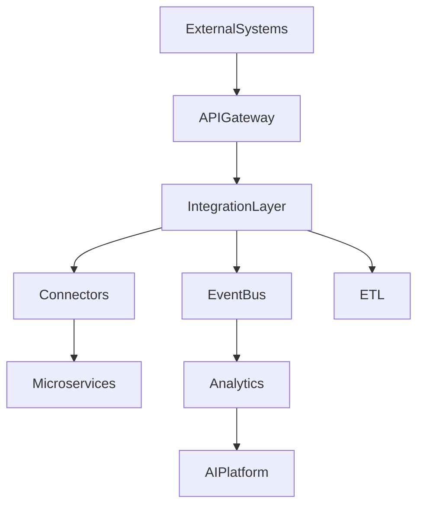

# ARCH-106 — Enterprise Integration Architecture

> Référentiel officiel de l'architecture d'intégration de la plateforme **EduWeb Planner**.

---

# Sommaire

1. Vision
2. Objectifs
3. Principes d'intégration
4. Architecture globale
5. Typologie des intégrations
6. Architecture API
7. Architecture événementielle
8. Enterprise Service Bus
9. Connecteurs
10. Synchronisation des données
11. ETL / ELT
12. Intégration temps réel
13. Intégration différée
14. Gestion des fichiers
15. Intégration documentaire
16. Intégration IA
17. Intégration avec les SI partenaires
18. Résilience
19. Sécurité
20. Observabilité
21. Gouvernance
22. API conceptuelle
23. Bonnes pratiques
24. Anti-patterns
25. KPI
26. Règles d'architecture

---

# 1. Vision

EduWeb Planner est conçu comme une **plateforme ouverte**, capable de communiquer avec les systèmes d'information des établissements, des ministères, des partenaires techniques et des services d'intelligence artificielle.

L'architecture d'intégration privilégie des standards ouverts afin de faciliter l'interopérabilité et l'évolution du système.

---

# 2. Objectifs

Les objectifs sont :

- assurer l'interopérabilité ;
- éviter les doubles saisies ;
- automatiser les échanges ;
- garantir la cohérence des données ;
- faciliter l'intégration de nouveaux partenaires.

---

# 3. Principes d'intégration

Toute intégration doit être :

- sécurisée ;
- documentée ;
- versionnée ;
- traçable ;
- testable ;
- réversible lorsque cela est applicable.

---

# 4. Architecture globale

```text
Applications externes

↓

API Gateway

↓

Integration Layer

↓

Microservices

↓

Event Bus

↓

Databases

↓

Analytics

↓

AI Platform
```

---

# 5. Typologie des intégrations

## Synchrones

- REST
- GraphQL
- gRPC (si utilisé)

---

## Asynchrones

- Bus d'événements
- Files de messages
- Streaming

---

## Batch

- ETL
- ELT
- Import/Export

---

## Temps réel

- WebSocket
- Server-Sent Events (SSE)
- Streaming d'événements

---

# 6. Architecture API

Les API constituent le mode d'intégration privilégié.

Les contrats sont décrits via :

- OpenAPI ;
- GraphQL Schema ;
- AsyncAPI (pour les événements).

---

# 7. Architecture événementielle

Les traitements asynchrones utilisent des événements métier.

Exemple :

```
StudentCreated

↓

Notification

↓

Reporting

↓

Business Intelligence

↓

IA
```

---

# 8. Enterprise Service Bus (ESB)

Lorsque nécessaire, un bus d'intégration permet :

- le routage ;
- la transformation ;
- l'orchestration ;
- la médiation ;
- la journalisation.

L'utilisation d'un ESB est optionnelle selon l'architecture cible et les besoins d'intégration.

---

# 9. Connecteurs

La plateforme peut proposer des connecteurs vers :

## Éducation

- LMS
- ENT
- Bibliothèques numériques
- Plateformes d'examen

---

## Finance

- banques ;
- solutions de paiement ;
- ERP financiers.

---

## Communication

- SMS ;
- e-mail ;
- messagerie instantanée ;
- visioconférence.

---

## Administration

- annuaires ;
- systèmes RH ;
- systèmes documentaires.

---

## IA

- fournisseurs de modèles ;
- moteurs de recherche vectorielle ;
- outils d'orchestration d'agents.

---

# 10. Synchronisation des données

Modes disponibles :

- temps réel ;
- quasi temps réel ;
- périodique ;
- manuelle.

Les règles de synchronisation sont documentées pour chaque intégration.

---

# 11. ETL / ELT

Les traitements de données permettent :

- extraction ;
- validation ;
- transformation ;
- chargement.

Sources possibles :

- CSV ;
- Excel ;
- XML ;
- JSON ;
- bases de données ;
- API.

---

# 12. Intégration temps réel

Cas d'usage :

- présences ;
- emplois du temps ;
- tableaux de bord ;
- notifications ;
- supervision.

Les mécanismes retenus dépendent des exigences de latence.

---

# 13. Intégration différée

Traitements planifiés :

- imports nocturnes ;
- consolidations ;
- archivages ;
- synchronisations massives.

Les exécutions sont supervisées et historisées.

---

# 14. Gestion des fichiers

Formats pris en charge :

- PDF ;
- DOCX ;
- XLSX ;
- CSV ;
- XML ;
- JSON ;
- images ;
- archives compressées.

Chaque fichier est soumis à des contrôles de sécurité avant traitement.

---

# 15. Intégration documentaire

Fonctionnalités :

- GED ;
- OCR ;
- signatures électroniques ;
- versionnement ;
- archivage.

Les documents peuvent être échangés avec des systèmes externes via des API ou des connecteurs dédiés.

---

# 16. Intégration IA

L'architecture prend en charge :

- modèles de langage ;
- moteurs RAG ;
- bases vectorielles ;
- agents spécialisés ;
- moteurs de recommandation.

Les services IA sont consommés via des interfaces standardisées.

---

# 17. Intégration avec les SI partenaires

Exemples :

- Ministère de l'Éducation ;
- Ministère de l'Enseignement Supérieur ;
- établissements scolaires ;
- universités ;
- collectivités ;
- partenaires internationaux.

Les échanges reposent sur des conventions d'intégration validées entre les parties.

---

# 18. Résilience

Les mécanismes suivants sont disponibles :

- Retry ;
- Circuit Breaker ;
- Timeout ;
- Dead Letter Queue ;
- reprise automatique ;
- compensation.

Les stratégies sont adaptées au niveau de criticité des échanges.

---

# 19. Sécurité

Toutes les intégrations appliquent :

- TLS ;
- OAuth2/OpenID Connect lorsque pertinent ;
- contrôle d'accès ;
- chiffrement des données sensibles ;
- validation des entrées ;
- journalisation.

---

# 20. Observabilité

Les flux d'intégration sont supervisés.

Informations disponibles :

- statut ;
- temps de traitement ;
- erreurs ;
- volume ;
- taux de réussite.

Des tableaux de bord permettent de suivre la santé des intégrations.

---

# 21. Gouvernance

Chaque intégration possède :

- un propriétaire métier ;
- un responsable technique ;
- une documentation ;
- un contrat ;
- une politique de versionnement ;
- un plan de supervision.

Le catalogue des intégrations est maintenu à l'échelle de la plateforme.

---

# 22. API conceptuelle

```typescript
EnterpriseIntegration {

    ApiGateway

    Connectors

    EventBus

    ETL

    FileExchange

    DocumentExchange

    AIConnectors

    Monitoring

}
```

---

# 23. Bonnes pratiques

✔ Privilégier les standards ouverts.

✔ Concevoir des interfaces faiblement couplées.

✔ Versionner tous les contrats.

✔ Automatiser les tests d'intégration.

✔ Journaliser tous les échanges critiques.

✔ Prévoir des mécanismes de reprise après incident.

---

# 24. Anti-patterns

✘ Intégration par accès direct aux bases de données partenaires.

✘ Formats propriétaires non documentés.

✘ Contrats implicites.

✘ Absence de supervision.

✘ Synchronisations manuelles non maîtrisées.

✘ Couplage fort entre applications.

---

# Diagramme Mermaid



---

# KPI

| KPI | Objectif |
|------|----------|
|Disponibilité des intégrations|99,95 %|
|Taux de réussite des synchronisations|> 99 %|
|Temps moyen d'intégration temps réel|< 2 s|
|Contrats documentés|100 %|
|Intégrations supervisées|100 %|

---

# Règles d'architecture

## RA-ARCH106-001

Toute intégration externe est réalisée via une interface documentée (API, événements, connecteur ou échange de fichiers sécurisé).

---

## RA-ARCH106-002

Les contrats d'intégration sont versionnés, testés et validés avant leur mise en production.

---

## RA-ARCH106-003

Les échanges critiques disposent de mécanismes de reprise, de journalisation et de supervision.

---

## RA-ARCH106-004

Les données échangées sont limitées au strict nécessaire et protégées conformément aux politiques de sécurité et de confidentialité.

---

## RA-ARCH106-005

Chaque intégration possède un propriétaire métier, un responsable technique et une documentation maintenue à jour.

---

# Documents liés

- ARCH-101 — Enterprise Architecture Overview
- ARCH-102 — Enterprise Microservices Architecture
- ARCH-103 — Domain-Driven Design
- ARCH-104 — Event-Driven Architecture
- ARCH-105 — API Architecture
- ARCH-107 — AI & Multi-Agent Architecture
- SEC-001 — Enterprise Security Standards
- DATA-002 — Enterprise Data Exchange Standards

---

# Conclusion

L'**Enterprise Integration Architecture** fournit un cadre unifié pour tous les échanges entre EduWeb Planner et son écosystème. En combinant API, événements, connecteurs, traitements ETL et mécanismes de résilience, elle garantit une interopérabilité durable, une gouvernance maîtrisée et une intégration sécurisée avec les systèmes d'information éducatifs, administratifs et technologiques.

# Fin du document
