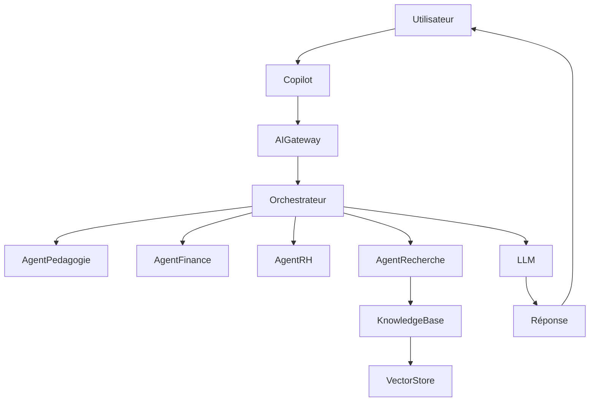

# ARCH-107 — Enterprise AI & Multi-Agent Architecture

> Référentiel officiel de l'architecture d'intelligence artificielle et des systèmes multi-agents d'**EduWeb Planner**.

---

# Sommaire

1. Vision
2. Objectifs
3. Principes d'architecture IA
4. Architecture globale
5. Couche LLM
6. Couche Orchestrateur
7. Architecture Multi-Agent
8. Typologie des agents
9. Mémoire
10. Base de connaissances (Knowledge Base)
11. RAG (Retrieval-Augmented Generation)
12. Vector Database
13. Outils (Tools)
14. Raisonnement
15. Planification
16. Exécution
17. Sécurité
18. Observabilité
19. Gouvernance
20. Évaluation
21. API conceptuelle
22. Bonnes pratiques
23. Anti-patterns
24. KPI
25. Règles d'architecture

---

# 1. Vision

EduWeb Planner intègre une **plateforme IA native**, capable d'assister l'ensemble des utilisateurs grâce à un **écosystème de Copilots et d'agents spécialisés**.

L'intelligence artificielle intervient comme un **assistant**, jamais comme un substitut aux décisions humaines.

---

# 2. Objectifs

L'architecture IA vise à :

- assister les utilisateurs ;
- automatiser les tâches répétitives ;
- améliorer la recherche documentaire ;
- accélérer les traitements ;
- produire des analyses avancées ;
- proposer des recommandations contextualisées.

---

# 3. Principes d'architecture IA

Toute l'architecture repose sur les principes suivants :

- Human-in-the-Loop ;
- Explainable AI ;
- AI by Design ;
- Security by Design ;
- Privacy by Design ;
- Modularité ;
- Observabilité.

---

# 4. Architecture globale

```text
Utilisateur

↓

Copilot EduWeb

↓

AI Gateway

↓

Agent Orchestrator

↓

Specialized Agents

↓

Tools

↓

Knowledge Base

↓

LLM

↓

Enterprise Data
```

---

# 5. Couche LLM

Le système peut fonctionner avec un ou plusieurs modèles de langage.

Exemples compatibles :

- GPT
- Claude
- Gemini
- Mistral
- Llama
- modèles privés

Le choix du modèle dépend :

- du coût ;
- des performances ;
- des contraintes réglementaires ;
- des exigences de confidentialité.

---

# 6. Couche Orchestrateur

L'orchestrateur est responsable de :

- comprendre la demande ;
- sélectionner les agents ;
- distribuer les tâches ;
- fusionner les résultats ;
- retourner la réponse.

Il constitue le cœur de l'architecture IA.

---

# 7. Architecture Multi-Agent

```text
Copilot

↓

Orchestrateur

↓

Agent RH

Agent Finance

Agent Pédagogie

Agent Juridique

Agent Recherche

Agent BI

↓

Fusion

↓

Réponse
```

Chaque agent possède :

- son domaine ;
- ses outils ;
- ses règles ;
- sa mémoire opérationnelle.

---

# 8. Typologie des agents

## Agent Pédagogie

- emplois du temps ;
- progressions ;
- évaluations ;
- bulletins.

---

## Agent Gouvernance

- décisions ;
- arrêtés ;
- procédures ;
- règlements.

---

## Agent RH

- carrières ;
- congés ;
- affectations ;
- promotions.

---

## Agent Finance

- budgets ;
- comptabilité ;
- paiements ;
- dépenses.

---

## Agent Recherche

- moteur documentaire ;
- recherche réglementaire ;
- synthèses.

---

## Agent Business Intelligence

- indicateurs ;
- tendances ;
- tableaux de bord ;
- simulations.

---

## Agent Qualité

- conformité ;
- audits ;
- indicateurs qualité.

---

## Agent Sécurité

- surveillance ;
- détection d'anomalies ;
- recommandations.

---

# 9. Mémoire

L'architecture distingue plusieurs niveaux de mémoire.

## Mémoire de session

Contexte de la conversation en cours.

---

## Mémoire de travail

Informations utiles pendant une tâche complexe.

---

## Mémoire organisationnelle

Connaissances institutionnelles validées.

---

## Mémoire documentaire

Documents indexés.

---

## Mémoire vectorielle

Embeddings utilisés par le RAG.

---

# 10. Base de connaissances

La Knowledge Base regroupe :

- procédures ;
- guides ;
- lois ;
- règlements ;
- FAQ ;
- documents métiers ;
- référentiels.

Les contenus sont versionnés et gouvernés.

---

# 11. RAG (Retrieval-Augmented Generation)

Le RAG permet :

```text
Question

↓

Recherche documentaire

↓

Documents pertinents

↓

LLM

↓

Réponse contextualisée
```

Les réponses s'appuient sur les sources disponibles plutôt que sur les seules connaissances générales du modèle.

---

# 12. Vector Database

La base vectorielle stocke :

- embeddings ;
- documents ;
- index sémantiques.

Technologies compatibles :

- pgvector
- Pinecone
- Weaviate
- Milvus
- Qdrant

Le choix dépend des exigences techniques et opérationnelles.

---

# 13. Outils (Tools)

Les agents peuvent utiliser des outils spécialisés.

Exemples :

- moteur de recherche ;
- calculateur ;
- OCR ;
- génération de documents ;
- API métier ;
- moteur statistique ;
- calendrier ;
- système de workflow.

Chaque outil est accessible selon les droits de l'utilisateur.

---

# 14. Raisonnement

Le raisonnement comprend :

- compréhension ;
- planification ;
- exécution ;
- validation ;
- synthèse.

Les mécanismes internes peuvent varier selon les modèles employés.

---

# 15. Planification

Avant d'exécuter une tâche complexe :

```text
Objectif

↓

Sous-tâches

↓

Ordonnancement

↓

Exécution
```

L'orchestrateur optimise la séquence des actions.

---

# 16. Exécution

L'orchestrateur :

- appelle les agents ;
- récupère les résultats ;
- détecte les incohérences ;
- consolide la réponse.

Les traitements peuvent être parallélisés lorsque cela est pertinent.

---

# 17. Sécurité

Les composants IA appliquent :

- authentification ;
- contrôle d'accès ;
- chiffrement ;
- journalisation ;
- filtrage des données ;
- protection contre les usages abusifs.

Les politiques de sécurité sont cohérentes avec celles de l'ensemble de la plateforme.

---

# 18. Observabilité

Chaque interaction IA est suivie.

Indicateurs disponibles :

- temps de réponse ;
- agent utilisé ;
- outils appelés ;
- taux de réussite ;
- erreurs ;
- niveau de confiance.

---

# 19. Gouvernance

Le Comité IA supervise :

- modèles ;
- agents ;
- prompts système ;
- connaissances ;
- sécurité ;
- conformité.

Les évolutions importantes font l'objet d'une revue avant déploiement.

---

# 20. Évaluation

Les agents sont évalués selon :

- pertinence ;
- exactitude ;
- robustesse ;
- temps de réponse ;
- satisfaction utilisateur.

Les campagnes d'évaluation sont réalisées régulièrement.

---

# 21. API conceptuelle

```typescript
EnterpriseAIPlatform {

    Copilot

    AgentOrchestrator

    SpecializedAgents

    KnowledgeBase

    VectorStore

    Tools

    PromptManager

    Evaluation

    Monitoring

}
```

---

# 22. Bonnes pratiques

✔ Limiter chaque agent à un domaine métier.

✔ Séparer orchestration et exécution.

✔ Utiliser le RAG pour les connaissances institutionnelles.

✔ Documenter les outils disponibles.

✔ Journaliser toutes les opérations sensibles.

✔ Maintenir une gouvernance des prompts et des connaissances.

---

# 23. Anti-patterns

✘ Un agent unique responsable de tous les métiers.

✘ Réponses sans contexte documentaire lorsque celui-ci est disponible.

✘ Absence de validation humaine pour les décisions sensibles.

✘ Mélange des responsabilités entre agents.

✘ Base de connaissances non versionnée.

✘ Utilisation de données non autorisées.

---

# Diagramme Mermaid



---

# KPI

| KPI | Objectif |
|------|----------|
|Temps moyen de réponse IA|< 3 s (hors traitements complexes)|
|Pertinence des réponses|> 90 %|
|Utilisation de sources documentaires pour les réponses institutionnelles|100 % lorsque disponibles|
|Disponibilité des services IA|99,9 %|
|Traçabilité des interactions IA|100 %|

---

# Règles d'architecture

## RA-ARCH107-001

Toute réponse produite par un agent métier utilisant des connaissances institutionnelles s'appuie sur la base documentaire validée lorsque celle-ci est disponible.

---

## RA-ARCH107-002

Les agents spécialisés n'accèdent qu'aux données autorisées pour le contexte et le profil de l'utilisateur.

---

## RA-ARCH107-003

L'orchestrateur est responsable de la coordination des agents et de la consolidation des résultats ; les agents ne communiquent pas directement entre eux sans mécanisme d'orchestration prévu.

---

## RA-ARCH107-004

Les bases de connaissances, les prompts système et les outils font l'objet d'une gouvernance, d'un versionnement et d'une procédure de validation.

---

## RA-ARCH107-005

Les interactions IA sensibles sont journalisées afin de garantir la traçabilité, l'auditabilité et l'amélioration continue des modèles et des agents.

---

# Documents liés

- ARCH-101 — Enterprise Architecture Overview
- ARCH-102 — Enterprise Microservices Architecture
- ARCH-103 — Domain-Driven Design
- ARCH-104 — Event-Driven Architecture
- ARCH-105 — API Architecture
- ARCH-106 — Enterprise Integration Architecture
- ARCH-108 — Enterprise Security Architecture
- AI-001 — AI Governance Framework
- AI-002 — Prompt Engineering Standards
- DATA-003 — Knowledge Management Architecture

---

# Conclusion

L'**Enterprise AI & Multi-Agent Architecture** fournit le cadre de référence pour l'intégration de l'intelligence artificielle dans EduWeb Planner. En combinant orchestration, agents spécialisés, bases de connaissances, recherche augmentée (RAG) et gouvernance rigoureuse, elle permet de développer des assistants intelligents capables d'accompagner les utilisateurs dans leurs activités administratives, pédagogiques, financières et décisionnelles, tout en préservant la sécurité, la conformité et la responsabilité humaine.

# Fin du document
