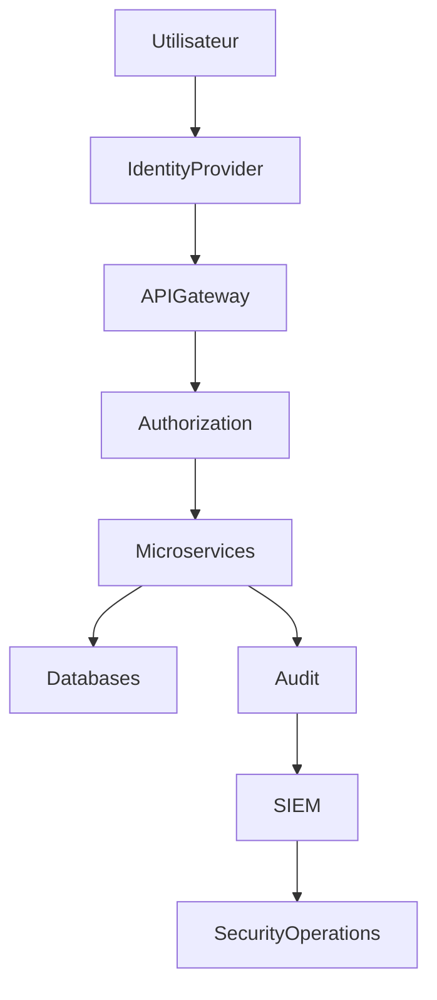

# ARCH-108 — Enterprise Security Architecture

> Référentiel officiel de l'architecture de sécurité de la plateforme **EduWeb Planner**.

---

# Sommaire

1. Vision
2. Objectifs
3. Principes de sécurité
4. Architecture globale
5. Zero Trust Architecture
6. Identity & Access Management (IAM)
7. Authentification
8. Autorisation
9. Gestion des rôles (RBAC)
10. Gestion des attributs (ABAC)
11. Multi-Tenant Security
12. Sécurité des API
13. Sécurité des microservices
14. Sécurité des données
15. Chiffrement
16. Gestion des secrets
17. Journalisation et audit
18. Détection des menaces
19. Sécurité de l'IA
20. Continuité d'activité
21. Gouvernance
22. API conceptuelle
23. Bonnes pratiques
24. Anti-patterns
25. KPI
26. Règles d'architecture

---

# 1. Vision

La sécurité constitue un **pilier fondamental** d'EduWeb Planner.

Elle est intégrée dès la conception de la plateforme selon les principes :

- Security by Design ;
- Privacy by Design ;
- Zero Trust ;
- Least Privilege ;
- Defense in Depth.

---

# 2. Objectifs

L'architecture poursuit les objectifs suivants :

- protéger les données ;
- garantir la confidentialité ;
- assurer l'intégrité ;
- garantir la disponibilité ;
- respecter les exigences réglementaires ;
- protéger les utilisateurs.

---

# 3. Principes de sécurité

Chaque composant applique :

- authentification forte ;
- autorisation systématique ;
- chiffrement ;
- journalisation ;
- traçabilité ;
- surveillance continue.

---

# 4. Architecture globale

```text
Utilisateur

↓

Identity Provider

↓

API Gateway

↓

Security Layer

↓

Microservices

↓

Databases

↓

Audit

↓

SIEM
```

---

# 5. Zero Trust Architecture

Principe :

> **Ne jamais faire confiance par défaut. Toujours vérifier.**

Chaque requête est contrôlée selon :

- identité ;
- contexte ;
- appareil ;
- permissions ;
- niveau de risque.

---

# 6. Identity & Access Management (IAM)

Le système IAM gère :

- utilisateurs ;
- rôles ;
- groupes ;
- organisations ;
- établissements ;
- permissions.

Fonctions :

- authentification ;
- fédération ;
- provisioning ;
- désactivation.

---

# 7. Authentification

Méthodes compatibles :

- identifiant / mot de passe ;
- MFA ;
- OpenID Connect ;
- OAuth2 ;
- SSO ;
- authentification fédérée.

Les mots de passe sont stockés sous forme de hachages robustes avec salage.

---

# 8. Autorisation

L'autorisation repose sur plusieurs niveaux :

- plateforme ;
- organisation ;
- établissement ;
- module ;
- ressource ;
- action.

Chaque demande est évaluée avant exécution.

---

# 9. Gestion des rôles (RBAC)

Exemples :

- Super Administrateur
- Administrateur
- Directeur
- Proviseur
- Enseignant
- Comptable
- Élève
- Parent
- Inspecteur

Les rôles sont combinables selon les besoins.

---

# 10. Gestion des attributs (ABAC)

Les décisions peuvent également tenir compte :

- de l'établissement ;
- de la région ;
- de la fonction ;
- de la période ;
- du type de document ;
- du contexte de connexion.

Le modèle ABAC complète le RBAC pour les scénarios complexes.

---

# 11. Multi-Tenant Security

Chaque organisation dispose d'un espace logique isolé.

Les garanties incluent :

- séparation des données ;
- séparation des permissions ;
- séparation des journaux ;
- séparation des paramètres.

Aucun locataire ne peut accéder aux données d'un autre.

---

# 12. Sécurité des API

Toutes les API appliquent :

- TLS ;
- OAuth2 ;
- JWT ;
- validation des entrées ;
- limitation de débit ;
- protection contre les attaques courantes.

Les API publiques et internes suivent des politiques adaptées à leur exposition.

---

# 13. Sécurité des microservices

Les échanges inter-services utilisent :

- authentification mutuelle lorsque nécessaire ;
- chiffrement des communications ;
- contrôle des identités de service ;
- journalisation.

Les communications directes non autorisées sont interdites.

---

# 14. Sécurité des données

Les données sont classées selon leur sensibilité.

Exemples :

- Publique
- Interne
- Confidentielle
- Très Confidentielle

Chaque niveau applique des mesures de protection adaptées.

---

# 15. Chiffrement

Le chiffrement est appliqué :

## En transit

TLS.

---

## Au repos

Chiffrement des bases de données, des sauvegardes et des stockages d'objets lorsque requis.

---

## Sauvegardes

Les sauvegardes sensibles sont protégées et contrôlées.

---

# 16. Gestion des secrets

Les secrets sont stockés dans un coffre sécurisé.

Exemples :

- mots de passe techniques ;
- clés API ;
- certificats ;
- jetons ;
- clés de chiffrement.

Aucun secret n'est intégré dans le code source.

---

# 17. Journalisation et audit

Les événements critiques sont enregistrés :

- authentifications ;
- échecs ;
- validations ;
- paiements ;
- signatures ;
- accès sensibles.

Les journaux sont horodatés et protégés contre les modifications non autorisées.

---

# 18. Détection des menaces

La plateforme surveille notamment :

- tentatives d'intrusion ;
- élévations de privilèges ;
- activités inhabituelles ;
- erreurs répétées ;
- comportements anormaux.

Les alertes sont transmises aux équipes habilitées.

---

# 19. Sécurité de l'IA

Les services IA appliquent :

- contrôle des accès ;
- filtrage des données ;
- protection contre les usages abusifs ;
- journalisation ;
- validation humaine pour les actions sensibles.

Les bases de connaissances suivent les mêmes exigences de sécurité que les autres données.

---

# 20. Continuité d'activité

Le dispositif prévoit :

- sauvegardes ;
- réplication ;
- reprise après incident ;
- plan de continuité (PCA) ;
- plan de reprise d'activité (PRA).

Les procédures sont testées périodiquement.

---

# 21. Gouvernance

La gouvernance est assurée par :

- RSSI ;
- DPO ;
- Architecte Sécurité ;
- Architecte Cloud ;
- Architecte IA ;
- Comité Sécurité.

Les politiques sont révisées régulièrement.

---

# 22. API conceptuelle

```typescript
EnterpriseSecurity {

    Identity

    Authentication

    Authorization

    RBAC

    ABAC

    Encryption

    Secrets

    Audit

    Monitoring

    IncidentResponse

}
```

---

# 23. Bonnes pratiques

✔ Appliquer le principe du moindre privilège.

✔ Utiliser l'authentification multifacteur pour les comptes sensibles.

✔ Journaliser les opérations critiques.

✔ Chiffrer les données sensibles.

✔ Réviser régulièrement les droits d'accès.

✔ Tester les plans de reprise.

---

# 24. Anti-patterns

✘ Comptes partagés.

✘ Secrets stockés dans le code source.

✘ Absence de journalisation.

✘ Permissions excessives.

✘ Communications non chiffrées.

✘ Comptes inactifs non désactivés.

---

# Diagramme Mermaid



---

# KPI

| KPI | Objectif |
|------|----------|
|Disponibilité IAM|99,99 %|
|Comptes protégés par MFA|100 % des comptes sensibles|
|Événements critiques journalisés|100 %|
|Rotation des secrets|Conforme à la politique de sécurité|
|Temps moyen de détection d'un incident (MTTD)|< 15 min|

---

# Règles d'architecture

## RA-ARCH108-001

Toute ressource protégée exige une authentification et une autorisation avant tout accès.

---

## RA-ARCH108-002

Les données sensibles sont chiffrées selon les politiques de sécurité de la plateforme, en transit et lorsque requis au repos.

---

## RA-ARCH108-003

Les identités techniques et humaines sont gérées de manière distincte, avec des politiques adaptées.

---

## RA-ARCH108-004

Les opérations critiques sont journalisées de manière inviolable afin de permettre les audits et les investigations.

---

## RA-ARCH108-005

Les politiques de sécurité sont révisées périodiquement et toute évolution majeure est validée par le Comité Sécurité.

---

# Documents liés

- ARCH-101 — Enterprise Architecture Overview
- ARCH-102 — Enterprise Microservices Architecture
- ARCH-105 — Enterprise API Architecture
- ARCH-106 — Enterprise Integration Architecture
- ARCH-107 — Enterprise AI & Multi-Agent Architecture
- ARCH-109 — High Availability & Scalability
- SEC-001 — Enterprise Security Standards
- SEC-002 — Identity & Access Management
- GOV-004 — Information Security Governance

---

# Conclusion

L'**Enterprise Security Architecture** fournit le cadre de référence pour protéger l'ensemble des composants d'EduWeb Planner. Fondée sur les principes **Zero Trust**, **Security by Design** et **Defense in Depth**, elle couvre les identités, les accès, les données, les API, les microservices, l'intelligence artificielle et la continuité d'activité. Elle garantit une protection cohérente et évolutive des actifs numériques de la plateforme tout en accompagnant son développement à grande échelle.

# Fin du document
