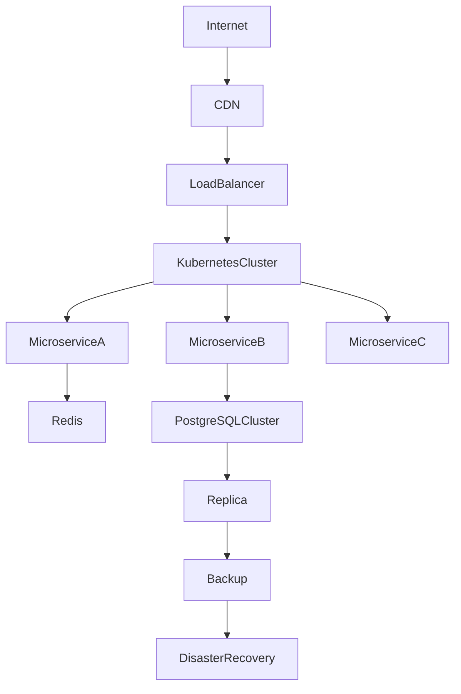

# ARCH-109 — High Availability, Scalability & Resilience Architecture

> Référentiel officiel de l'architecture de **haute disponibilité, de montée en charge et de résilience** de la plateforme **EduWeb Planner**.

---

# Sommaire

1. Vision
2. Objectifs
3. Principes fondamentaux
4. Architecture globale
5. Haute disponibilité (HA)
6. Scalabilité horizontale
7. Scalabilité verticale
8. Équilibrage de charge (Load Balancing)
9. Répartition géographique
10. Réplication des données
11. Cache distribué
12. Résilience applicative
13. Résilience des données
14. Continuité d'activité
15. Plan de Reprise d'Activité (PRA)
16. Tolérance aux pannes
17. Auto-scaling
18. Monitoring
19. Capacity Planning
20. Gouvernance
21. API conceptuelle
22. Bonnes pratiques
23. Anti-patterns
24. KPI
25. Règles d'architecture

---

# 1. Vision

EduWeb Planner est conçu pour assurer une **continuité de service quasi permanente**, capable de supporter simultanément :

- plusieurs ministères ;
- plusieurs pays ;
- plusieurs milliers d'établissements ;
- plusieurs millions d'utilisateurs.

L'objectif est d'assurer une plateforme robuste, hautement disponible et capable d'évoluer sans interruption majeure de service.

---

# 2. Objectifs

Cette architecture vise à :

- garantir la disponibilité ;
- absorber les pics de charge ;
- limiter les interruptions ;
- assurer la reprise rapide après incident ;
- optimiser les performances ;
- maintenir la qualité de service.

---

# 3. Principes fondamentaux

Les principes directeurs sont :

- Haute Disponibilité (HA)
- Scalabilité
- Résilience
- Élasticité
- Redondance
- Dégradation maîtrisée
- Auto-réparation (Self-Healing)

---

# 4. Architecture globale

```text
Internet

↓

CDN

↓

Load Balancer

↓

API Gateway

↓

Cluster Kubernetes

↓

Microservices

↓

Cache

↓

Cluster PostgreSQL

↓

Storage

↓

Backups
```

---

# 5. Haute disponibilité (HA)

La haute disponibilité repose sur :

- plusieurs nœuds applicatifs ;
- plusieurs réplicas de services ;
- bases de données redondantes ;
- équilibrage automatique ;
- surveillance permanente.

Objectif :

> disponibilité ≥ **99,95 %**

---

# 6. Scalabilité horizontale

La montée en charge privilégiée est horizontale.

```
1 serveur

↓

3 serveurs

↓

10 serveurs

↓

50 serveurs
```

Les nouveaux nœuds peuvent être ajoutés sans interruption.

---

# 7. Scalabilité verticale

La plateforme peut également augmenter :

- CPU ;
- RAM ;
- stockage ;
- bande passante.

Cette approche est utilisée principalement lorsque la montée horizontale n'est pas pertinente.

---

# 8. Équilibrage de charge (Load Balancing)

Le Load Balancer répartit automatiquement :

- trafic HTTP ;
- WebSocket ;
- API ;
- services IA.

Fonctions :

- Health Check ;
- Sticky Sessions (si nécessaire) ;
- Répartition intelligente ;
- Failover automatique.

---

# 9. Répartition géographique

La plateforme peut être déployée sur plusieurs régions cloud.

Exemple :

```
Abidjan

↓

Paris

↓

Johannesburg

↓

Montréal
```

Les utilisateurs sont dirigés vers la région la plus adaptée selon les politiques de routage.

---

# 10. Réplication des données

Les bases de données utilisent :

- réplication synchrone lorsque requis ;
- réplication asynchrone selon les besoins ;
- sauvegardes régulières ;
- restauration contrôlée.

Les choix dépendent des exigences de disponibilité et de performance.

---

# 11. Cache distribué

Les caches réduisent :

- la charge des bases ;
- les temps de réponse ;
- les appels répétés.

Technologies possibles :

- Redis ;
- Memcached.

Le cache est cohérent avec les politiques d'invalidation de la plateforme.

---

# 12. Résilience applicative

Les services mettent en œuvre :

- Retry ;
- Timeout ;
- Circuit Breaker ;
- Bulkhead ;
- Fallback.

Ces mécanismes limitent la propagation des défaillances.

---

# 13. Résilience des données

Les données critiques bénéficient :

- de sauvegardes automatisées ;
- de tests de restauration ;
- de contrôles d'intégrité ;
- de réplications adaptées.

Les procédures sont documentées et régulièrement vérifiées.

---

# 14. Continuité d'activité

Le PCA prévoit :

- fonctionnement dégradé ;
- priorisation des services essentiels ;
- procédures d'urgence ;
- communication de crise.

Les fonctions critiques sont identifiées à l'avance.

---

# 15. Plan de Reprise d'Activité (PRA)

Le PRA définit :

- les responsabilités ;
- les procédures ;
- les délais ;
- les tests ;
- les scénarios de reprise.

Objectifs indicatifs :

- **RPO** (Recovery Point Objective) : ≤ 15 minutes pour les données critiques.
- **RTO** (Recovery Time Objective) : ≤ 1 heure pour les services prioritaires.

Ces objectifs peuvent être ajustés selon les niveaux de service retenus.

---

# 16. Tolérance aux pannes

Le système est conçu pour continuer à fonctionner malgré :

- la perte d'un serveur ;
- la défaillance d'un service ;
- une panne réseau localisée ;
- la perte d'un nœud de calcul.

Les composants redondants prennent automatiquement le relais lorsque cela est possible.

---

# 17. Auto-scaling

Le système peut ajuster automatiquement le nombre d'instances selon :

- CPU ;
- mémoire ;
- nombre de requêtes ;
- longueur des files de messages.

Les règles de montée et de descente en charge sont configurables.

---

# 18. Monitoring

La supervision couvre :

- disponibilité ;
- performances ;
- consommation ;
- erreurs ;
- ressources ;
- saturation.

Les tableaux de bord et alertes facilitent une intervention rapide.

---

# 19. Capacity Planning

Le dimensionnement repose sur :

- croissance des utilisateurs ;
- volumes de données ;
- trafic ;
- consommation IA ;
- saisonnalité.

Des revues régulières permettent d'anticiper les besoins futurs.

---

# 20. Gouvernance

La gouvernance est assurée par :

- Architecte Cloud ;
- Architecte Infrastructure ;
- DevOps ;
- SRE ;
- RSSI ;
- Comité Architecture.

Les objectifs de disponibilité et de performance sont suivis dans le cadre des SLA.

---

# 21. API conceptuelle

```typescript
EnterpriseAvailability {

    LoadBalancer

    Kubernetes

    AutoScaling

    Replication

    Backup

    Recovery

    Monitoring

    HealthChecks

    Cache

}
```

---

# 22. Bonnes pratiques

✔ Concevoir les services sans état (stateless) lorsque possible.

✔ Tester régulièrement les sauvegardes et restaurations.

✔ Réaliser des exercices de reprise d'activité.

✔ Superviser tous les composants critiques.

✔ Prévoir des mécanismes de dégradation maîtrisée.

✔ Automatiser le déploiement et la montée en charge.

---

# 23. Anti-patterns

✘ Point de défaillance unique (Single Point of Failure).

✘ Sauvegardes non testées.

✘ Scalabilité uniquement verticale.

✘ Absence de supervision.

✘ Procédures de reprise non documentées.

✘ Déploiements manuels sur les environnements de production.

---

# Diagramme Mermaid



---

# KPI

| KPI | Objectif |
|------|----------|
|Disponibilité globale|≥ 99,95 %|
|Temps moyen de reprise (RTO)|≤ 1 heure pour les services prioritaires|
|Perte maximale de données (RPO)|≤ 15 minutes pour les données critiques|
|Taux de réussite des sauvegardes|100 %|
|Temps moyen de réponse des API|< 300 ms (hors traitements lourds)|
|Taux d'auto-récupération des incidents|> 90 %|

---

# Règles d'architecture

## RA-ARCH109-001

Les composants critiques de la plateforme doivent être déployés de manière redondante afin d'éliminer les points uniques de défaillance.

---

## RA-ARCH109-002

Les sauvegardes, les réplications et les procédures de restauration sont régulièrement testées et documentées.

---

## RA-ARCH109-003

La plateforme privilégie la scalabilité horizontale pour accompagner la croissance des utilisateurs et des traitements.

---

## RA-ARCH109-004

Les services critiques mettent en œuvre des mécanismes de résilience tels que Retry, Timeout, Circuit Breaker et Health Checks.

---

## RA-ARCH109-005

Les objectifs de disponibilité, de performance et de reprise sont suivis au travers d'indicateurs, d'alertes et de revues périodiques.

---

# Documents liés

- ARCH-101 — Enterprise Architecture Overview
- ARCH-102 — Enterprise Microservices Architecture
- ARCH-104 — Event-Driven Architecture
- ARCH-106 — Enterprise Integration Architecture
- ARCH-107 — Enterprise AI & Multi-Agent Architecture
- ARCH-108 — Enterprise Security Architecture
- OPS-001 — DevSecOps Architecture
- OPS-002 — Observability Architecture
- OPS-003 — Disaster Recovery & Business Continuity

---

# Conclusion

L'**High Availability, Scalability & Resilience Architecture** constitue le socle opérationnel garantissant la robustesse d'EduWeb Planner. En combinant redondance, orchestration cloud-native, supervision continue, reprise d'activité et montée en charge automatique, cette architecture permet d'assurer un service fiable, performant et évolutif, capable d'accompagner durablement les besoins des établissements scolaires, des administrations éducatives et des utilisateurs à grande échelle.

# Fin du document
