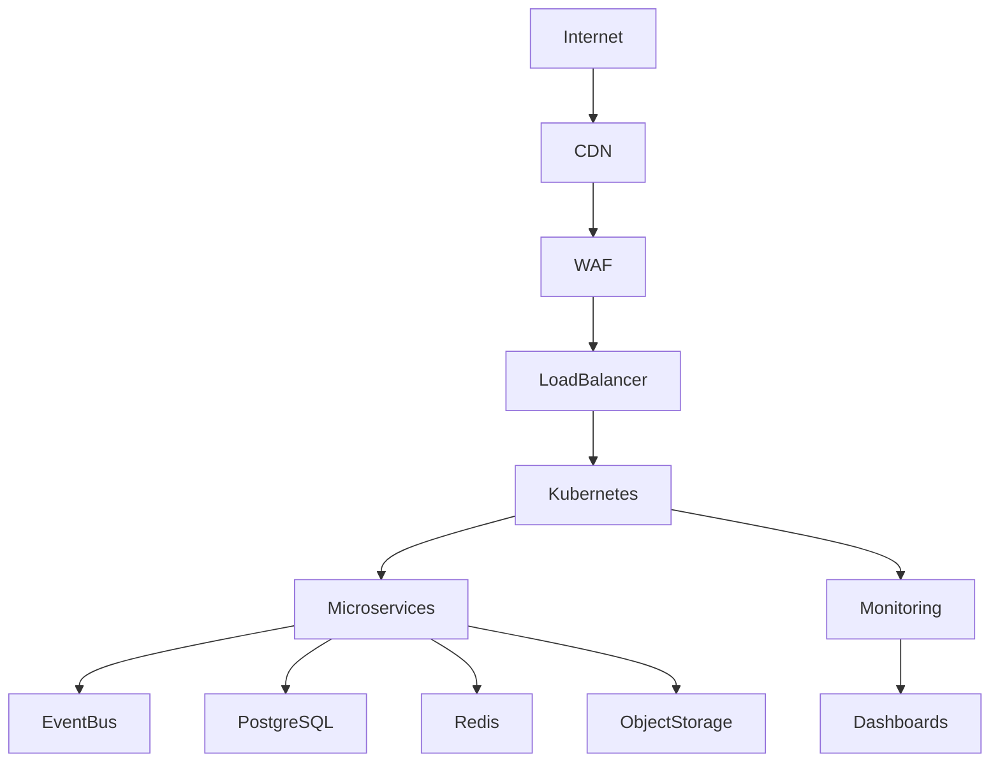

# ARCH-110 — Cloud-Native Architecture

> Référentiel officiel de l'architecture **Cloud-Native** de la plateforme **EduWeb Planner**.

---

# Sommaire

1. Vision
2. Objectifs
3. Principes Cloud-Native
4. Architecture globale
5. Infrastructure as Code
6. Containers
7. Kubernetes
8. Service Mesh
9. API Gateway
10. Cloud Storage
11. Cloud Databases
12. Serverless Computing
13. Event-Driven Cloud
14. Multi-Cloud Strategy
15. Hybrid Cloud
16. Cloud Security
17. Cloud Observability
18. DevSecOps Integration
19. Cloud Cost Optimization (FinOps)
20. Sustainability (Green IT)
21. Gouvernance Cloud
22. API conceptuelle
23. Bonnes pratiques
24. Anti-patterns
25. KPI
26. Règles d'architecture

---

# 1. Vision

EduWeb Planner est conçu comme une plateforme **Cloud-Native**, capable d'être déployée aussi bien :

- sur un cloud public ;
- sur un cloud privé ;
- dans un environnement hybride ;
- ou en mode multi-cloud.

L'architecture favorise :

- l'agilité ;
- l'élasticité ;
- l'automatisation ;
- la résilience.

---

# 2. Objectifs

Le Cloud-Native permet de :

- réduire les temps de déploiement ;
- automatiser l'infrastructure ;
- améliorer la disponibilité ;
- simplifier la montée en charge ;
- optimiser les coûts ;
- faciliter les évolutions.

---

# 3. Principes Cloud-Native

Les principes retenus sont :

- Containers First
- Kubernetes First
- Immutable Infrastructure
- Infrastructure as Code
- GitOps
- API First
- Event Driven
- Automation by Default

---

# 4. Architecture globale

```text
Internet

↓

CDN

↓

WAF

↓

Load Balancer

↓

Ingress Controller

↓

Kubernetes

↓

Microservices

↓

Event Bus

↓

Databases

↓

Object Storage

↓

Monitoring
```

---

# 5. Infrastructure as Code (IaC)

Toute l'infrastructure est décrite sous forme de code.

Technologies compatibles :

- Terraform
- OpenTofu
- Pulumi
- Ansible

L'IaC garantit :

- reproductibilité ;
- traçabilité ;
- automatisation ;
- contrôle des versions.

---

# 6. Containers

Chaque composant applicatif est emballé dans un conteneur.

Principaux avantages :

- portabilité ;
- isolation ;
- cohérence entre environnements ;
- déploiement rapide.

Technologie de référence :

- Docker (ou compatible OCI).

---

# 7. Kubernetes

Kubernetes constitue la plateforme principale d'orchestration.

Fonctions :

- scheduling ;
- auto-healing ;
- rolling update ;
- autoscaling ;
- service discovery ;
- gestion des secrets.

---

# 8. Service Mesh

Le Service Mesh facilite la communication entre microservices.

Fonctions :

- chiffrement mTLS ;
- observabilité ;
- contrôle du trafic ;
- retries ;
- circuit breakers ;
- politiques de sécurité.

Technologies possibles :

- Istio ;
- Linkerd.

---

# 9. API Gateway

Toutes les API externes transitent par une passerelle.

Fonctions :

- authentification ;
- routage ;
- limitation de débit ;
- journalisation ;
- observabilité ;
- protection.

---

# 10. Cloud Storage

Les documents sont stockés dans un espace objet.

Types :

- fichiers utilisateurs ;
- archives ;
- sauvegardes ;
- médias ;
- exports.

Le stockage applique des politiques de cycle de vie adaptées.

---

# 11. Cloud Databases

Les bases de données peuvent être déployées en mode managé ou auto-hébergé.

Exemples :

- PostgreSQL ;
- Redis ;
- Elasticsearch/OpenSearch ;
- bases vectorielles.

Le choix dépend des exigences de performance, de souveraineté et de coûts.

---

# 12. Serverless Computing

Certaines fonctions ponctuelles peuvent être exécutées en mode serverless.

Cas d'usage :

- génération de documents ;
- traitement d'images ;
- notifications ;
- tâches planifiées.

Les traitements sont découplés des services principaux.

---

# 13. Event-Driven Cloud

Les traitements cloud s'appuient sur des événements.

Exemple :

```
DocumentUploaded

↓

OCR

↓

Indexation

↓

Knowledge Base

↓

Notification
```

Cette approche améliore la réactivité et la scalabilité.

---

# 14. Multi-Cloud Strategy

La plateforme peut répartir ses composants sur plusieurs fournisseurs afin de :

- limiter la dépendance à un seul acteur ;
- améliorer la résilience ;
- répondre à des contraintes de localisation des données.

---

# 15. Hybrid Cloud

L'architecture autorise une combinaison de ressources :

- cloud public ;
- cloud privé ;
- infrastructures sur site.

Les échanges sont sécurisés et gouvernés.

---

# 16. Cloud Security

Les mesures de sécurité comprennent :

- chiffrement ;
- gestion des identités ;
- segmentation réseau ;
- gestion des secrets ;
- politiques de conformité.

Les contrôles sont intégrés au cycle de vie des déploiements.

---

# 17. Cloud Observability

La supervision couvre :

- métriques ;
- journaux ;
- traces distribuées ;
- alertes ;
- tableaux de bord.

Les indicateurs alimentent les équipes DevOps et SRE.

---

# 18. DevSecOps Integration

Le pipeline automatise :

- construction ;
- tests ;
- analyse de sécurité ;
- déploiement ;
- validation.

Les contrôles sont exécutés à chaque livraison.

---

# 19. Cloud Cost Optimization (FinOps)

Les ressources sont pilotées selon des principes FinOps :

- suivi des coûts ;
- optimisation des capacités ;
- extinction des ressources inutilisées ;
- alertes budgétaires.

Les indicateurs financiers sont partagés avec les équipes concernées.

---

# 20. Sustainability (Green IT)

La plateforme cherche à réduire son empreinte numérique par :

- l'autoscaling ;
- l'optimisation des ressources ;
- la limitation des traitements inutiles ;
- des politiques d'archivage adaptées.

---

# 21. Gouvernance Cloud

La gouvernance implique :

- Architecte Cloud ;
- Architecte Infrastructure ;
- DevOps ;
- RSSI ;
- Comité Architecture.

Les décisions de déploiement sont alignées sur les exigences métiers, techniques et réglementaires.

---

# 22. API conceptuelle

```typescript
EnterpriseCloud {

    Kubernetes

    Containers

    ServiceMesh

    APIGateway

    Storage

    Databases

    Serverless

    Monitoring

    FinOps

    IaC

}
```

---

# 23. Bonnes pratiques

✔ Décrire toute l'infrastructure en code.

✔ Déployer des applications sans état lorsque possible.

✔ Automatiser les déploiements.

✔ Utiliser des images de conteneurs minimales et sécurisées.

✔ Mettre en place une supervision centralisée.

✔ Réviser régulièrement les coûts et la consommation des ressources.

---

# 24. Anti-patterns

✘ Déploiements manuels non reproductibles.

✘ Configuration directement modifiée en production.

✘ Conteneurs privilégiant des privilèges excessifs.

✘ Absence de politiques de cycle de vie des ressources.

✘ Dépendance forte à un fournisseur sans stratégie de réversibilité.

✘ Surveillance limitée aux seuls serveurs.

---

# Diagramme Mermaid



---

# KPI

| KPI | Objectif |
|------|----------|
|Disponibilité de la plateforme|≥ 99,95 %|
|Temps moyen de déploiement|< 15 minutes|
|Taux d'automatisation des déploiements|100 %|
|Infrastructure gérée en IaC|100 %|
|Taux de couverture des métriques critiques|100 %|
|Optimisation mensuelle des coûts cloud|Revue systématique|

---

# Règles d'architecture

## RA-ARCH110-001

Toute infrastructure est décrite, versionnée et déployée via une approche Infrastructure as Code.

---

## RA-ARCH110-002

Les applications sont conçues pour fonctionner dans des environnements conteneurisés et orchestrés.

---

## RA-ARCH110-003

Les ressources cloud sont supervisées en continu afin de garantir la disponibilité, les performances et la maîtrise des coûts.

---

## RA-ARCH110-004

Les composants critiques sont déployés de manière redondante et automatisée conformément aux objectifs de haute disponibilité.

---

## RA-ARCH110-005

Les décisions relatives au choix des services cloud prennent en compte les exigences de sécurité, de souveraineté, de performance, de portabilité et de réversibilité.

---

# Documents liés

- ARCH-101 — Enterprise Architecture Overview
- ARCH-102 — Enterprise Microservices Architecture
- ARCH-104 — Event-Driven Architecture
- ARCH-108 — Enterprise Security Architecture
- ARCH-109 — High Availability, Scalability & Resilience Architecture
- OPS-001 — DevSecOps Architecture
- OPS-002 — Observability Architecture
- OPS-004 — FinOps Framework
- CLOUD-001 — Cloud Operations Guide

---

# Conclusion

L'**Architecture Cloud-Native** d'EduWeb Planner constitue la fondation technique de son déploiement à grande échelle. En s'appuyant sur les principes de conteneurisation, d'orchestration, d'automatisation, d'observabilité et de gouvernance cloud, elle garantit une plateforme évolutive, résiliente, sécurisée et économiquement maîtrisée, capable d'accompagner les besoins des systèmes éducatifs nationaux et internationaux.

# Fin du document
