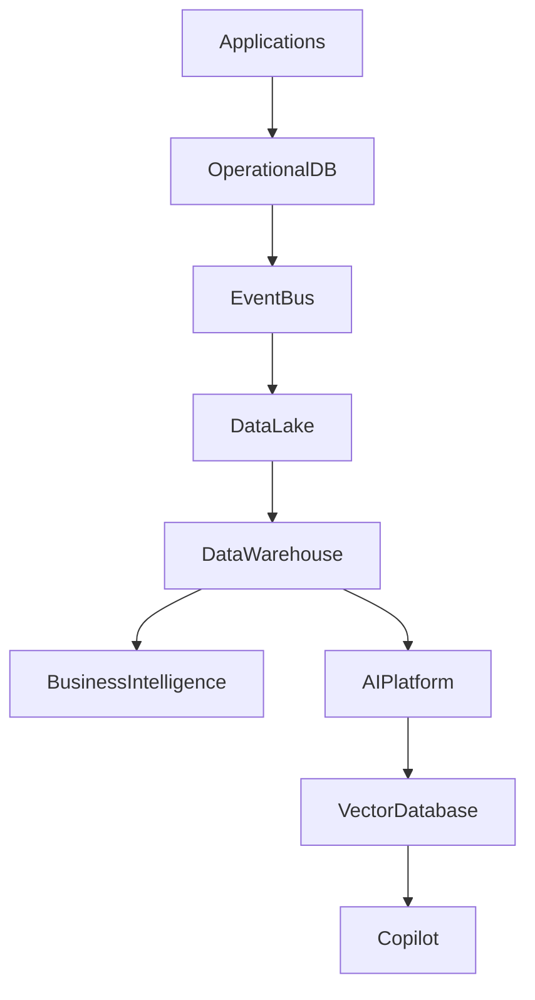

# ARCH-111 — Enterprise Data Architecture

> Référentiel officiel de l'architecture des données de la plateforme **EduWeb Planner**.

---

# Sommaire

1. Vision
2. Objectifs
3. Principes fondamentaux
4. Architecture globale
5. Domaines de données
6. Modélisation des données
7. Master Data Management (MDM)
8. Référentiels d'entreprise
9. Cycle de vie des données
10. Qualité des données
11. Gouvernance des données
12. Data Lake
13. Data Warehouse
14. Bases de données opérationnelles
15. Bases NoSQL
16. Base vectorielle
17. Métadonnées
18. Catalogue de données
19. Data Lineage
20. Archivage
21. Sécurité des données
22. API conceptuelle
23. Bonnes pratiques
24. Anti-patterns
25. KPI
26. Règles d'architecture

---

# 1. Vision

Les données constituent un **actif stratégique** d'EduWeb Planner.

Elles doivent être :

- fiables ;
- cohérentes ;
- traçables ;
- sécurisées ;
- partageables ;
- gouvernées.

L'architecture des données garantit leur exploitation optimale par les utilisateurs, les services métiers, les outils décisionnels et les systèmes d'intelligence artificielle.

---

# 2. Objectifs

Cette architecture poursuit les objectifs suivants :

- garantir une source unique de vérité ;
- améliorer la qualité des données ;
- faciliter les échanges ;
- alimenter les analyses décisionnelles ;
- soutenir les agents IA ;
- assurer la conformité réglementaire.

---

# 3. Principes fondamentaux

Les données doivent être :

- uniques ;
- normalisées ;
- documentées ;
- versionnées lorsque nécessaire ;
- auditables ;
- protégées.

---

# 4. Architecture globale

```text
Applications

↓

Microservices

↓

Operational Databases

↓

Event Bus

↓

Data Lake

↓

Data Warehouse

↓

Business Intelligence

↓

Artificial Intelligence
```

---

# 5. Domaines de données

Les principaux domaines sont :

## Gouvernance

- organisations ;
- établissements ;
- structures administratives.

---

## Ressources humaines

- personnels ;
- carrières ;
- affectations ;
- formations.

---

## Pédagogie

- élèves ;
- enseignants ;
- classes ;
- emplois du temps ;
- évaluations.

---

## Finance

- budgets ;
- dépenses ;
- recettes ;
- paiements.

---

## Documentation

- textes réglementaires ;
- procédures ;
- archives ;
- ressources pédagogiques.

---

## Intelligence artificielle

- bases de connaissances ;
- embeddings ;
- prompts ;
- évaluations IA.

---

# 6. Modélisation des données

Les modèles reposent sur :

- entités ;
- relations ;
- agrégats ;
- contraintes d'intégrité.

Les modèles conceptuels, logiques et physiques sont maintenus de manière cohérente.

---

# 7. Master Data Management (MDM)

Les données maîtres comprennent notamment :

- établissements ;
- personnes ;
- organisations ;
- disciplines ;
- matières ;
- programmes ;
- territoires.

Chaque donnée maître possède un propriétaire métier.

---

# 8. Référentiels d'entreprise

Les référentiels communs incluent :

- pays ;
- régions ;
- départements ;
- communes ;
- établissements ;
- niveaux scolaires ;
- disciplines ;
- calendriers académiques.

Ces référentiels sont partagés par tous les modules.

---

# 9. Cycle de vie des données

```text
Création

↓

Validation

↓

Utilisation

↓

Mise à jour

↓

Archivage

↓

Suppression
```

Chaque étape suit des règles de gouvernance documentées.

---

# 10. Qualité des données

Les dimensions de qualité évaluées sont :

- exactitude ;
- complétude ;
- cohérence ;
- unicité ;
- fraîcheur ;
- traçabilité.

Des contrôles automatisés contribuent à maintenir ces niveaux de qualité.

---

# 11. Gouvernance des données

Les responsabilités sont réparties entre :

- Data Owner ;
- Data Steward ;
- Architecte Data ;
- RSSI ;
- DPO ;
- Comité Data.

Chaque domaine de données dispose d'une gouvernance identifiée.

---

# 12. Data Lake

Le Data Lake centralise les données :

- brutes ;
- semi-structurées ;
- non structurées.

Exemples :

- documents ;
- images ;
- journaux ;
- exports.

Il constitue une source pour les traitements analytiques et l'IA.

---

# 13. Data Warehouse

Le Data Warehouse regroupe les données consolidées destinées :

- aux tableaux de bord ;
- aux indicateurs ;
- aux analyses historiques ;
- au pilotage stratégique.

Les modèles analytiques sont optimisés pour la consultation.

---

# 14. Bases de données opérationnelles

Les applications utilisent principalement des bases relationnelles.

Exemple :

- PostgreSQL.

Chaque microservice reste propriétaire de ses données.

---

# 15. Bases NoSQL

Les bases NoSQL sont utilisées lorsque cela apporte une valeur ajoutée.

Exemples :

- cache ;
- sessions ;
- documents ;
- événements.

Le choix est guidé par les besoins fonctionnels et techniques.

---

# 16. Base vectorielle

Les connaissances exploitées par les agents IA sont indexées dans une base vectorielle.

Contenu :

- embeddings ;
- documents ;
- index sémantiques.

Cette base alimente les mécanismes de recherche augmentée (RAG).

---

# 17. Métadonnées

Les métadonnées décrivent :

- origine ;
- propriétaire ;
- classification ;
- sens métier ;
- format ;
- historique.

Elles facilitent la compréhension et la réutilisation des données.

---

# 18. Catalogue de données

Le catalogue recense :

- jeux de données ;
- modèles ;
- API ;
- responsables ;
- niveaux de qualité ;
- règles d'accès.

Il constitue le point d'entrée de la gouvernance des données.

---

# 19. Data Lineage

Le Data Lineage permet de suivre :

```text
Source

↓

Transformation

↓

Stockage

↓

Analyse

↓

Restitution
```

Chaque transformation significative est documentée.

---

# 20. Archivage

Les données archivées respectent :

- les exigences réglementaires ;
- les politiques institutionnelles ;
- les besoins historiques.

Les règles de conservation sont définies par domaine.

---

# 21. Sécurité des données

Les données sont protégées par :

- classification ;
- contrôle d'accès ;
- chiffrement ;
- journalisation ;
- sauvegarde ;
- traçabilité.

Les traitements respectent les politiques de confidentialité de la plateforme.

---

# 22. API conceptuelle

```typescript
EnterpriseData {

    MasterData

    ReferenceData

    OperationalDatabase

    DataLake

    DataWarehouse

    Metadata

    Catalog

    Lineage

    VectorDatabase

    Governance

}
```

---

# 23. Bonnes pratiques

✔ Définir un propriétaire pour chaque domaine de données.

✔ Réutiliser les référentiels communs.

✔ Documenter les métadonnées.

✔ Contrôler régulièrement la qualité des données.

✔ Centraliser les définitions métier.

✔ Limiter les duplications.

---

# 24. Anti-patterns

✘ Multiplication des référentiels locaux.

✘ Absence de gouvernance.

✘ Données sans propriétaire identifié.

✘ Modifications directes sans traçabilité.

✘ Duplication massive des données.

✘ Documentation inexistante.

---

# Diagramme Mermaid



---

# KPI

| KPI | Objectif |
|------|----------|
|Jeux de données documentés|100 %|
|Domaines avec Data Owner identifié|100 %|
|Taux de complétude des données critiques|> 98 %|
|Anomalies de qualité détectées|Suivi continu et réduction progressive|
|Traçabilité des données critiques|100 %|

---

# Règles d'architecture

## RA-ARCH111-001

Chaque domaine de données possède un propriétaire métier, un responsable de gouvernance et des règles de qualité documentées.

---

## RA-ARCH111-002

Les données maîtres sont administrées de manière centralisée afin de garantir une source unique de vérité.

---

## RA-ARCH111-003

Les traitements analytiques et les services d'intelligence artificielle exploitent des données documentées, gouvernées et traçables.

---

## RA-ARCH111-004

Les données critiques sont classifiées, protégées et conservées conformément aux politiques de sécurité et de conservation de la plateforme.

---

## RA-ARCH111-005

Les transformations de données significatives sont documentées afin d'assurer la traçabilité complète du cycle de vie des informations.

---

# Documents liés

- ARCH-101 — Enterprise Architecture Overview
- ARCH-103 — Domain-Driven Design
- ARCH-104 — Event-Driven Architecture
- ARCH-107 — Enterprise AI & Multi-Agent Architecture
- ARCH-108 — Enterprise Security Architecture
- ARCH-110 — Cloud-Native Architecture
- DATA-101 — Data Governance Framework
- DATA-102 — Master Data Management
- DATA-103 — Business Intelligence Architecture
- AI-003 — Knowledge Base Architecture

---

# Conclusion

L'**Enterprise Data Architecture** définit le cadre de gestion des données d'EduWeb Planner. En structurant les référentiels, la gouvernance, les bases opérationnelles, les plateformes analytiques et les bases de connaissances de l'IA, elle garantit des données fiables, sécurisées et exploitables pour l'ensemble des processus métiers, des tableaux de bord décisionnels et des services d'intelligence artificielle. Elle constitue ainsi l'un des fondements stratégiques de l'écosystème EduWeb.

# Fin du document
