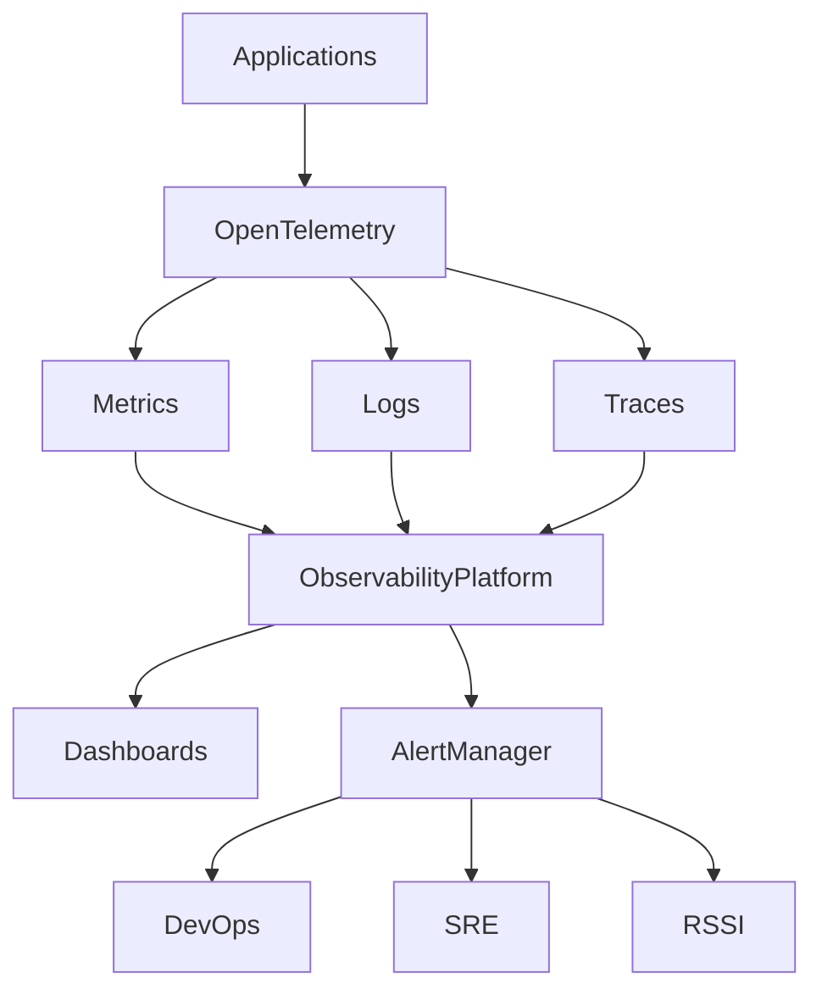

# ARCH-112 — Enterprise Observability Architecture

> Référentiel officiel de l'architecture d'**observabilité** de la plateforme **EduWeb Planner**.

---

# Sommaire

1. Vision
2. Objectifs
3. Principes fondamentaux
4. Architecture globale
5. Les trois piliers de l'observabilité
6. Collecte des métriques
7. Journalisation centralisée
8. Traçage distribué
9. Corrélation des événements
10. Monitoring applicatif
11. Monitoring de l'infrastructure
12. Monitoring des bases de données
13. Monitoring des API
14. Monitoring IA
15. Alerting intelligent
16. Dashboards
17. Capacity Monitoring
18. SLA / SLO / SLI
19. Incident Management
20. Gouvernance
21. API conceptuelle
22. Bonnes pratiques
23. Anti-patterns
24. KPI
25. Règles d'architecture

---

# 1. Vision

Une plateforme nationale comme **EduWeb Planner** doit permettre de comprendre son état interne **sans devoir reproduire les incidents**.

L'observabilité fournit une visibilité complète sur :

- les utilisateurs ;
- les applications ;
- les microservices ;
- les API ;
- les bases de données ;
- l'infrastructure Cloud ;
- les services IA.

---

# 2. Objectifs

L'observabilité permet de :

- détecter rapidement les incidents ;
- comprendre leur origine ;
- accélérer leur résolution ;
- améliorer les performances ;
- mesurer la qualité de service ;
- alimenter les décisions techniques.

---

# 3. Principes fondamentaux

L'observabilité repose sur :

- Monitoring by Design
- Instrumentation by Default
- Centralisation
- Corrélation
- Temps réel
- Traçabilité
- Automatisation

---

# 4. Architecture globale

```text
Applications

↓

Instrumentation

↓

OpenTelemetry

↓

Collecteurs

↓

Logs

Metrics

Traces

↓

Observability Platform

↓

Dashboards

↓

Alertes

↓

Équipes DevOps / SRE
```

---

# 5. Les trois piliers de l'observabilité

## Logs

Historique détaillé des événements.

---

## Metrics

Indicateurs numériques.

---

## Traces

Parcours complet d'une requête.

---

Les trois dimensions sont systématiquement corrélées.

---

# 6. Collecte des métriques

Les métriques concernent notamment :

- CPU ;
- mémoire ;
- stockage ;
- temps de réponse ;
- utilisateurs connectés ;
- files d'attente ;
- consommation IA.

---

# 7. Journalisation centralisée

Tous les composants publient leurs journaux.

Exemples :

- authentifications ;
- erreurs ;
- API ;
- workflows ;
- paiements ;
- synchronisations.

Les journaux sont centralisés afin de faciliter les recherches.

---

# 8. Traçage distribué

Chaque requête possède un identifiant unique.

```text
Utilisateur

↓

Gateway

↓

Microservice A

↓

Microservice B

↓

Base de données

↓

Réponse
```

Le parcours complet peut être reconstitué.

---

# 9. Corrélation des événements

Les informations suivantes sont reliées :

- logs ;
- traces ;
- métriques ;
- événements métier.

Cette corrélation accélère le diagnostic.

---

# 10. Monitoring applicatif

Surveillance :

- disponibilité ;
- erreurs ;
- temps de réponse ;
- consommation mémoire ;
- saturation.

---

# 11. Monitoring de l'infrastructure

Suivi :

- serveurs ;
- Kubernetes ;
- stockage ;
- réseau ;
- équilibreurs de charge.

---

# 12. Monitoring des bases de données

Indicateurs :

- connexions ;
- index ;
- requêtes lentes ;
- verrouillages ;
- réplication ;
- stockage.

---

# 13. Monitoring des API

Chaque API expose :

- latence ;
- débit ;
- erreurs ;
- disponibilité ;
- consommation.

---

# 14. Monitoring IA

Les services IA publient :

- temps d'inférence ;
- modèle utilisé ;
- coût estimé ;
- consommation de jetons ;
- taux de succès ;
- qualité des réponses.

---

# 15. Alerting intelligent

Les alertes sont générées selon :

- seuils ;
- anomalies ;
- tendances ;
- événements critiques.

Les notifications sont hiérarchisées afin de limiter le bruit opérationnel.

---

# 16. Dashboards

Les tableaux de bord sont adaptés aux profils :

## Direction Générale

- disponibilité globale ;
- SLA ;
- KPI.

---

## DevOps

- infrastructure ;
- Kubernetes ;
- réseau.

---

## Développeurs

- erreurs ;
- performances ;
- API.

---

## SRE

- incidents ;
- saturation ;
- capacité.

---

## RSSI

- événements de sécurité ;
- accès ;
- anomalies.

---

# 17. Capacity Monitoring

Le système prévoit :

- prévision de charge ;
- évolution du stockage ;
- consommation mémoire ;
- croissance des bases.

Les tendances alimentent les décisions d'investissement.

---

# 18. SLA / SLO / SLI

## SLA

Engagement de service.

---

## SLO

Objectif opérationnel.

---

## SLI

Mesure effective.

Exemple :

```
Disponibilité

99,95 %

↓

Mesurée automatiquement
```

---

# 19. Incident Management

Cycle :

```text
Détection

↓

Qualification

↓

Diagnostic

↓

Correction

↓

Validation

↓

Clôture

↓

Retour d'expérience
```

Les incidents majeurs donnent lieu à une analyse post-incident.

---

# 20. Gouvernance

Les responsabilités sont réparties entre :

- DevOps ;
- SRE ;
- Architectes ;
- RSSI ;
- Comité Exploitation.

Les indicateurs sont revus périodiquement.

---

# 21. API conceptuelle

```typescript
EnterpriseObservability {

    Metrics

    Logs

    Traces

    Dashboards

    Alerting

    CapacityPlanning

    Monitoring

    IncidentManagement

}
```

---

# 22. Bonnes pratiques

✔ Instrumenter tous les services.

✔ Utiliser OpenTelemetry comme standard d'instrumentation.

✔ Corréler logs, métriques et traces.

✔ Mettre en place des alertes utiles.

✔ Construire des tableaux de bord orientés métier.

✔ Réaliser régulièrement des exercices de simulation d'incidents.

---

# 23. Anti-patterns

✘ Journaux dispersés.

✘ Alertes trop nombreuses.

✘ Absence de traçage distribué.

✘ Surveillance limitée aux serveurs.

✘ Dashboards non maintenus.

✘ Métriques sans objectifs définis.

---

# Diagramme Mermaid



---

# KPI

| KPI | Objectif |
|------|----------|
|Couverture de l'instrumentation|100 % des services critiques|
|Temps moyen de détection (MTTD)|< 5 min|
|Temps moyen de résolution (MTTR)|< 30 min pour les incidents majeurs|
|Disponibilité des tableaux de bord|99,95 %|
|Alertes pertinentes|> 95 %|

---

# Règles d'architecture

## RA-ARCH112-001

Tout composant déployé en production doit produire des métriques, des journaux et des traces exploitables.

---

## RA-ARCH112-002

Les journaux, métriques et traces sont centralisés et corrélés au sein d'une plateforme d'observabilité unique.

---

## RA-ARCH112-003

Les alertes sont fondées sur des indicateurs mesurables et régulièrement réévaluées afin de limiter les faux positifs.

---

## RA-ARCH112-004

Les tableaux de bord sont adaptés aux différents profils (direction, exploitation, développement, sécurité) et mis à jour de manière continue.

---

## RA-ARCH112-005

Les incidents majeurs font l'objet d'une analyse post-incident documentée afin d'améliorer en continu la résilience de la plateforme.

---

# Documents liés

- ARCH-101 — Enterprise Architecture Overview
- ARCH-108 — Enterprise Security Architecture
- ARCH-109 — High Availability, Scalability & Resilience Architecture
- ARCH-110 — Cloud-Native Architecture
- ARCH-111 — Enterprise Data Architecture
- OPS-101 — DevSecOps Architecture
- OPS-102 — Monitoring & Operations
- OPS-103 — Site Reliability Engineering (SRE)

---

# Conclusion

L'**Enterprise Observability Architecture** fournit les mécanismes permettant de comprendre en temps réel le comportement d'EduWeb Planner. Grâce à une instrumentation systématique, à la centralisation des journaux, des métriques et des traces, ainsi qu'à des tableaux de bord orientés métier et à une gestion proactive des alertes, elle renforce la disponibilité, la performance et la fiabilité de la plateforme, tout en facilitant l'exploitation opérationnelle et l'amélioration continue.

# Fin du document
