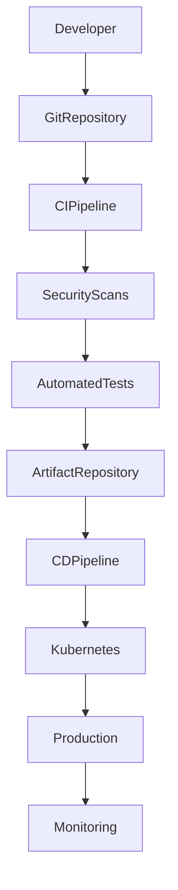

# ARCH-113 — Enterprise DevSecOps Architecture

> Référentiel officiel de l'architecture **DevSecOps** de la plateforme **EduWeb Planner**.

---

# Sommaire

1. Vision
2. Objectifs
3. Principes DevSecOps
4. Architecture globale
5. GitOps
6. Gestion du code source
7. Intégration Continue (CI)
8. Livraison Continue (CD)
9. Déploiement Continu
10. Tests automatisés
11. Sécurité dans le pipeline
12. Gestion des artefacts
13. Infrastructure as Code
14. Gestion des environnements
15. Gestion des versions
16. Feature Flags
17. Rollback
18. Observabilité du pipeline
19. Gouvernance
20. API conceptuelle
21. Bonnes pratiques
22. Anti-patterns
23. KPI
24. Règles d'architecture

---

# 1. Vision

EduWeb Planner adopte une approche **DevSecOps** où le développement, la sécurité et l'exploitation collaborent tout au long du cycle de vie logiciel.

L'objectif est de livrer rapidement des fonctionnalités fiables tout en intégrant la sécurité dès la conception.

---

# 2. Objectifs

L'architecture DevSecOps vise à :

- accélérer les livraisons ;
- automatiser les déploiements ;
- intégrer la sécurité dès le développement ;
- améliorer la qualité logicielle ;
- réduire les incidents ;
- renforcer la traçabilité.

---

# 3. Principes DevSecOps

Les principes directeurs sont :

- Automation First
- Shift Left Security
- GitOps
- Continuous Testing
- Continuous Delivery
- Infrastructure as Code
- Observability by Design

---

# 4. Architecture globale

```text
Developer

↓

Git Repository

↓

CI Pipeline

↓

Security Scans

↓

Automated Tests

↓

Artifact Repository

↓

CD Pipeline

↓

Kubernetes

↓

Production

↓

Monitoring
```

---

# 5. GitOps

Git constitue la source unique de vérité.

Les déploiements sont pilotés à partir des dépôts Git.

Les avantages :

- traçabilité ;
- auditabilité ;
- reproductibilité ;
- retour arrière facilité.

---

# 6. Gestion du code source

Les développements sont organisés par :

- branches ;
- revues de code ;
- Pull Requests ;
- validation automatique.

Chaque modification est historisée.

---

# 7. Intégration Continue (CI)

Le pipeline CI réalise automatiquement :

- compilation ;
- analyse statique ;
- tests unitaires ;
- génération des artefacts.

Aucun code ne peut être intégré sans validation.

---

# 8. Livraison Continue (CD)

La livraison continue automatise :

- préparation ;
- validation ;
- publication ;
- déploiement.

Les environnements sont cohérents grâce à l'automatisation.

---

# 9. Déploiement Continu

Les déploiements peuvent être :

- manuels ;
- semi-automatiques ;
- automatiques.

Les stratégies supportées :

- Rolling Update ;
- Blue/Green ;
- Canary.

Le choix dépend du niveau de criticité.

---

# 10. Tests automatisés

Les tests comprennent :

- unitaires ;
- intégration ;
- API ;
- end-to-end ;
- performance ;
- sécurité.

Ils sont exécutés à chaque pipeline.

---

# 11. Sécurité dans le pipeline

Les contrôles incluent :

- analyse des dépendances ;
- analyse statique du code ;
- détection de secrets ;
- scan des conteneurs ;
- vérification des licences.

Les vulnérabilités critiques bloquent le pipeline.

---

# 12. Gestion des artefacts

Les artefacts sont stockés dans un dépôt sécurisé.

Exemples :

- images de conteneurs ;
- bibliothèques ;
- packages ;
- livrables.

Chaque version est identifiée de manière unique.

---

# 13. Infrastructure as Code

L'infrastructure est décrite sous forme de code.

Les changements suivent le même cycle de validation que les applications.

---

# 14. Gestion des environnements

Environnements typiques :

- Développement ;
- Intégration ;
- Recette ;
- Préproduction ;
- Production.

Chaque environnement est isolé et configurable.

---

# 15. Gestion des versions

Le versionnement suit une convention cohérente.

Exemple :

```
MAJOR.MINOR.PATCH

2.5.1
```

Les versions sont associées aux livrables et aux notes de publication.

---

# 16. Feature Flags

Les fonctionnalités peuvent être activées ou désactivées sans redéploiement.

Cas d'usage :

- expérimentation ;
- déploiement progressif ;
- retour arrière rapide.

---

# 17. Rollback

Le système permet un retour rapide vers une version stable en cas d'incident.

Les procédures de rollback sont testées régulièrement.

---

# 18. Observabilité du pipeline

Chaque exécution fournit :

- durée ;
- statut ;
- erreurs ;
- couverture des tests ;
- résultats des scans de sécurité.

Ces informations alimentent les tableaux de bord DevOps.

---

# 19. Gouvernance

La gouvernance implique :

- Architecte Logiciel ;
- Architecte Cloud ;
- DevOps ;
- RSSI ;
- QA ;
- Comité Architecture.

Les pipelines sont revus périodiquement.

---

# 20. API conceptuelle

```typescript
EnterpriseDevSecOps {

    Git

    CIPipeline

    CDPipeline

    SecurityScanning

    Testing

    ArtifactRepository

    Deployment

    Rollback

    Monitoring

}
```

---

# 21. Bonnes pratiques

✔ Automatiser tous les tests possibles.

✔ Intégrer les contrôles de sécurité dès le développement.

✔ Utiliser Git comme source unique de vérité.

✔ Réaliser des revues de code systématiques.

✔ Déployer progressivement les fonctionnalités critiques.

✔ Documenter les pipelines et les procédures de reprise.

---

# 22. Anti-patterns

✘ Déploiements manuels en production.

✘ Absence de tests automatisés.

✘ Contournement des revues de code.

✘ Secrets stockés dans le dépôt Git.

✘ Absence de stratégie de rollback.

✘ Validation uniquement en fin de projet.

---

# Diagramme Mermaid



---

# KPI

| KPI | Objectif |
|------|----------|
|Déploiements automatisés|100 %|
|Couverture des tests automatisés|> 90 %|
|Temps moyen du pipeline CI|< 10 min|
|Vulnérabilités critiques en production|0|
|Temps moyen de rollback|< 10 min|

---

# Règles d'architecture

## RA-ARCH113-001

Toute modification du code ou de l'infrastructure est versionnée dans Git et validée via une revue de code avant intégration.

---

## RA-ARCH113-002

Les pipelines CI/CD exécutent automatiquement les contrôles de qualité, les tests et les analyses de sécurité avant tout déploiement.

---

## RA-ARCH113-003

Les artefacts déployés en production proviennent exclusivement des dépôts d'artefacts validés par le pipeline.

---

## RA-ARCH113-004

Les déploiements critiques utilisent des stratégies limitant les risques (Rolling Update, Blue/Green ou Canary) ainsi qu'un mécanisme de rollback documenté.

---

## RA-ARCH113-005

Les pipelines, les environnements et les infrastructures sont supervisés et régulièrement audités afin de garantir leur conformité, leur sécurité et leur performance.

---

# Documents liés

- ARCH-101 — Enterprise Architecture Overview
- ARCH-108 — Enterprise Security Architecture
- ARCH-109 — High Availability, Scalability & Resilience Architecture
- ARCH-110 — Cloud-Native Architecture
- ARCH-112 — Enterprise Observability Architecture
- OPS-101 — CI/CD Standards
- OPS-102 — GitOps Framework
- OPS-103 — Infrastructure as Code Standards
- SEC-003 — Secure Software Development Lifecycle (SSDLC)

---

# Conclusion

L'**Enterprise DevSecOps Architecture** constitue le cadre de référence pour le développement, le déploiement et l'exploitation d'EduWeb Planner. En combinant automatisation, intégration continue, livraison continue, sécurité intégrée, Infrastructure as Code et observabilité, elle permet de livrer rapidement des solutions fiables, sécurisées et évolutives, tout en garantissant la qualité et la maîtrise opérationnelle de la plateforme.

# Fin du document
