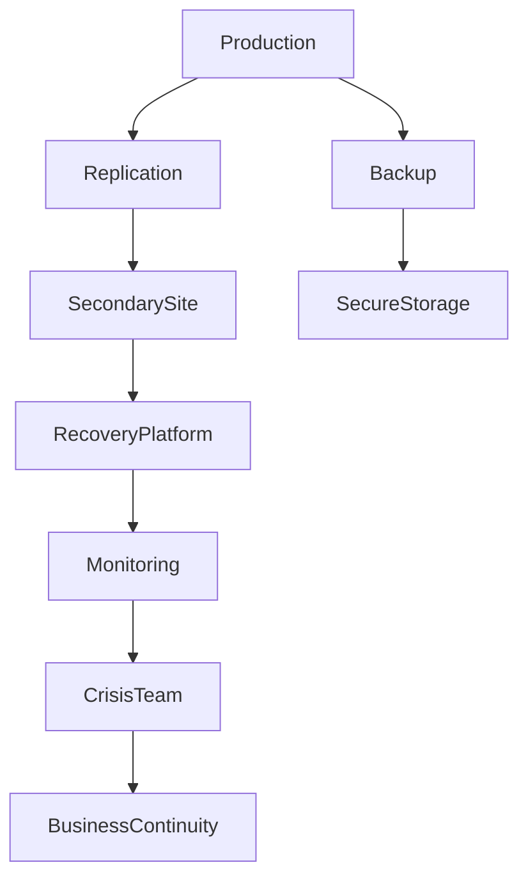

# ARCH-114 — Enterprise Disaster Recovery & Business Continuity Architecture

> Référentiel officiel de l'architecture de **Continuité d'Activité (PCA)** et de **Reprise après Sinistre (PRA)** de la plateforme **EduWeb Planner**.

---

# Sommaire

1. Vision
2. Objectifs
3. Principes fondamentaux
4. Architecture globale
5. Analyse d'Impact Métier (BIA)
6. Classification des services critiques
7. Plan de Continuité d'Activité (PCA)
8. Plan de Reprise d'Activité (PRA)
9. Sauvegardes
10. Réplication
11. Site de secours
12. Gestion des crises
13. Gestion des incidents majeurs
14. Communication de crise
15. Tests de continuité
16. Gestion documentaire
17. Automatisation de la reprise
18. Gouvernance
19. API conceptuelle
20. Bonnes pratiques
21. Anti-patterns
22. KPI
23. Règles d'architecture

---

# 1. Vision

EduWeb Planner doit assurer la continuité des services éducatifs même en cas :

- de panne majeure ;
- de catastrophe naturelle ;
- d'incident cyber ;
- de perte d'un centre de données ;
- d'erreur humaine critique.

L'objectif est de garantir un niveau de disponibilité compatible avec les exigences des établissements scolaires, des universités et des administrations publiques.

---

# 2. Objectifs

Cette architecture vise à :

- assurer la continuité des services essentiels ;
- limiter les interruptions ;
- protéger les données ;
- réduire les pertes d'exploitation ;
- accélérer la reprise ;
- maintenir la confiance des utilisateurs.

---

# 3. Principes fondamentaux

Les principes retenus sont :

- Business Continuity by Design
- Disaster Recovery by Design
- Redondance
- Automatisation
- Résilience
- Tests réguliers
- Amélioration continue

---

# 4. Architecture globale

```text
Production

↓

Replication

↓

Secondary Site

↓

Backups

↓

Recovery Platform

↓

Monitoring

↓

Business Continuity Team
```

---

# 5. Analyse d'Impact Métier (BIA)

Chaque service est évalué selon :

- impact financier ;
- impact pédagogique ;
- impact administratif ;
- impact juridique ;
- impact réputationnel.

Cette analyse permet de prioriser les actions de reprise.

---

# 6. Classification des services critiques

### Niveau 1 — Critique

Exemples :

- Authentification
- Gestion des établissements
- Paiements
- Emplois du temps

---

### Niveau 2 — Important

- RH
- Gouvernance
- Gestion documentaire

---

### Niveau 3 — Standard

- Reporting avancé
- Statistiques historiques

---

# 7. Plan de Continuité d'Activité (PCA)

Le PCA prévoit :

- fonctionnement dégradé ;
- priorisation des services ;
- procédures alternatives ;
- responsabilités ;
- communication.

Le PCA est maintenu à jour et révisé régulièrement.

---

# 8. Plan de Reprise d'Activité (PRA)

Le PRA définit :

- scénarios ;
- responsabilités ;
- procédures ;
- ressources ;
- critères de validation.

Objectifs indicatifs :

| Niveau | RTO | RPO |
|----------|------|------|
| Critique | ≤ 1 h | ≤ 15 min |
| Important | ≤ 4 h | ≤ 1 h |
| Standard | ≤ 24 h | ≤ 24 h |

Les valeurs peuvent être adaptées selon les engagements de service.

---

# 9. Sauvegardes

Les sauvegardes comprennent :

- bases de données ;
- documents ;
- configurations ;
- secrets ;
- journaux essentiels.

Les sauvegardes sont :

- automatisées ;
- chiffrées ;
- testées.

---

# 10. Réplication

Les données critiques peuvent être répliquées :

- localement ;
- vers un second site ;
- entre plusieurs régions cloud.

Les mécanismes de réplication sont adaptés au niveau de criticité.

---

# 11. Site de secours

Le site de secours peut être :

- chaud (Hot Site) ;
- tiède (Warm Site) ;
- froid (Cold Site).

Le choix dépend :

- des exigences métier ;
- des coûts ;
- des délais de reprise.

---

# 12. Gestion des crises

En cas d'incident majeur :

```text
Détection

↓

Qualification

↓

Activation de la cellule de crise

↓

Décisions

↓

Communication

↓

Reprise

↓

Retour d'expérience
```

Chaque rôle est défini à l'avance.

---

# 13. Gestion des incidents majeurs

Les incidents majeurs incluent :

- perte totale d'un datacenter ;
- cyberattaque ;
- corruption massive de données ;
- indisponibilité prolongée du cloud ;
- panne généralisée.

Des procédures spécifiques sont documentées pour chaque scénario.

---

# 14. Communication de crise

Les parties prenantes sont informées selon un plan défini :

- Direction Générale ;
- équipes techniques ;
- établissements ;
- partenaires ;
- autorités compétentes ;
- utilisateurs.

La communication est centralisée afin d'assurer la cohérence des messages.

---

# 15. Tests de continuité

Les exercices comprennent :

- restauration de sauvegardes ;
- bascule vers le site de secours ;
- simulations de crise ;
- exercices de communication.

Les résultats sont analysés afin d'améliorer les procédures.

---

# 16. Gestion documentaire

Les documents suivants sont maintenus :

- PCA ;
- PRA ;
- procédures ;
- listes de contacts ;
- check-lists ;
- comptes rendus d'exercices.

Les versions sont contrôlées.

---

# 17. Automatisation de la reprise

Les mécanismes automatisés peuvent inclure :

- bascule des services ;
- restauration des configurations ;
- redémarrage des clusters ;
- reconfiguration du routage.

Les automatisations sont validées avant leur mise en œuvre.

---

# 18. Gouvernance

La gouvernance implique :

- Direction Générale ;
- RSSI ;
- Architecte Infrastructure ;
- DevOps ;
- SRE ;
- Comité de Continuité d'Activité.

Des revues annuelles sont organisées.

---

# 19. API conceptuelle

```typescript
EnterpriseRecovery {

    Backup

    Replication

    Recovery

    Continuity

    CrisisManagement

    DisasterRecovery

    Monitoring

    Reporting

}
```

---

# 20. Bonnes pratiques

✔ Tester régulièrement les sauvegardes.

✔ Réaliser des exercices de bascule.

✔ Documenter tous les scénarios.

✔ Identifier clairement les responsabilités.

✔ Automatiser les procédures répétitives.

✔ Réviser les plans après chaque incident majeur.

---

# 21. Anti-patterns

✘ Sauvegardes jamais restaurées.

✘ PCA obsolète.

✘ Procédures non documentées.

✘ Contacts de crise non mis à jour.

✘ Dépendance à une seule région cloud.

✘ Absence d'exercices de simulation.

---

# Diagramme Mermaid



---

# KPI

| KPI | Objectif |
|------|----------|
|Taux de réussite des sauvegardes|100 %|
|Tests de restauration réalisés|100 % selon le planning annuel|
|Respect du RTO|≥ 95 %|
|Respect du RPO|≥ 95 %|
|Exercices PCA/PRA réalisés|Au moins 2 par an|
|Plans PCA/PRA révisés|1 fois par an minimum|

---

# Règles d'architecture

## RA-ARCH114-001

Tous les services critiques disposent d'un PCA et d'un PRA documentés, validés et régulièrement révisés.

---

## RA-ARCH114-002

Les sauvegardes des données critiques sont automatisées, chiffrées, testées et conservées conformément aux politiques de rétention.

---

## RA-ARCH114-003

Les objectifs RTO et RPO sont définis pour chaque service selon son niveau de criticité et suivis par des indicateurs.

---

## RA-ARCH114-004

Les procédures de reprise font l'objet d'exercices réguliers afin de garantir leur efficacité opérationnelle.

---

## RA-ARCH114-005

Chaque incident majeur donne lieu à un retour d'expérience documenté et à un plan d'amélioration continue.

---

# Documents liés

- ARCH-108 — Enterprise Security Architecture
- ARCH-109 — High Availability, Scalability & Resilience Architecture
- ARCH-110 — Cloud-Native Architecture
- ARCH-112 — Enterprise Observability Architecture
- ARCH-113 — Enterprise DevSecOps Architecture
- OPS-201 — Business Continuity Management
- OPS-202 — Disaster Recovery Procedures
- SEC-005 — Cyber Crisis Management

---

# Conclusion

L'**Enterprise Disaster Recovery & Business Continuity Architecture** définit le cadre de référence permettant à EduWeb Planner de maintenir ou de rétablir rapidement ses services en cas de crise majeure. En combinant plans de continuité, plans de reprise, sauvegardes, réplications, automatisation et gouvernance, cette architecture garantit la résilience opérationnelle de la plateforme et la protection durable des activités éducatives qu'elle supporte.

# Fin du document
