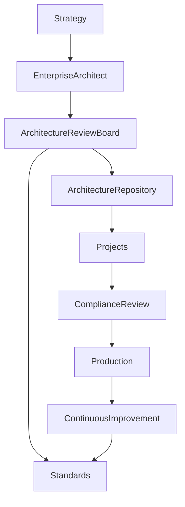

# ARCH-115 — Enterprise Architecture Governance

> Référentiel officiel de la **gouvernance de l'architecture d'entreprise** d'**EduWeb Planner**.

---

# Sommaire

1. Vision
2. Objectifs
3. Principes de gouvernance
4. Architecture Governance Framework
5. Les acteurs
6. Architecture Review Board (ARB)
7. Processus de gouvernance
8. Gestion des décisions d'architecture
9. Architecture Repository
10. Architecture Compliance
11. Gestion des exceptions
12. Urbanisation du SI
13. Gestion des standards
14. Gestion des risques d'architecture
15. Architecture Maturity
16. Architecture Roadmap
17. Documentation d'architecture
18. Communication
19. Amélioration continue
20. API conceptuelle
21. Bonnes pratiques
22. Anti-patterns
23. KPI
24. Règles d'architecture

---

# 1. Vision

La gouvernance d'architecture garantit que toutes les évolutions de la plateforme **EduWeb Planner** restent :

- cohérentes ;
- évolutives ;
- sécurisées ;
- alignées avec la stratégie de l'organisation.

L'architecture devient ainsi un véritable **levier de transformation numérique**.

---

# 2. Objectifs

Cette gouvernance vise à :

- maintenir la cohérence globale ;
- limiter la dette technique ;
- accélérer les décisions ;
- favoriser la réutilisation ;
- garantir la qualité des architectures ;
- accompagner les projets.

---

# 3. Principes de gouvernance

Les principes directeurs sont :

- Business First
- Architecture First
- Reuse Before Build
- API First
- Cloud First
- Security by Design
- AI by Design
- Data by Design

---

# 4. Architecture Governance Framework

La gouvernance couvre :

```
Vision

↓

Business Architecture

↓

Information Systems

↓

Applications

↓

Data

↓

Infrastructure

↓

Cloud

↓

AI

↓

Security

↓

Operations
```

---

# 5. Les acteurs

La gouvernance implique :

## Direction Générale

Définit la vision stratégique.

---

## Enterprise Architect

Pilote l'architecture globale.

---

## Domain Architects

Responsables des architectures métier.

---

## Solution Architects

Conçoivent les solutions des projets.

---

## Technical Architects

Garantissent la cohérence technique.

---

## DevOps

Assurent l'exploitation.

---

## RSSI

Garantit la sécurité.

---

## Data Architect

Pilote la gouvernance des données.

---

## AI Architect

Pilote les architectures IA.

---

# 6. Architecture Review Board (ARB)

Le comité d'architecture valide :

- nouvelles architectures ;
- choix techniques majeurs ;
- dérogations ;
- standards ;
- feuilles de route.

Le comité se réunit périodiquement ou à la demande.

---

# 7. Processus de gouvernance

```text
Besoin

↓

Étude

↓

Architecture

↓

Revue

↓

Validation

↓

Développement

↓

Déploiement

↓

Audit
```

Chaque étape est documentée.

---

# 8. Gestion des décisions d'architecture

Toutes les décisions importantes sont formalisées sous forme d'**Architecture Decision Records (ADR)**.

Chaque ADR comprend :

- contexte ;
- problème ;
- options étudiées ;
- décision retenue ;
- justification ;
- impacts ;
- date ;
- responsables.

---

# 9. Architecture Repository

Le référentiel central contient :

- diagrammes ;
- standards ;
- modèles ;
- ADR ;
- feuilles de route ;
- catalogues ;
- bonnes pratiques.

Il constitue la mémoire technique de la plateforme.

---

# 10. Architecture Compliance

Les projets sont évalués selon leur conformité aux référentiels.

Les contrôles portent notamment sur :

- sécurité ;
- données ;
- API ;
- cloud ;
- IA ;
- performances.

Les écarts donnent lieu à un plan de remédiation.

---

# 11. Gestion des exceptions

Lorsqu'une dérogation est nécessaire :

- justification ;
- analyse de risques ;
- durée de validité ;
- validation par l'ARB ;
- plan de retour à la conformité.

Les exceptions sont limitées dans le temps.

---

# 12. Urbanisation du SI

Le système d'information est organisé par domaines fonctionnels afin de :

- limiter les dépendances ;
- favoriser la modularité ;
- simplifier les évolutions.

L'urbanisation s'appuie sur les principes du Domain-Driven Design.

---

# 13. Gestion des standards

Les standards concernent notamment :

- architecture ;
- développement ;
- sécurité ;
- données ;
- UX ;
- DevSecOps ;
- IA.

Ils sont publiés, versionnés et révisés régulièrement.

---

# 14. Gestion des risques d'architecture

Les risques évalués incluent :

- dette technique ;
- obsolescence ;
- dépendance fournisseur ;
- sécurité ;
- disponibilité ;
- conformité.

Chaque risque fait l'objet d'un suivi.

---

# 15. Architecture Maturity

Le niveau de maturité est évalué selon plusieurs axes :

- gouvernance ;
- documentation ;
- automatisation ;
- sécurité ;
- qualité ;
- observabilité.

Les résultats orientent les actions d'amélioration.

---

# 16. Architecture Roadmap

La feuille de route décrit :

- les évolutions ;
- les migrations ;
- les remplacements ;
- les innovations ;
- les priorités.

Elle est révisée au minimum une fois par an.

---

# 17. Documentation d'architecture

Chaque domaine possède :

- une vision ;
- des diagrammes ;
- des normes ;
- des modèles ;
- une documentation API ;
- des guides d'exploitation.

Les documents sont versionnés.

---

# 18. Communication

La gouvernance prévoit :

- revues d'architecture ;
- ateliers ;
- formations ;
- communautés de pratique ;
- diffusion des standards.

---

# 19. Amélioration continue

Le cycle est permanent :

```text
Mesure

↓

Analyse

↓

Décision

↓

Amélioration

↓

Standardisation
```

Les retours d'expérience alimentent les évolutions du référentiel.

---

# 20. API conceptuelle

```typescript
EnterpriseGovernance {

    ArchitectureBoard

    Standards

    Repository

    ADR

    Compliance

    Roadmap

    RiskManagement

    ContinuousImprovement

}
```

---

# 21. Bonnes pratiques

✔ Formaliser les décisions importantes avec des ADR.

✔ Réaliser des revues d'architecture régulières.

✔ Maintenir un référentiel documentaire unique.

✔ Limiter les dérogations.

✔ Mettre à jour les standards après chaque évolution majeure.

✔ Impliquer les métiers dans les décisions structurantes.

---

# 22. Anti-patterns

✘ Décisions d'architecture non documentées.

✘ Multiplication de standards contradictoires.

✘ Architecture dépendante des personnes plutôt que des référentiels.

✘ Dérogations permanentes.

✘ Documentation obsolète.

✘ Gouvernance uniquement réactive.

---

# Diagramme Mermaid



---

# KPI

| KPI | Objectif |
|------|----------|
|Projets soumis à une revue d'architecture|100 %|
|Décisions majeures documentées (ADR)|100 %|
|Conformité aux standards d'architecture|> 95 %|
|Standards révisés|Au moins une fois par an|
|Dérogations ouvertes|Réduction continue|

---

# Règles d'architecture

## RA-ARCH115-001

Tout projet impactant l'architecture d'entreprise fait l'objet d'une revue par l'Architecture Review Board avant sa mise en production.

---

## RA-ARCH115-002

Les décisions d'architecture structurantes sont documentées sous forme d'Architecture Decision Records (ADR) et conservées dans le référentiel d'architecture.

---

## RA-ARCH115-003

Les standards d'architecture sont versionnés, publiés et appliqués à l'ensemble des projets, sauf dérogation approuvée.

---

## RA-ARCH115-004

Les écarts de conformité sont identifiés, évalués et accompagnés d'un plan de remédiation validé.

---

## RA-ARCH115-005

La gouvernance de l'architecture est revue périodiquement afin de garantir son alignement avec la stratégie, les évolutions technologiques et les besoins métiers.

---

# Documents liés

- ARCH-101 — Enterprise Architecture Overview
- ARCH-102 — Enterprise Microservices Architecture
- ARCH-107 — Enterprise AI & Multi-Agent Architecture
- ARCH-108 — Enterprise Security Architecture
- ARCH-110 — Cloud-Native Architecture
- ARCH-113 — Enterprise DevSecOps Architecture
- ARCH-114 — Disaster Recovery & Business Continuity
- GOV-101 — Enterprise Governance Framework
- GOV-102 — Architecture Decision Records Standard
- GOV-103 — Enterprise Standards Catalog

---

# Conclusion

L'**Enterprise Architecture Governance** constitue le cadre décisionnel garantissant la cohérence, la qualité et la pérennité de l'ensemble des architectures d'EduWeb Planner. En s'appuyant sur des standards communs, un comité d'architecture, un référentiel documentaire centralisé, des revues de conformité et une démarche d'amélioration continue, elle assure que chaque évolution de la plateforme reste alignée avec la stratégie institutionnelle, les exigences techniques et les meilleures pratiques internationales.

# Fin du document
