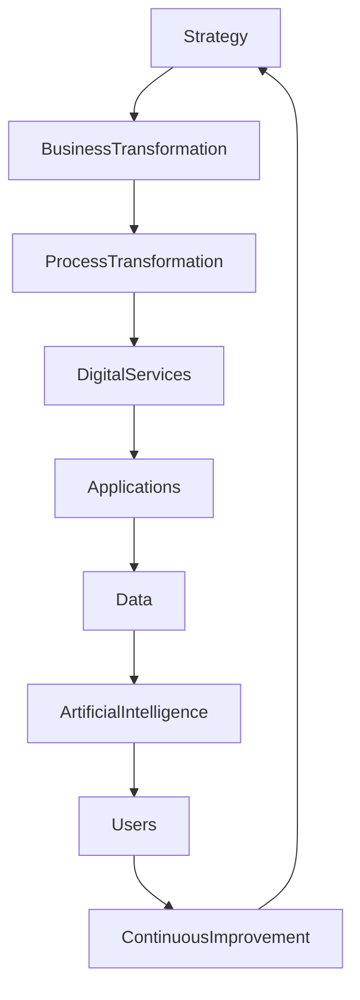

# ARCH-116 — Enterprise Digital Transformation Architecture

> Référentiel officiel de l'architecture de **Transformation Numérique** de la plateforme **EduWeb Planner**.

---

# Sommaire

1. Vision
2. Objectifs
3. Principes directeurs
4. Architecture globale
5. Alignement stratégique
6. Transformation des processus métier
7. Transformation des services
8. Transformation des données
9. Transformation des applications
10. Transformation de l'infrastructure
11. Transformation des compétences
12. Intelligence Artificielle comme accélérateur
13. Innovation continue
14. Conduite du changement
15. Mesure de la maturité numérique
16. Pilotage de la transformation
17. Gouvernance
18. API conceptuelle
19. Bonnes pratiques
20. Anti-patterns
21. KPI
22. Règles d'architecture

---

# 1. Vision

EduWeb Planner constitue le socle numérique permettant aux établissements scolaires, aux universités, aux administrations publiques et aux ministères de transformer durablement leurs modes de fonctionnement.

La transformation numérique ne consiste pas uniquement à digitaliser les procédures existantes, mais à **repenser les organisations, les processus, les services et les modes de collaboration** afin d'améliorer la qualité du service rendu.

---

# 2. Objectifs

Cette architecture vise à :

- moderniser les processus métiers ;
- améliorer l'expérience utilisateur ;
- accélérer les prises de décision ;
- favoriser l'exploitation des données ;
- intégrer l'intelligence artificielle dans les processus ;
- renforcer la collaboration entre les acteurs ;
- soutenir une amélioration continue.

---

# 3. Principes directeurs

La transformation numérique repose sur les principes suivants :

- User First
- Digital by Default
- Cloud First
- AI First
- Data Driven
- Mobile First
- API First
- Security by Design
- Continuous Improvement

---

# 4. Architecture globale

```text
Vision Stratégique

↓

Transformation Métier

↓

Transformation Organisationnelle

↓

Transformation Numérique

↓

Applications

↓

Données

↓

Intelligence Artificielle

↓

Pilotage

↓

Amélioration Continue
```

---

# 5. Alignement stratégique

Toute initiative numérique doit être alignée avec :

- la vision institutionnelle ;
- les objectifs stratégiques ;
- les politiques publiques ;
- les besoins des utilisateurs ;
- les contraintes réglementaires.

Les projets sont priorisés selon leur valeur métier.

---

# 6. Transformation des processus métier

Les processus sont :

- cartographiés ;
- simplifiés ;
- automatisés lorsque pertinent ;
- mesurés ;
- continuellement optimisés.

L'automatisation ne doit jamais reproduire un processus inefficace sans remise en question préalable.

---

# 7. Transformation des services

Les services numériques doivent être :

- accessibles ;
- omnicanaux ;
- disponibles en continu lorsque nécessaire ;
- personnalisés selon les profils utilisateurs ;
- interopérables.

Les parcours utilisateurs sont conçus autour des besoins réels.

---

# 8. Transformation des données

Les données deviennent un actif stratégique.

Les actions comprennent :

- normalisation ;
- gouvernance ;
- partage sécurisé ;
- valorisation analytique ;
- exploitation par les systèmes d'IA.

---

# 9. Transformation des applications

Les applications évoluent vers :

- une architecture modulaire ;
- des microservices ;
- des API ouvertes ;
- des interfaces modernes ;
- des composants réutilisables.

La réutilisation est privilégiée avant tout nouveau développement.

---

# 10. Transformation de l'infrastructure

L'infrastructure est conçue pour être :

- évolutive ;
- automatisée ;
- hautement disponible ;
- sécurisée ;
- observable ;
- résiliente.

Les infrastructures Cloud-Native sont privilégiées.

---

# 11. Transformation des compétences

La réussite de la transformation numérique repose également sur les compétences humaines.

Les actions incluent :

- formation continue ;
- développement des compétences numériques ;
- accompagnement des utilisateurs ;
- communautés de pratique ;
- partage des connaissances.

---

# 12. Intelligence Artificielle comme accélérateur

L'IA intervient notamment pour :

- assister les utilisateurs ;
- automatiser certaines tâches ;
- analyser les données ;
- recommander des actions ;
- améliorer la qualité des décisions.

L'IA complète l'expertise humaine sans s'y substituer.

---

# 13. Innovation continue

L'innovation est encouragée par :

- les laboratoires d'innovation ;
- les prototypes ;
- les expérimentations ;
- les retours utilisateurs ;
- les indicateurs de performance.

Les innovations validées sont progressivement industrialisées.

---

# 14. Conduite du changement

Chaque transformation est accompagnée par :

- un plan de communication ;
- des formations ;
- des ateliers ;
- des démonstrations ;
- des ambassadeurs du changement ;
- un suivi des usages.

L'adhésion des utilisateurs est un facteur clé de succès.

---

# 15. Mesure de la maturité numérique

La maturité est évaluée selon plusieurs dimensions :

- gouvernance ;
- culture numérique ;
- données ;
- sécurité ;
- processus ;
- technologies ;
- compétences ;
- innovation.

Les évaluations permettent de définir les priorités d'évolution.

---

# 16. Pilotage de la transformation

Le pilotage repose sur :

- des feuilles de route ;
- des indicateurs ;
- des tableaux de bord ;
- des revues périodiques ;
- des audits.

Les décisions sont prises sur la base de données mesurables.

---

# 17. Gouvernance

La gouvernance mobilise :

- Direction Générale ;
- Comité de Transformation Numérique ;
- Architectes ;
- Directions métiers ;
- RSSI ;
- DSI ;
- Responsables Innovation ;
- Responsables Formation.

Les responsabilités sont clairement définies.

---

# 18. API conceptuelle

```typescript
EnterpriseDigitalTransformation {

    Strategy

    BusinessTransformation

    ProcessTransformation

    ServiceTransformation

    DataTransformation

    ApplicationTransformation

    InfrastructureTransformation

    AITransformation

    ChangeManagement

    Innovation

    Governance

}
```

---

# 19. Bonnes pratiques

✔ Aligner chaque projet sur les objectifs stratégiques.

✔ Concevoir les services autour des utilisateurs.

✔ Déployer progressivement les innovations.

✔ Accompagner les utilisateurs dans le changement.

✔ Mesurer systématiquement les résultats.

✔ Réviser régulièrement la feuille de route numérique.

---

# 20. Anti-patterns

✘ Digitaliser des processus inefficaces sans les simplifier.

✘ Lancer des projets sans vision stratégique.

✘ Négliger l'accompagnement des utilisateurs.

✘ Considérer la transformation comme un projet ponctuel.

✘ Déployer des technologies sans gouvernance.

✘ Évaluer uniquement les aspects techniques.

---

# Diagramme Mermaid



---

# KPI

| KPI | Objectif |
|------|----------|
|Processus métiers digitalisés|> 90 %|
|Services accessibles en ligne|100 % des services éligibles|
|Satisfaction des utilisateurs|> 90 %|
|Adoption des nouveaux services|> 85 %|
|Taux d'automatisation des processus|Croissance continue|
|Indice global de maturité numérique|Progression annuelle documentée|

---

# Règles d'architecture

## RA-ARCH116-001

Toute initiative de transformation numérique est alignée avec la stratégie institutionnelle et les objectifs métiers.

---

## RA-ARCH116-002

Les processus sont analysés et optimisés avant toute automatisation ou digitalisation.

---

## RA-ARCH116-003

Les services numériques sont conçus selon une approche centrée utilisateur, sécurisée, accessible et interopérable.

---

## RA-ARCH116-004

La conduite du changement, la formation et l'accompagnement des utilisateurs font partie intégrante de chaque projet de transformation.

---

## RA-ARCH116-005

La transformation numérique est pilotée par des indicateurs mesurables et fait l'objet d'une amélioration continue fondée sur les retours d'expérience.

---

# Documents liés

- ARCH-101 — Enterprise Architecture Overview
- ARCH-103 — Domain-Driven Design
- ARCH-107 — Enterprise AI & Multi-Agent Architecture
- ARCH-111 — Enterprise Data Architecture
- ARCH-113 — Enterprise DevSecOps Architecture
- ARCH-115 — Enterprise Architecture Governance
- GOV-101 — Enterprise Governance Framework
- BPM-101 — Business Process Architecture
- AI-001 — Enterprise AI Strategy
- STRAT-101 — Digital Strategy Framework

---

# Conclusion

L'**Enterprise Digital Transformation Architecture** fournit le cadre de référence permettant à EduWeb Planner d'accompagner durablement la modernisation des établissements d'enseignement, des administrations et des organisations partenaires. En articulant stratégie, processus, données, technologies, intelligence artificielle, gouvernance et conduite du changement, elle garantit une transformation numérique cohérente, mesurable et créatrice de valeur pour l'ensemble des parties prenantes.

# Fin du document
