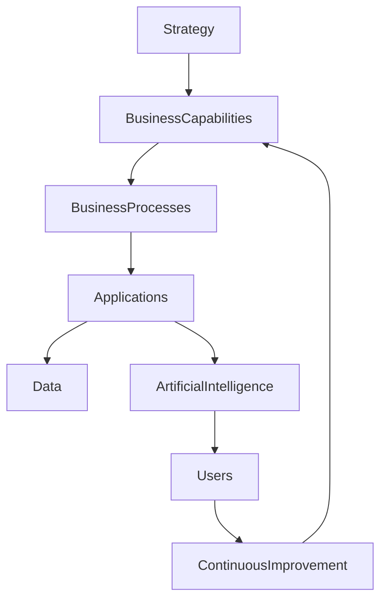

# ARCH-117 — Enterprise Business Capability Architecture

> Référentiel officiel de l'architecture des **capacités métiers (Business Capabilities)** de la plateforme **EduWeb Planner**.

---

# Sommaire

1. Vision
2. Objectifs
3. Principes fondamentaux
4. Qu'est-ce qu'une Business Capability ?
5. Architecture globale
6. Cartographie des capacités
7. Capacités stratégiques
8. Capacités cœur de métier
9. Capacités de soutien
10. Niveaux de maturité
11. Relations entre capacités
12. Alignement avec les processus métiers
13. Alignement avec les applications
14. Alignement avec les données
15. Alignement avec l'IA
16. Gouvernance des capacités
17. Évolution des capacités
18. API conceptuelle
19. Bonnes pratiques
20. Anti-patterns
21. KPI
22. Règles d'architecture

---

# 1. Vision

L'architecture des capacités métiers décrit **ce que l'organisation doit être capable de faire**, indépendamment :

- des applications ;
- des technologies ;
- des structures organisationnelles ;
- des personnes.

Elle constitue le lien entre la stratégie institutionnelle et les solutions numériques mises en œuvre par EduWeb Planner.

---

# 2. Objectifs

Cette architecture vise à :

- aligner les projets sur les besoins métiers ;
- identifier les capacités stratégiques ;
- faciliter les priorisations ;
- améliorer les investissements numériques ;
- guider les transformations ;
- mesurer la maturité fonctionnelle.

---

# 3. Principes fondamentaux

Les capacités métiers sont :

- stables ;
- indépendantes des applications ;
- orientées valeur ;
- réutilisables ;
- mesurables ;
- évolutives.

---

# 4. Qu'est-ce qu'une Business Capability ?

Une **Business Capability** représente une aptitude durable de l'organisation.

Exemples :

- gérer un établissement ;
- inscrire un élève ;
- produire un emploi du temps ;
- gérer une carrière ;
- piloter un budget ;
- publier une décision administrative.

Une capacité ne décrit pas **comment** une activité est réalisée, mais **ce que l'organisation sait faire**.

---

# 5. Architecture globale

```text
Vision stratégique

↓

Business Capabilities

↓

Business Processes

↓

Applications

↓

Données

↓

Infrastructure

↓

Utilisateurs
```

---

# 6. Cartographie des capacités

Les capacités sont regroupées par domaines.

## Gouvernance

- gestion des organisations ;
- gouvernance administrative ;
- décisions ;
- textes réglementaires.

---

## Éducation

- gestion des élèves ;
- gestion des enseignants ;
- emplois du temps ;
- examens ;
- évaluations.

---

## Ressources humaines

- recrutement ;
- carrière ;
- formation ;
- mobilité.

---

## Finance

- budget ;
- comptabilité ;
- paiements ;
- achats.

---

## Services numériques

- authentification ;
- notifications ;
- GED ;
- reporting.

---

## Intelligence Artificielle

- assistance ;
- recommandations ;
- recherche sémantique ;
- automatisation documentaire.

---

# 7. Capacités stratégiques

Les capacités stratégiques apportent un avantage majeur.

Exemples :

- pilotage national de l'éducation ;
- génération intelligente des emplois du temps ;
- gestion réglementaire ;
- agents IA spécialisés.

Ces capacités bénéficient d'investissements prioritaires.

---

# 8. Capacités cœur de métier

Elles soutiennent directement les missions principales.

Exemples :

- scolarité ;
- planification pédagogique ;
- administration ;
- évaluation.

---

# 9. Capacités de soutien

Ces capacités facilitent le fonctionnement général.

Exemples :

- gestion documentaire ;
- gestion des utilisateurs ;
- communication ;
- sécurité ;
- supervision.

---

# 10. Niveaux de maturité

Chaque capacité est évaluée selon une échelle de maturité.

| Niveau | Description |
|---------|-------------|
|1|Initial|
|2|Structuré|
|3|Maîtrisé|
|4|Optimisé|
|5|Innovant|

Les évaluations servent à orienter les investissements.

---

# 11. Relations entre capacités

Les capacités peuvent dépendre les unes des autres.

Exemple :

```text
Gestion des établissements

↓

Gestion des enseignants

↓

Gestion des classes

↓

Génération des emplois du temps

↓

Suivi pédagogique
```

Ces dépendances sont documentées afin de limiter les impacts des évolutions.

---

# 12. Alignement avec les processus métiers

Une capacité peut être mise en œuvre par plusieurs processus.

Inversement, un processus peut mobiliser plusieurs capacités.

Cette séparation facilite les évolutions organisationnelles.

---

# 13. Alignement avec les applications

Chaque capacité est supportée par un ou plusieurs composants applicatifs.

Exemple :

| Capacité | Module EduWeb |
|-----------|---------------|
|Gestion des emplois du temps|EduWeb Planner|
|Gestion administrative|EduWeb Governance|
|Formation en ligne|EduWeb E-School|
|Encadrement à domicile|EduWeb Family|
|Réservation des ressources|EduWeb Booking|

---

# 14. Alignement avec les données

Chaque capacité produit ou consomme des données.

Exemples :

- élèves ;
- enseignants ;
- établissements ;
- emplois du temps ;
- budgets ;
- décisions.

La gouvernance des données garantit leur cohérence.

---

# 15. Alignement avec l'IA

Les capacités peuvent être augmentées par des services d'intelligence artificielle.

Exemples :

- assistance conversationnelle ;
- recommandations pédagogiques ;
- génération automatique de documents ;
- aide à la décision ;
- recherche intelligente.

L'IA renforce les capacités sans modifier leur finalité.

---

# 16. Gouvernance des capacités

Chaque capacité possède :

- un responsable métier ;
- un responsable applicatif ;
- un responsable des données ;
- des indicateurs ;
- une feuille de route.

Les responsabilités sont clairement établies.

---

# 17. Évolution des capacités

Le cycle d'évolution est le suivant :

```text
Identification

↓

Analyse

↓

Priorisation

↓

Transformation

↓

Déploiement

↓

Évaluation

↓

Amélioration continue
```

Les évolutions sont alignées avec la stratégie institutionnelle.

---

# 18. API conceptuelle

```typescript
EnterpriseBusinessCapabilities {

    Governance

    Education

    HumanResources

    Finance

    DigitalServices

    ArtificialIntelligence

    CapabilityMap

    MaturityAssessment

    Roadmap

}
```

---

# 19. Bonnes pratiques

✔ Définir les capacités avant les solutions techniques.

✔ Cartographier les dépendances.

✔ Mesurer régulièrement leur maturité.

✔ Identifier un responsable pour chaque capacité.

✔ Réutiliser les capacités existantes avant d'en créer de nouvelles.

✔ Maintenir une cartographie vivante.

---

# 20. Anti-patterns

✘ Confondre capacité, processus et application.

✘ Organiser les capacités selon l'organigramme.

✘ Créer plusieurs capacités pour un même objectif métier.

✘ Négliger la gouvernance des capacités.

✘ Faire évoluer les applications sans mettre à jour la cartographie.

✘ Absence d'indicateurs de maturité.

---

# Diagramme Mermaid



---

# KPI

| KPI | Objectif |
|------|----------|
|Capacités cartographiées|100 %|
|Capacités avec responsable identifié|100 %|
|Capacités évaluées annuellement|100 %|
|Capacités critiques disposant d'une feuille de route|100 %|
|Indice moyen de maturité|Progression annuelle|

---

# Règles d'architecture

## RA-ARCH117-001

Toute solution numérique est rattachée à une ou plusieurs capacités métiers clairement identifiées.

---

## RA-ARCH117-002

Les capacités métiers sont définies indépendamment des applications, des technologies et de l'organisation interne.

---

## RA-ARCH117-003

Chaque capacité dispose d'un responsable métier, d'indicateurs de performance et d'une feuille de route d'évolution.

---

## RA-ARCH117-004

Les dépendances entre capacités sont documentées afin d'évaluer les impacts des évolutions et des transformations.

---

## RA-ARCH117-005

La cartographie des capacités est révisée périodiquement pour rester alignée avec la stratégie institutionnelle et les besoins des utilisateurs.

---

# Documents liés

- ARCH-101 — Enterprise Architecture Overview
- ARCH-103 — Domain-Driven Design
- ARCH-111 — Enterprise Data Architecture
- ARCH-115 — Enterprise Architecture Governance
- ARCH-116 — Enterprise Digital Transformation Architecture
- BPM-101 — Business Process Architecture
- GOV-101 — Enterprise Governance Framework
- STRAT-101 — Enterprise Strategic Planning
- AI-001 — Enterprise AI Strategy

---

# Conclusion

L'**Enterprise Business Capability Architecture** fournit une représentation stable et stratégique des aptitudes fondamentales de l'organisation. En dissociant les capacités des processus, des applications et des technologies, elle facilite l'alignement entre la stratégie, les transformations numériques et les investissements. Pour EduWeb Planner, elle constitue un outil essentiel de pilotage, de priorisation et de gouvernance des évolutions fonctionnelles à l'échelle nationale.

# Fin du document
