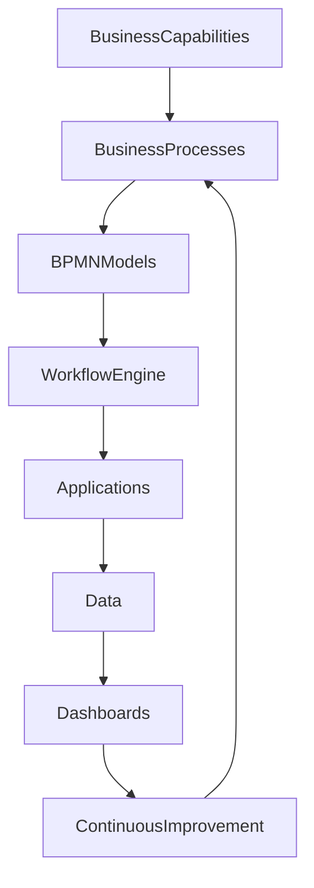

# ARCH-118 — Enterprise Business Process Architecture

> Référentiel officiel de l'architecture des **processus métiers** de la plateforme **EduWeb Planner**.

---

# Sommaire

1. Vision
2. Objectifs
3. Principes fondamentaux
4. Définition d'un processus métier
5. Architecture globale
6. Classification des processus
7. Processus stratégiques
8. Processus opérationnels
9. Processus de support
10. Cartographie des processus
11. Modélisation BPMN
12. Orchestration des processus
13. Automatisation des processus
14. Gestion des workflows
15. Pilotage par les processus
16. Optimisation continue
17. Gouvernance des processus
18. API conceptuelle
19. Bonnes pratiques
20. Anti-patterns
21. KPI
22. Règles d'architecture

---

# 1. Vision

EduWeb Planner place les **processus métiers** au cœur de la transformation numérique.

Les processus constituent la traduction opérationnelle des capacités métiers et permettent de délivrer des services cohérents, mesurables et reproductibles.

---

# 2. Objectifs

Cette architecture vise à :

- standardiser les pratiques ;
- simplifier les opérations ;
- automatiser les traitements répétitifs ;
- améliorer la qualité de service ;
- renforcer la traçabilité ;
- faciliter l'amélioration continue.

---

# 3. Principes fondamentaux

Les processus sont :

- orientés valeur ;
- documentés ;
- mesurables ;
- automatisables lorsque pertinent ;
- indépendants des personnes ;
- évolutifs.

---

# 4. Définition d'un processus métier

Un processus métier décrit **comment** une organisation réalise une activité afin de produire un résultat attendu.

Il comprend :

- un déclencheur ;
- des activités ;
- des décisions ;
- des acteurs ;
- des données ;
- un résultat.

---

# 5. Architecture globale

```text
Vision stratégique

↓

Business Capabilities

↓

Business Processes

↓

Workflows

↓

Applications

↓

Données

↓

Indicateurs
```

---

# 6. Classification des processus

Les processus sont répartis en trois catégories :

- processus stratégiques ;
- processus opérationnels ;
- processus de support.

Cette classification facilite leur gouvernance.

---

# 7. Processus stratégiques

Ils pilotent l'organisation.

Exemples :

- élaboration de la stratégie ;
- gouvernance institutionnelle ;
- pilotage des performances ;
- gestion des risques ;
- planification budgétaire.

---

# 8. Processus opérationnels

Ils produisent directement les services rendus aux utilisateurs.

Exemples :

- inscription des élèves ;
- affectation des enseignants ;
- génération des emplois du temps ;
- organisation des examens ;
- publication des résultats ;
- gestion des décisions administratives.

---

# 9. Processus de support

Ils soutiennent les activités principales.

Exemples :

- ressources humaines ;
- achats ;
- finances ;
- informatique ;
- documentation ;
- maintenance.

---

# 10. Cartographie des processus

Les processus sont représentés dans une cartographie hiérarchique.

```text
Niveau 1

Macro-processus

↓

Niveau 2

Processus

↓

Niveau 3

Sous-processus

↓

Niveau 4

Procédures

↓

Niveau 5

Instructions de travail
```

Chaque niveau est documenté et versionné.

---

# 11. Modélisation BPMN

Les processus sont modélisés selon la notation **BPMN 2.0**.

Les principaux éléments utilisés sont :

- événements ;
- activités ;
- passerelles ;
- flux ;
- piscines (Pools) ;
- couloirs (Lanes).

Cette notation facilite la compréhension par les métiers et les équipes techniques.

---

# 12. Orchestration des processus

Les workflows orchestrent :

- les tâches humaines ;
- les traitements automatiques ;
- les appels API ;
- les décisions ;
- les notifications.

Les moteurs de workflow assurent l'exécution des processus complexes.

---

# 13. Automatisation des processus

Les automatisations concernent notamment :

- validations ;
- notifications ;
- génération documentaire ;
- synchronisations ;
- calculs ;
- archivage.

L'automatisation est privilégiée lorsque la valeur ajoutée humaine est limitée.

---

# 14. Gestion des workflows

Chaque workflow possède :

- un propriétaire ;
- un état ;
- un historique ;
- des règles métier ;
- des délais de traitement ;
- des indicateurs.

Les workflows sont supervisés en temps réel.

---

# 15. Pilotage par les processus

Les processus sont suivis grâce à des indicateurs tels que :

- durée moyenne ;
- taux de réussite ;
- nombre de dossiers traités ;
- taux d'erreur ;
- niveau de satisfaction.

Les tableaux de bord facilitent les décisions.

---

# 16. Optimisation continue

Le cycle d'amélioration est le suivant :

```text
Mesure

↓

Analyse

↓

Identification des améliorations

↓

Optimisation

↓

Déploiement

↓

Évaluation
```

Les retours utilisateurs alimentent ce cycle.

---

# 17. Gouvernance des processus

Chaque processus dispose :

- d'un propriétaire métier ;
- d'un responsable opérationnel ;
- d'indicateurs de performance ;
- d'une documentation ;
- d'un historique des évolutions.

Les changements sont validés selon les règles de gouvernance.

---

# 18. API conceptuelle

```typescript
EnterpriseBusinessProcesses {

    ProcessCatalog

    BPMNModels

    Workflows

    Automation

    ProcessMonitoring

    KPIs

    Governance

    ContinuousImprovement

}
```

---

# 19. Bonnes pratiques

✔ Cartographier les processus avant leur automatisation.

✔ Utiliser BPMN 2.0 comme standard de modélisation.

✔ Définir un propriétaire pour chaque processus.

✔ Mesurer les performances de manière continue.

✔ Simplifier avant d'automatiser.

✔ Documenter toutes les évolutions.

---

# 20. Anti-patterns

✘ Automatiser un processus inefficace.

✘ Mélanger processus, procédures et applications.

✘ Absence de responsable identifié.

✘ Processus non documentés.

✘ Multiplication de variantes locales sans justification.

✘ Aucune mesure de performance.

---

# Diagramme Mermaid



---

# KPI

| KPI | Objectif |
|------|----------|
|Processus documentés|100 %|
|Processus modélisés en BPMN|100 % des processus critiques|
|Processus avec propriétaire identifié|100 %|
|Processus automatisés lorsque pertinent|Progression continue|
|Temps moyen de traitement|Réduction continue|
|Taux de conformité des processus|> 95 %|

---

# Règles d'architecture

## RA-ARCH118-001

Tout processus métier critique est documenté, cartographié et versionné selon les standards de l'organisation.

---

## RA-ARCH118-002

Les processus sont modélisés avec BPMN 2.0 afin de garantir une compréhension commune entre les métiers et les équipes techniques.

---

## RA-ARCH118-003

Chaque processus dispose d'un propriétaire métier, d'indicateurs de performance et d'un mécanisme de suivi.

---

## RA-ARCH118-004

L'automatisation des processus est précédée d'une analyse visant à simplifier et optimiser les activités existantes.

---

## RA-ARCH118-005

Les performances des processus sont mesurées régulièrement et alimentent une démarche d'amélioration continue.

---

# Documents liés

- ARCH-101 — Enterprise Architecture Overview
- ARCH-103 — Domain-Driven Design
- ARCH-104 — Event-Driven Architecture
- ARCH-105 — Enterprise API Architecture
- ARCH-117 — Enterprise Business Capability Architecture
- BPM-101 — BPM Governance Framework
- BPM-102 — Workflow Standards
- GOV-101 — Enterprise Governance Framework
- AI-002 — Intelligent Process Automation

---

# Conclusion

L'**Enterprise Business Process Architecture** constitue le référentiel de conception, de gouvernance et d'optimisation des processus métiers d'EduWeb Planner. En établissant une cartographie claire, une modélisation normalisée, une orchestration maîtrisée et une amélioration continue pilotée par des indicateurs, elle garantit des processus efficaces, évolutifs et alignés avec les objectifs stratégiques de l'organisation.

# Fin du document
