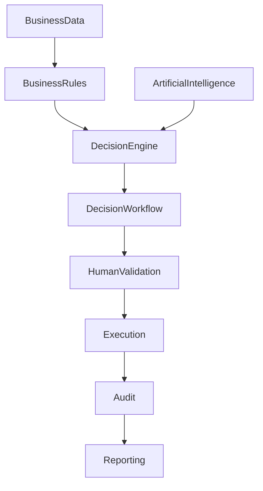

# ARCH-119 — Enterprise Decision Architecture

> Référentiel officiel de l'architecture de **gestion des décisions d'entreprise (Enterprise Decision Management)** de la plateforme **EduWeb Planner**.

---

# Sommaire

1. Vision
2. Objectifs
3. Principes fondamentaux
4. Qu'est-ce qu'une décision métier ?
5. Architecture globale
6. Typologie des décisions
7. Cycle de vie d'une décision
8. Moteur de règles métier
9. Moteur de décision
10. Décisions assistées par l'IA
11. Traçabilité des décisions
12. Explicabilité
13. Catalogue des décisions
14. Gouvernance des décisions
15. Audit et conformité
16. Performance décisionnelle
17. API conceptuelle
18. Bonnes pratiques
19. Anti-patterns
20. KPI
21. Règles d'architecture

---

# 1. Vision

Dans EduWeb Planner, la prise de décision constitue un actif stratégique.

L'architecture décisionnelle permet de :

- rendre les décisions cohérentes ;
- automatiser les décisions répétitives ;
- assister les décideurs humains ;
- garantir la transparence ;
- assurer la traçabilité complète.

---

# 2. Objectifs

Cette architecture vise à :

- standardiser les décisions métier ;
- séparer les règles métier du code applicatif ;
- améliorer la rapidité des traitements ;
- renforcer la conformité réglementaire ;
- intégrer l'intelligence artificielle lorsque cela est pertinent ;
- conserver une traçabilité complète.

---

# 3. Principes fondamentaux

Les décisions doivent être :

- explicables ;
- auditables ;
- reproductibles ;
- sécurisées ;
- gouvernées ;
- mesurables.

---

# 4. Qu'est-ce qu'une décision métier ?

Une décision métier est une conclusion produite à partir :

- de règles ;
- de données ;
- de politiques ;
- d'algorithmes ;
- ou d'une validation humaine.

Exemples :

- admission d'un élève ;
- validation d'un paiement ;
- affectation d'un enseignant ;
- publication d'une décision administrative ;
- génération d'un emploi du temps ;
- recommandation pédagogique.

---

# 5. Architecture globale

```text
Applications

↓

Business Rules

↓

Decision Engine

↓

Artificial Intelligence

↓

Decision Service

↓

Audit

↓

Reporting
```

---

# 6. Typologie des décisions

## Décisions entièrement automatiques

Exemples :

- calculs ;
- notifications ;
- validations techniques.

---

## Décisions assistées

L'IA ou le moteur de règles formule une proposition.

Un utilisateur valide la décision.

---

## Décisions humaines

La décision appartient exclusivement au responsable habilité.

Le système assure uniquement :

- la préparation ;
- la documentation ;
- la traçabilité.

---

# 7. Cycle de vie d'une décision

```text
Déclenchement

↓

Collecte des données

↓

Application des règles

↓

Analyse IA éventuelle

↓

Décision

↓

Validation

↓

Exécution

↓

Archivage

↓

Audit
```

---

# 8. Moteur de règles métier

Le moteur de règles contient :

- critères ;
- seuils ;
- politiques ;
- exceptions ;
- priorités.

Les règles sont configurables sans modifier le code applicatif.

---

# 9. Moteur de décision

Le moteur combine :

- règles métier ;
- workflows ;
- politiques ;
- modèles prédictifs ;
- validations humaines.

Chaque décision possède un identifiant unique.

---

# 10. Décisions assistées par l'IA

L'intelligence artificielle peut intervenir pour :

- recommander une décision ;
- détecter des anomalies ;
- calculer un niveau de confiance ;
- produire des explications ;
- proposer plusieurs scénarios.

La décision finale reste sous le contrôle de l'organisation lorsque les enjeux sont significatifs.

---

# 11. Traçabilité des décisions

Chaque décision conserve :

- date ;
- auteur ;
- données utilisées ;
- règles appliquées ;
- version des modèles IA ;
- justification ;
- résultat.

Cette traçabilité facilite les audits.

---

# 12. Explicabilité

Toute décision automatisée importante doit pouvoir expliquer :

- pourquoi elle a été prise ;
- quelles données ont été utilisées ;
- quelles règles ont été appliquées ;
- quel niveau de confiance est associé.

L'explicabilité renforce la confiance des utilisateurs.

---

# 13. Catalogue des décisions

Le catalogue référence :

- les décisions ;
- leurs propriétaires ;
- leurs règles ;
- leurs indicateurs ;
- leurs dépendances ;
- leur niveau de criticité.

Il constitue le référentiel décisionnel de l'organisation.

---

# 14. Gouvernance des décisions

Chaque décision possède :

- un propriétaire métier ;
- un responsable fonctionnel ;
- un responsable technique ;
- un responsable de conformité.

Les modifications suivent un processus de validation.

---

# 15. Audit et conformité

Les audits portent notamment sur :

- les règles métier ;
- les modèles IA ;
- les validations humaines ;
- les exceptions ;
- les journaux de décision.

Les exigences réglementaires sont prises en compte.

---

# 16. Performance décisionnelle

Les indicateurs suivis comprennent :

- temps moyen de décision ;
- taux d'automatisation ;
- taux d'erreur ;
- taux de validation humaine ;
- satisfaction des utilisateurs.

Ces mesures alimentent l'amélioration continue.

---

# 17. API conceptuelle

```typescript
EnterpriseDecisionManagement {

    DecisionCatalog

    BusinessRules

    DecisionEngine

    ArtificialIntelligence

    DecisionWorkflow

    Audit

    Reporting

    Governance

}
```

---

# 18. Bonnes pratiques

✔ Séparer les règles métier du code applicatif.

✔ Documenter toutes les décisions critiques.

✔ Utiliser l'IA comme assistance lorsque cela est approprié.

✔ Prévoir une validation humaine pour les décisions sensibles.

✔ Versionner les règles métier.

✔ Réaliser des audits réguliers.

---

# 19. Anti-patterns

✘ Règles métier codées en dur dans les applications.

✘ Décisions automatisées sans traçabilité.

✘ Modèles IA impossibles à expliquer.

✘ Absence de propriétaire métier.

✘ Exceptions non documentées.

✘ Journalisation insuffisante.

---

# Diagramme Mermaid



---

# KPI

| KPI | Objectif |
|------|----------|
|Décisions critiques documentées|100 %|
|Décisions traçables|100 %|
|Règles métier versionnées|100 %|
|Temps moyen de traitement|Réduction continue|
|Décisions assistées avec explicabilité|100 %|
|Audits de conformité réalisés|Selon le planning annuel|

---

# Règles d'architecture

## RA-ARCH119-001

Toute décision métier critique est documentée, versionnée et rattachée à un propriétaire métier identifié.

---

## RA-ARCH119-002

Les règles métier sont gérées dans un moteur de règles indépendant des applications afin de faciliter leur évolution et leur gouvernance.

---

## RA-ARCH119-003

Les décisions automatisées importantes sont explicables, traçables et auditables sur l'ensemble de leur cycle de vie.

---

## RA-ARCH119-004

Les décisions assistées par l'intelligence artificielle préservent un contrôle humain lorsque les impacts sont réglementaires, financiers ou pédagogiques.

---

## RA-ARCH119-005

Les performances du système décisionnel sont mesurées régulièrement et utilisées pour améliorer les règles, les modèles et les processus de décision.

---

# Documents liés

- ARCH-103 — Domain-Driven Design
- ARCH-104 — Event-Driven Architecture
- ARCH-107 — Enterprise AI & Multi-Agent Architecture
- ARCH-111 — Enterprise Data Architecture
- ARCH-115 — Enterprise Architecture Governance
- ARCH-117 — Enterprise Business Capability Architecture
- ARCH-118 — Enterprise Business Process Architecture
- GOV-104 — Enterprise Decision Governance
- AI-004 — Explainable Artificial Intelligence (XAI)

---

# Conclusion

L'**Enterprise Decision Architecture** fournit à EduWeb Planner un cadre structuré pour concevoir, automatiser, gouverner et auditer les décisions métier. En séparant les règles métier des applications, en intégrant des moteurs de décision, des mécanismes d'explicabilité et des capacités d'intelligence artificielle sous contrôle humain, cette architecture garantit des décisions cohérentes, transparentes, conformes et évolutives au service des établissements d'enseignement et des administrations.

# Fin du document
