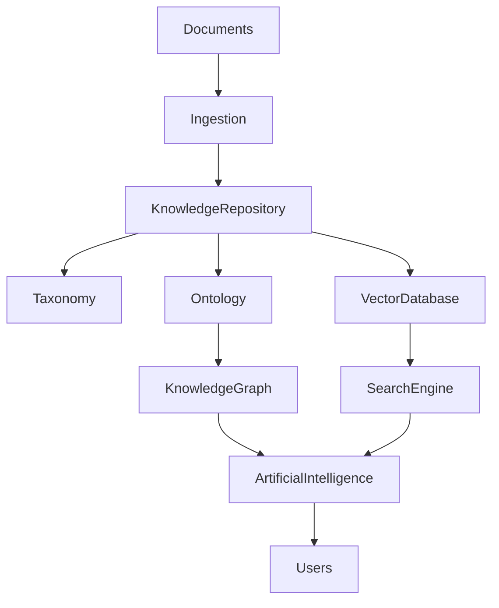

# ARCH-120 — Enterprise Knowledge Architecture

> Référentiel officiel de l'architecture de **gestion des connaissances (Enterprise Knowledge Architecture)** de la plateforme **EduWeb Planner**.

---

# Sommaire

1. Vision
2. Objectifs
3. Principes fondamentaux
4. Définition de la connaissance
5. Architecture globale
6. Sources de connaissances
7. Cycle de vie des connaissances
8. Capitalisation des connaissances
9. Organisation du référentiel documentaire
10. Base de connaissances
11. Ontologies métier
12. Taxonomie et classification
13. Recherche intelligente
14. RAG (Retrieval-Augmented Generation)
15. Gestion des connaissances IA
16. Gouvernance des connaissances
17. Qualité des connaissances
18. API conceptuelle
19. Bonnes pratiques
20. Anti-patterns
21. KPI
22. Règles d'architecture

---

# 1. Vision

La connaissance constitue l'un des patrimoines les plus importants d'EduWeb Planner.

Cette architecture vise à transformer :

- les documents ;
- les procédures ;
- les expériences ;
- les réglementations ;
- les savoir-faire ;
- les productions pédagogiques ;

en un patrimoine numérique structuré, exploitable aussi bien par les utilisateurs que par les systèmes d'intelligence artificielle.

---

# 2. Objectifs

Cette architecture poursuit les objectifs suivants :

- préserver les connaissances institutionnelles ;
- faciliter leur partage ;
- accélérer leur recherche ;
- éviter la perte de savoir ;
- alimenter les agents IA ;
- soutenir la prise de décision.

---

# 3. Principes fondamentaux

Les connaissances doivent être :

- fiables ;
- documentées ;
- versionnées ;
- indexées ;
- gouvernées ;
- accessibles selon les droits.

---

# 4. Définition de la connaissance

Une connaissance est une information enrichie par :

- son contexte ;
- son interprétation ;
- son usage ;
- son historique ;
- ses relations avec d'autres connaissances.

La connaissance dépasse donc le simple document.

---

# 5. Architecture globale

```text
Sources documentaires

↓

Ingestion

↓

Classification

↓

Knowledge Repository

↓

Vectorisation

↓

Knowledge Graph

↓

Recherche intelligente

↓

Agents IA

↓

Utilisateurs
```

---

# 6. Sources de connaissances

Les connaissances proviennent notamment de :

## Documents

- lois ;
- décrets ;
- arrêtés ;
- circulaires ;
- procédures.

---

## Ressources pédagogiques

- cours ;
- évaluations ;
- guides ;
- vidéos ;
- exercices.

---

## Données métiers

- établissements ;
- élèves ;
- enseignants ;
- statistiques.

---

## Expériences

- bonnes pratiques ;
- retours d'expérience ;
- études de cas ;
- recommandations.

---

# 7. Cycle de vie des connaissances

```text
Création

↓

Validation

↓

Publication

↓

Utilisation

↓

Révision

↓

Archivage
```

Chaque étape est documentée.

---

# 8. Capitalisation des connaissances

Les connaissances sont :

- collectées ;
- consolidées ;
- enrichies ;
- validées ;
- diffusées.

La capitalisation évite la perte d'expertise lors des changements d'organisation.

---

# 9. Organisation du référentiel documentaire

Le référentiel est structuré selon plusieurs dimensions :

- domaine ;
- type de document ;
- institution ;
- niveau scolaire ;
- auteur ;
- date ;
- version.

Cette organisation facilite les recherches transversales.

---

# 10. Base de connaissances

La base de connaissances comprend :

- documents validés ;
- FAQ ;
- guides ;
- procédures ;
- référentiels ;
- décisions ;
- modèles.

Elle constitue la source officielle des réponses fournies par les agents IA.

---

# 11. Ontologies métier

Les ontologies décrivent les concepts du domaine.

Exemples :

- établissement ;
- enseignant ;
- élève ;
- classe ;
- emploi du temps ;
- évaluation ;
- décision administrative.

Les relations entre concepts sont explicitement modélisées.

---

# 12. Taxonomie et classification

Les contenus sont classifiés selon :

- domaines ;
- thèmes ;
- mots-clés ;
- niveaux ;
- typologies.

Cette taxonomie favorise une navigation cohérente.

---

# 13. Recherche intelligente

La plateforme combine plusieurs approches :

- recherche plein texte ;
- recherche sémantique ;
- filtres ;
- recherche vectorielle ;
- recommandations.

Les résultats sont classés selon leur pertinence.

---

# 14. RAG (Retrieval-Augmented Generation)

Les agents IA utilisent une architecture RAG reposant sur :

- recherche documentaire ;
- récupération des passages pertinents ;
- enrichissement du contexte ;
- génération de réponses.

Les réponses restent ainsi fondées sur les connaissances institutionnelles.

---

# 15. Gestion des connaissances IA

Les modèles IA exploitent :

- bases vectorielles ;
- graphes de connaissances ;
- documents officiels ;
- métadonnées ;
- historiques.

Les connaissances sont continuellement mises à jour.

---

# 16. Gouvernance des connaissances

Chaque domaine dispose :

- d'un propriétaire ;
- d'un comité de validation ;
- d'une politique de publication ;
- d'une politique de révision.

Les contenus obsolètes sont identifiés et remplacés.

---

# 17. Qualité des connaissances

Les critères évalués comprennent :

- exactitude ;
- actualité ;
- cohérence ;
- complétude ;
- pertinence ;
- traçabilité.

Des revues périodiques garantissent la qualité du patrimoine documentaire.

---

# 18. API conceptuelle

```typescript
EnterpriseKnowledgeArchitecture {

    KnowledgeRepository

    DocumentManagement

    Taxonomy

    Ontology

    KnowledgeGraph

    VectorDatabase

    SearchEngine

    RAG

    Governance

}
```

---

# 19. Bonnes pratiques

✔ Identifier un propriétaire pour chaque domaine de connaissances.

✔ Versionner tous les documents officiels.

✔ Structurer les contenus selon une taxonomie commune.

✔ Alimenter les agents IA uniquement avec des connaissances validées.

✔ Réviser régulièrement les contenus.

✔ Mesurer l'utilisation des connaissances.

---

# 20. Anti-patterns

✘ Documents contradictoires.

✘ Multiplication des référentiels.

✘ Connaissances non validées.

✘ Contenus obsolètes.

✘ Recherche limitée aux mots-clés.

✘ IA alimentée par des documents non officiels.

---

# Diagramme Mermaid



---

# KPI

| KPI | Objectif |
|------|----------|
|Documents versionnés|100 %|
|Documents avec propriétaire identifié|100 %|
|Connaissances validées avant publication|100 %|
|Temps moyen de recherche documentaire|< 3 secondes|
|Taux de satisfaction des recherches|> 90 %|
|Contenus révisés selon le planning|100 %|

---

# Règles d'architecture

## RA-ARCH120-001

Toute connaissance institutionnelle publiée est validée, versionnée et rattachée à un propriétaire clairement identifié.

---

## RA-ARCH120-002

Les connaissances sont organisées selon une taxonomie et une ontologie communes afin de garantir leur cohérence et leur réutilisation.

---

## RA-ARCH120-003

Les agents d'intelligence artificielle exploitent exclusivement des connaissances validées, traçables et conformes aux politiques de gouvernance documentaire.

---

## RA-ARCH120-004

Les mécanismes de recherche combinent indexation classique, recherche sémantique et technologies RAG afin d'améliorer la pertinence des résultats.

---

## RA-ARCH120-005

Le patrimoine documentaire fait l'objet de revues régulières visant à maintenir l'exactitude, l'actualité et la qualité des connaissances disponibles.

---

# Documents liés

- ARCH-107 — Enterprise AI & Multi-Agent Architecture
- ARCH-111 — Enterprise Data Architecture
- ARCH-115 — Enterprise Architecture Governance
- ARCH-119 — Enterprise Decision Architecture
- AI-003 — Knowledge Base Architecture
- AI-004 — Retrieval-Augmented Generation (RAG)
- DATA-104 — Metadata Management
- DOC-101 — Enterprise Document Management
- GOV-105 — Knowledge Governance Framework

---

# Conclusion

L'**Enterprise Knowledge Architecture** constitue le socle de la gestion des connaissances d'EduWeb Planner. En structurant les documents, les référentiels, les ontologies, les graphes de connaissances et les bases vectorielles, elle permet de préserver le patrimoine intellectuel de l'organisation, d'améliorer l'accès à l'information et d'alimenter des services d'intelligence artificielle fiables, explicables et alignés sur les connaissances institutionnelles.

# Fin du document
