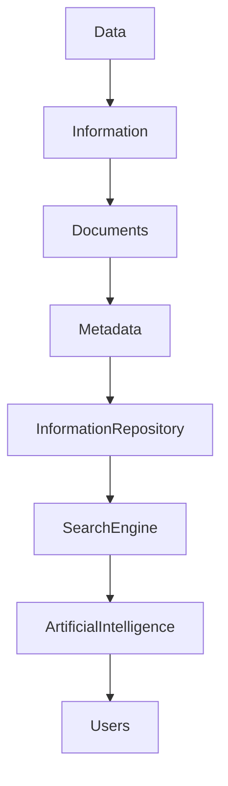

# ARCH-121 — Enterprise Information Architecture

> Référentiel officiel de l'**Architecture de l'Information** de la plateforme **EduWeb Planner**.

---

# Sommaire

1. Vision
2. Objectifs
3. Principes fondamentaux
4. Définition de l'information
5. Architecture globale
6. Cycle de vie de l'information
7. Typologie des informations
8. Classification des informations
9. Structure des informations
10. Métadonnées
11. Gestion documentaire
12. Architecture des contenus
13. Recherche et navigation
14. Qualité de l'information
15. Gouvernance de l'information
16. Archivage et conservation
17. Information et Intelligence Artificielle
18. API conceptuelle
19. Bonnes pratiques
20. Anti-patterns
21. KPI
22. Règles d'architecture

---

# 1. Vision

L'information est le **vecteur principal de communication et de fonctionnement** d'EduWeb Planner.

L'architecture de l'information vise à garantir que chaque information soit :

- facilement trouvable ;
- correctement structurée ;
- compréhensible ;
- fiable ;
- sécurisée ;
- réutilisable.

Elle constitue le pont entre les données, les documents, les connaissances et les utilisateurs.

---

# 2. Objectifs

Cette architecture poursuit plusieurs objectifs :

- organiser les contenus de manière cohérente ;
- faciliter la navigation ;
- améliorer la recherche ;
- garantir la qualité des informations ;
- favoriser leur réutilisation ;
- alimenter les services numériques et l'IA.

---

# 3. Principes fondamentaux

Les informations doivent être :

- cohérentes ;
- accessibles selon les droits ;
- structurées ;
- normalisées ;
- versionnées ;
- traçables.

---

# 4. Définition de l'information

Une information est une donnée interprétée dans un contexte donné.

Elle peut prendre plusieurs formes :

- document ;
- page ;
- formulaire ;
- tableau ;
- rapport ;
- tableau de bord ;
- contenu multimédia.

---

# 5. Architecture globale

```text
Données

↓

Information

↓

Documents

↓

Connaissances

↓

Décisions

↓

Services numériques

↓

Utilisateurs
```

---

# 6. Cycle de vie de l'information

```text
Création

↓

Validation

↓

Publication

↓

Consultation

↓

Mise à jour

↓

Archivage

↓

Destruction contrôlée
```

Chaque étape est soumise à des règles de gouvernance.

---

# 7. Typologie des informations

Les principales catégories sont :

## Informations administratives

- décisions ;
- arrêtés ;
- circulaires ;
- procédures.

---

## Informations pédagogiques

- programmes ;
- cours ;
- emplois du temps ;
- évaluations.

---

## Informations RH

- dossiers du personnel ;
- carrières ;
- formations.

---

## Informations financières

- budgets ;
- paiements ;
- factures ;
- marchés.

---

## Informations techniques

- architecture ;
- API ;
- journaux ;
- configurations.

---

## Informations analytiques

- statistiques ;
- tableaux de bord ;
- indicateurs ;
- rapports.

---

# 8. Classification des informations

Les informations sont classifiées selon leur sensibilité.

| Niveau | Exemple |
|---------|----------|
|Public|Communiqués|
|Interne|Notes de service|
|Confidentiel|Dossiers RH|
|Très confidentiel|Secrets, clés, données sensibles|

Cette classification détermine les règles d'accès.

---

# 9. Structure des informations

Chaque information comprend généralement :

- identifiant ;
- titre ;
- résumé ;
- contenu ;
- auteur ;
- propriétaire ;
- date ;
- version ;
- statut ;
- mots-clés.

Cette structure facilite les traitements automatisés.

---

# 10. Métadonnées

Les métadonnées décrivent :

- l'origine ;
- le contexte ;
- le domaine ;
- la classification ;
- les droits ;
- les versions ;
- les relations.

Elles améliorent la recherche et la gouvernance.

---

# 11. Gestion documentaire

Les contenus sont gérés dans un système documentaire comprenant :

- classement ;
- versionnement ;
- validation ;
- diffusion ;
- archivage.

Les documents de référence sont identifiés explicitement.

---

# 12. Architecture des contenus

Les contenus sont organisés selon une hiérarchie logique.

Exemple :

```text
Institution

↓

Direction

↓

Service

↓

Domaine

↓

Sous-domaine

↓

Document
```

Cette organisation facilite la navigation.

---

# 13. Recherche et navigation

Les utilisateurs disposent de plusieurs modes d'accès :

- navigation hiérarchique ;
- recherche plein texte ;
- recherche sémantique ;
- filtres ;
- favoris ;
- recommandations.

Les résultats tiennent compte des droits d'accès.

---

# 14. Qualité de l'information

Les critères de qualité comprennent :

- exactitude ;
- actualité ;
- cohérence ;
- exhaustivité ;
- lisibilité ;
- pertinence.

Des contrôles périodiques garantissent le maintien de cette qualité.

---

# 15. Gouvernance de l'information

Chaque domaine d'information possède :

- un propriétaire ;
- un responsable de publication ;
- un responsable qualité ;
- des règles de conservation.

Les rôles sont clairement définis.

---

# 16. Archivage et conservation

Les politiques d'archivage précisent :

- les durées de conservation ;
- les conditions d'archivage ;
- les modalités de destruction ;
- les obligations réglementaires.

Les archives restent consultables selon les droits.

---

# 17. Information et Intelligence Artificielle

Les services d'IA utilisent :

- les contenus validés ;
- les métadonnées ;
- les taxonomies ;
- les ontologies ;
- les bases de connaissances.

L'IA améliore :

- la recherche ;
- les recommandations ;
- la synthèse documentaire ;
- la génération assistée de contenus.

---

# 18. API conceptuelle

```typescript
EnterpriseInformationArchitecture {

    InformationRepository

    DocumentManagement

    Metadata

    Classification

    Navigation

    Search

    ContentManagement

    Governance

    Archiving

}
```

---

# 19. Bonnes pratiques

✔ Définir une structure homogène pour tous les contenus.

✔ Utiliser des métadonnées normalisées.

✔ Identifier clairement les propriétaires des informations.

✔ Versionner les documents importants.

✔ Mettre en œuvre des politiques de conservation.

✔ Vérifier régulièrement la qualité des contenus.

---

# 20. Anti-patterns

✘ Documents sans propriétaire.

✘ Classement incohérent.

✘ Multiplication des versions non contrôlées.

✘ Contenus obsolètes accessibles comme références.

✘ Absence de métadonnées.

✘ Recherche limitée à une simple arborescence.

---

# Diagramme Mermaid



---

# KPI

| KPI | Objectif |
|------|----------|
|Informations avec propriétaire identifié|100 %|
|Documents versionnés|100 % des documents officiels|
|Informations classifiées|100 %|
|Temps moyen de recherche|< 3 secondes|
|Contenus révisés selon le planning|100 %|
|Satisfaction des utilisateurs|> 90 %|

---

# Règles d'architecture

## RA-ARCH121-001

Toute information publiée possède un propriétaire, un statut, une version et une classification clairement identifiés.

---

## RA-ARCH121-002

Les contenus sont organisés selon une architecture homogène reposant sur des métadonnées normalisées et une taxonomie commune.

---

## RA-ARCH121-003

Les mécanismes de recherche combinent navigation hiérarchique, recherche plein texte et recherche sémantique afin d'améliorer l'accès à l'information.

---

## RA-ARCH121-004

Les politiques de conservation, d'archivage et de destruction sont appliquées conformément aux exigences réglementaires et institutionnelles.

---

## RA-ARCH121-005

Les informations exploitées par les services d'intelligence artificielle proviennent exclusivement de contenus validés, gouvernés et maintenus à jour.

---

# Documents liés

- ARCH-111 — Enterprise Data Architecture
- ARCH-119 — Enterprise Decision Architecture
- ARCH-120 — Enterprise Knowledge Architecture
- DATA-104 — Metadata Management
- DOC-101 — Enterprise Document Management
- GOV-105 — Knowledge Governance Framework
- AI-003 — Knowledge Base Architecture
- UX-103 — Information Architecture
- SEC-002 — Information Security Classification

---

# Conclusion

L'**Enterprise Information Architecture** définit le cadre d'organisation, de structuration et de gouvernance des informations au sein d'EduWeb Planner. En assurant une architecture cohérente des contenus, des métadonnées normalisées, une recherche intelligente et une gouvernance rigoureuse, elle facilite l'accès à une information fiable et exploitable, aussi bien pour les utilisateurs que pour les services d'intelligence artificielle. Elle constitue un maillon essentiel reliant les données, les documents, les connaissances et les décisions au sein de l'écosystème numérique de la plateforme.

# Fin du document
