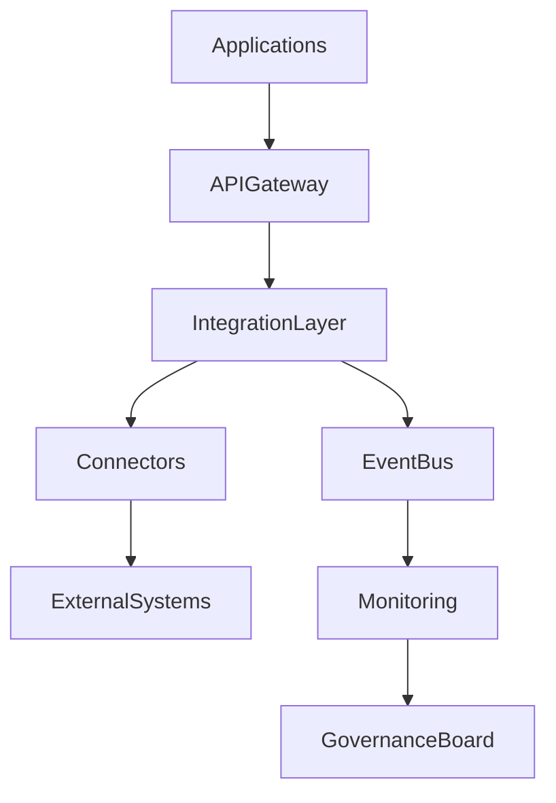

# ARCH-122 — Enterprise Integration Governance Architecture

> Référentiel officiel de la **gouvernance des intégrations** de la plateforme **EduWeb Planner**.

---

# Sommaire

1. Vision
2. Objectifs
3. Principes fondamentaux
4. Portée de la gouvernance
5. Architecture globale
6. Catalogue des intégrations
7. Typologie des intégrations
8. Gouvernance des API
9. Gouvernance des événements
10. Gouvernance des échanges de données
11. Gouvernance des connecteurs
12. Versionnement des interfaces
13. Gestion des contrats
14. Qualité des intégrations
15. Sécurité des intégrations
16. Cycle de vie des intégrations
17. Supervision et observabilité
18. Gestion des changements
19. Gouvernance
20. API conceptuelle
21. Bonnes pratiques
22. Anti-patterns
23. KPI
24. Règles d'architecture

---

# 1. Vision

EduWeb Planner repose sur un écosystème composé de nombreuses applications, plateformes et partenaires.

La gouvernance des intégrations garantit que tous les échanges :

- sont cohérents ;
- sécurisés ;
- documentés ;
- évolutifs ;
- interopérables ;
- traçables.

Elle permet aux différentes composantes de fonctionner comme un système d'information unifié.

---

# 2. Objectifs

Cette architecture poursuit les objectifs suivants :

- standardiser les intégrations ;
- limiter les couplages ;
- assurer l'interopérabilité ;
- renforcer la sécurité ;
- améliorer la qualité des échanges ;
- faciliter les évolutions.

---

# 3. Principes fondamentaux

Les intégrations doivent respecter les principes suivants :

- API First
- Event First
- Loose Coupling
- Standardisation
- Sécurité par défaut
- Traçabilité
- Réutilisation

---

# 4. Portée de la gouvernance

La gouvernance couvre notamment :

- API REST ;
- GraphQL ;
- Webhooks ;
- Event Bus ;
- fichiers d'échange ;
- connecteurs externes ;
- plateformes partenaires ;
- services IA.

---

# 5. Architecture globale

```text
Applications

↓

API Gateway

↓

Enterprise Integration Layer

↓

Event Bus

↓

External Systems

↓

Monitoring

↓

Governance
```

---

# 6. Catalogue des intégrations

Chaque intégration est enregistrée dans un catalogue comprenant :

- identifiant ;
- propriétaire ;
- description ;
- domaine métier ;
- protocole ;
- version ;
- niveau de criticité ;
- documentation ;
- dépendances.

Le catalogue constitue la référence officielle.

---

# 7. Typologie des intégrations

Les intégrations sont classées selon leur mode de fonctionnement.

## Synchrones

- REST
- GraphQL
- gRPC

---

## Asynchrones

- Kafka
- RabbitMQ
- Azure Service Bus

---

## Batch

- ETL
- ELT
- Import/Export

---

## Temps réel

- Streaming
- WebSocket
- Notifications

---

# 8. Gouvernance des API

Chaque API possède :

- un propriétaire ;
- une documentation OpenAPI ;
- une politique de versionnement ;
- des règles de sécurité ;
- des indicateurs de performance.

Les API sont publiées via l'API Gateway.

---

# 9. Gouvernance des événements

Les événements métier sont :

- nommés selon une convention commune ;
- documentés ;
- versionnés ;
- publiés dans un catalogue.

Exemple :

```
StudentEnrolled

TeacherAssigned

DecisionPublished

InvoicePaid
```

---

# 10. Gouvernance des échanges de données

Les échanges de données respectent :

- des modèles communs ;
- des schémas validés ;
- des référentiels métiers ;
- des contrôles de qualité.

Les transformations sont documentées.

---

# 11. Gouvernance des connecteurs

Les connecteurs concernent notamment :

- ministères ;
- établissements ;
- systèmes RH ;
- systèmes financiers ;
- plateformes pédagogiques ;
- solutions de paiement ;
- services d'identité numérique.

Chaque connecteur est homologué avant son déploiement.

---

# 12. Versionnement des interfaces

Les interfaces suivent une stratégie de versionnement.

Exemple :

```
v1

↓

v2

↓

v3
```

Les évolutions incompatibles nécessitent une nouvelle version majeure.

---

# 13. Gestion des contrats

Les contrats définissent :

- structures des données ;
- formats ;
- règles métier ;
- erreurs ;
- niveaux de service ;
- compatibilité.

Les contrats sont validés avant toute mise en production.

---

# 14. Qualité des intégrations

Les indicateurs portent sur :

- disponibilité ;
- temps de réponse ;
- taux d'erreur ;
- compatibilité ;
- qualité des données ;
- conformité.

Les anomalies font l'objet d'un suivi.

---

# 15. Sécurité des intégrations

Les échanges utilisent notamment :

- OAuth2 ;
- OpenID Connect ;
- JWT ;
- TLS ;
- signatures numériques ;
- journalisation.

Les accès sont limités au strict nécessaire.

---

# 16. Cycle de vie des intégrations

```text
Besoin

↓

Conception

↓

Développement

↓

Validation

↓

Déploiement

↓

Exploitation

↓

Évolution

↓

Retrait
```

Chaque étape est documentée.

---

# 17. Supervision et observabilité

Les intégrations sont supervisées selon :

- disponibilité ;
- débit ;
- latence ;
- erreurs ;
- consommation ;
- incidents.

Les tableaux de bord permettent une surveillance en temps réel.

---

# 18. Gestion des changements

Toute évolution d'une intégration suit un processus comprenant :

- analyse d'impact ;
- validation ;
- communication ;
- tests ;
- déploiement ;
- surveillance post-déploiement.

Les changements incompatibles sont anticipés.

---

# 19. Gouvernance

Les principaux acteurs sont :

- Enterprise Architect ;
- Integration Architect ;
- API Manager ;
- Data Architect ;
- RSSI ;
- DevSecOps ;
- propriétaires métiers.

Les décisions sont validées par le comité d'architecture.

---

# 20. API conceptuelle

```typescript
EnterpriseIntegrationGovernance {

    IntegrationCatalog

    ApiGovernance

    EventGovernance

    ConnectorManagement

    ContractManagement

    Security

    Monitoring

    LifecycleManagement

}
```

---

# 21. Bonnes pratiques

✔ Centraliser le catalogue des intégrations.

✔ Documenter tous les contrats d'échange.

✔ Versionner systématiquement les interfaces.

✔ Tester les intégrations automatiquement.

✔ Réutiliser les API existantes.

✔ Mesurer la qualité de service.

---

# 22. Anti-patterns

✘ Interfaces non documentées.

✘ Intégrations point-à-point incontrôlées.

✘ Changements incompatibles sans versionnement.

✘ Contrats implicites.

✘ Échanges non sécurisés.

✘ Absence de supervision.

---

# Diagramme Mermaid



---

# KPI

| KPI | Objectif |
|------|----------|
|Intégrations enregistrées dans le catalogue|100 %|
|API documentées (OpenAPI)|100 %|
|Contrats versionnés|100 %|
|Disponibilité des intégrations critiques|≥ 99,95 %|
|Temps moyen de résolution des incidents d'intégration|< 2 heures|
|Tests automatisés des intégrations|100 % des interfaces critiques|

---

# Règles d'architecture

## RA-ARCH122-001

Toute intégration est enregistrée dans un catalogue officiel comprenant son propriétaire, son contrat, sa documentation et son niveau de criticité.

---

## RA-ARCH122-002

Les API, événements et échanges de données suivent des conventions communes de conception, de nommage, de versionnement et de sécurité.

---

## RA-ARCH122-003

Les modifications incompatibles d'une interface donnent lieu à une nouvelle version et à une analyse d'impact documentée.

---

## RA-ARCH122-004

Les intégrations critiques sont supervisées en continu et disposent d'indicateurs de disponibilité, de performance et de qualité.

---

## RA-ARCH122-005

Les décisions relatives aux intégrations stratégiques sont validées par les instances de gouvernance d'architecture afin de préserver la cohérence de l'écosystème numérique.

---

# Documents liés

- ARCH-105 — Enterprise API Architecture
- ARCH-106 — Enterprise Integration Architecture
- ARCH-108 — Enterprise Security Architecture
- ARCH-111 — Enterprise Data Architecture
- ARCH-112 — Enterprise Observability Architecture
- ARCH-115 — Enterprise Architecture Governance
- ARCH-121 — Enterprise Information Architecture
- API-101 — API Governance Framework
- DATA-103 — Enterprise Data Exchange Standards
- SEC-004 — Secure Integration Standards

---

# Conclusion

L'**Enterprise Integration Governance Architecture** définit le cadre de gouvernance des échanges entre les composants d'EduWeb Planner et son écosystème de partenaires. En s'appuyant sur des standards communs, un catalogue centralisé, une gouvernance des API, des événements, des connecteurs et des contrats d'échange, elle garantit des intégrations sécurisées, interopérables, évolutives et conformes aux objectifs stratégiques de la plateforme.

# Fin du document
