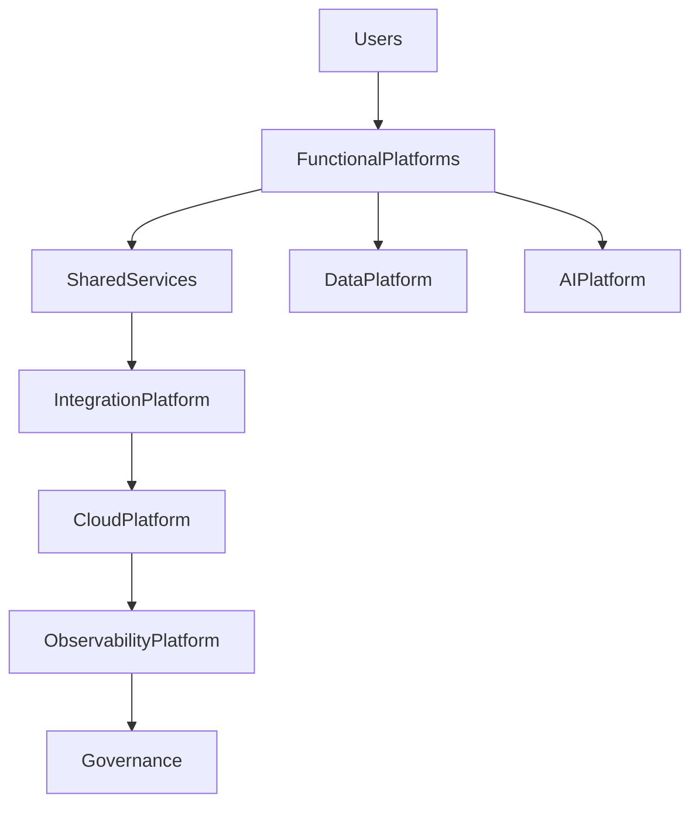

# ARCH-123 — Enterprise Platform Architecture

> Référentiel officiel de l'architecture de **plateforme d'entreprise (Enterprise Platform Architecture)** de **EduWeb Planner**.

---

# Sommaire

1. Vision
2. Objectifs
3. Principes fondamentaux
4. Définition d'une plateforme d'entreprise
5. Architecture globale
6. Architecture modulaire
7. Plateformes fonctionnelles
8. Services partagés
9. Plateforme des données
10. Plateforme IA
11. Plateforme d'intégration
12. Plateforme DevSecOps
13. Plateforme Cloud
14. Plateforme d'observabilité
15. Gouvernance des plateformes
16. Évolutivité
17. API conceptuelle
18. Bonnes pratiques
19. Anti-patterns
20. KPI
21. Règles d'architecture

---

# 1. Vision

EduWeb Planner est conçu comme une **plateforme numérique unifiée** capable de supporter simultanément :

- plusieurs ministères ;
- plusieurs pays ;
- plusieurs institutions ;
- plusieurs établissements ;
- plusieurs millions d'utilisateurs.

La plateforme mutualise les services communs tout en permettant une forte personnalisation selon les besoins métiers.

---

# 2. Objectifs

Cette architecture vise à :

- mutualiser les services ;
- réduire les duplications ;
- accélérer les développements ;
- améliorer la qualité ;
- faciliter les évolutions ;
- soutenir l'innovation.

---

# 3. Principes fondamentaux

La plateforme repose sur :

- Platform First
- Shared Services
- Cloud Native
- API First
- Multi-Tenant
- Modularité
- Scalabilité
- Sécurité intégrée

---

# 4. Définition d'une plateforme d'entreprise

Une plateforme d'entreprise fournit un ensemble cohérent de services réutilisables utilisés par plusieurs applications.

Elle constitue le socle commun de l'ensemble des solutions EduWeb.

---

# 5. Architecture globale

```text
Utilisateurs

↓

Applications EduWeb

↓

Plateformes Métier

↓

Plateformes Techniques

↓

Infrastructure Cloud

↓

Observabilité
```

---

# 6. Architecture modulaire

Chaque plateforme est composée de modules indépendants.

Exemples :

- authentification ;
- paiements ;
- notifications ;
- GED ;
- IA ;
- reporting ;
- recherche.

Les modules peuvent évoluer indépendamment.

---

# 7. Plateformes fonctionnelles

Les principales plateformes métier sont :

## EduWeb Planner

- emplois du temps ;
- planification.

---

## EduWeb Governance

- administration ;
- textes réglementaires.

---

## EduWeb E-School

- e-learning ;
- évaluations.

---

## EduWeb Family

- accompagnement scolaire.

---

## EduWeb Booking

- réservation de ressources.

---

## EduWeb Analytics

- pilotage décisionnel.

---

# 8. Services partagés

Les services mutualisés comprennent notamment :

- authentification ;
- gestion des utilisateurs ;
- notifications ;
- messagerie ;
- recherche ;
- stockage documentaire ;
- traduction ;
- journalisation.

Ils sont utilisés par l'ensemble des plateformes.

---

# 9. Plateforme des données

La plateforme Data regroupe :

- bases relationnelles ;
- entrepôts de données ;
- Data Lake ;
- bases vectorielles ;
- catalogue de données.

Elle constitue la fondation analytique de l'écosystème.

---

# 10. Plateforme IA

La plateforme IA fournit :

- agents spécialisés ;
- orchestrateur multi-agents ;
- RAG ;
- moteurs de recommandations ;
- génération documentaire ;
- assistants conversationnels.

Tous les produits EduWeb peuvent s'y connecter.

---

# 11. Plateforme d'intégration

Elle assure :

- API Gateway ;
- Event Bus ;
- connecteurs ;
- synchronisation ;
- orchestration.

Les échanges entre plateformes y transitent.

---

# 12. Plateforme DevSecOps

Elle comprend :

- gestion Git ;
- pipelines CI/CD ;
- registre d'artefacts ;
- déploiement automatisé ;
- Infrastructure as Code.

Elle industrialise les livraisons.

---

# 13. Plateforme Cloud

La plateforme Cloud fournit :

- Kubernetes ;
- stockage ;
- réseau ;
- sauvegardes ;
- sécurité ;
- haute disponibilité.

Elle garantit la résilience des services.

---

# 14. Plateforme d'observabilité

Elle centralise :

- logs ;
- métriques ;
- traces ;
- alertes ;
- tableaux de bord.

Les équipes d'exploitation disposent d'une visibilité globale.

---

# 15. Gouvernance des plateformes

Chaque plateforme possède :

- un Product Owner ;
- un Platform Owner ;
- un Architecte référent ;
- un Responsable Sécurité ;
- un Responsable Exploitation.

Les responsabilités sont clairement définies.

---

# 16. Évolutivité

Les plateformes sont conçues pour :

- évoluer indépendamment ;
- supporter une montée en charge progressive ;
- accueillir de nouveaux modules ;
- intégrer de nouveaux partenaires ;
- s'adapter aux évolutions réglementaires.

Cette approche garantit la pérennité de l'écosystème.

---

# 17. API conceptuelle

```typescript
EnterprisePlatformArchitecture {

    FunctionalPlatforms

    SharedServices

    DataPlatform

    AIPlatform

    IntegrationPlatform

    DevSecOpsPlatform

    CloudPlatform

    ObservabilityPlatform

    Governance

}
```

---

# 18. Bonnes pratiques

✔ Mutualiser les services communs.

✔ Limiter les dépendances entre plateformes.

✔ Définir clairement les responsabilités.

✔ Standardiser les interfaces.

✔ Concevoir des plateformes indépendantes.

✔ Mesurer la qualité des services partagés.

---

# 19. Anti-patterns

✘ Réimplémenter plusieurs fois le même service.

✘ Coupler fortement les plateformes.

✘ Multiplier les référentiels techniques.

✘ Déployer sans gouvernance.

✘ Mélanger responsabilités métier et techniques.

✘ Absence de catalogue des services.

---

# Diagramme Mermaid



---

# KPI

| KPI | Objectif |
|------|----------|
|Services mutualisés|Progression continue|
|Modules réutilisant les services partagés|> 95 %|
|Disponibilité des plateformes critiques|≥ 99,95 %|
|Temps moyen d'intégration d'un nouveau module|Réduction continue|
|Plateformes conformes aux standards|100 %|
|Satisfaction des équipes de développement|> 90 %|

---

# Règles d'architecture

## RA-ARCH123-001

Toute nouvelle solution développée au sein d'EduWeb Planner s'appuie prioritairement sur les plateformes et services partagés existants.

---

## RA-ARCH123-002

Les plateformes fonctionnelles et techniques sont conçues comme des composants indépendants, interopérables et faiblement couplés.

---

## RA-ARCH123-003

Les services communs (authentification, notifications, recherche, stockage, IA, etc.) sont mutualisés afin d'éviter les duplications fonctionnelles.

---

## RA-ARCH123-004

Chaque plateforme dispose d'un responsable clairement identifié, d'indicateurs de performance et d'une feuille de route d'évolution.

---

## RA-ARCH123-005

L'évolution des plateformes est gouvernée par les principes d'architecture d'entreprise afin de garantir la cohérence, la scalabilité et la pérennité de l'écosystème EduWeb.

---

# Documents liés

- ARCH-101 — Enterprise Architecture Overview
- ARCH-102 — Enterprise Microservices Architecture
- ARCH-107 — Enterprise AI & Multi-Agent Architecture
- ARCH-110 — Cloud-Native Architecture
- ARCH-112 — Enterprise Observability Architecture
- ARCH-113 — Enterprise DevSecOps Architecture
- ARCH-115 — Enterprise Architecture Governance
- ARCH-122 — Enterprise Integration Governance Architecture
- PLAT-101 — Shared Services Framework
- PLAT-102 — Enterprise Platform Engineering

---

# Conclusion

L'**Enterprise Platform Architecture** constitue le socle technique et fonctionnel d'EduWeb Planner. En organisant l'écosystème autour de plateformes spécialisées, de services mutualisés et d'une gouvernance unifiée, elle favorise la réutilisation, la modularité, la montée en charge et l'innovation continue. Cette architecture permet à EduWeb Planner de s'adapter durablement aux besoins des établissements d'enseignement, des administrations publiques et des partenaires, tout en garantissant cohérence, performance et évolutivité.

# Fin du document
