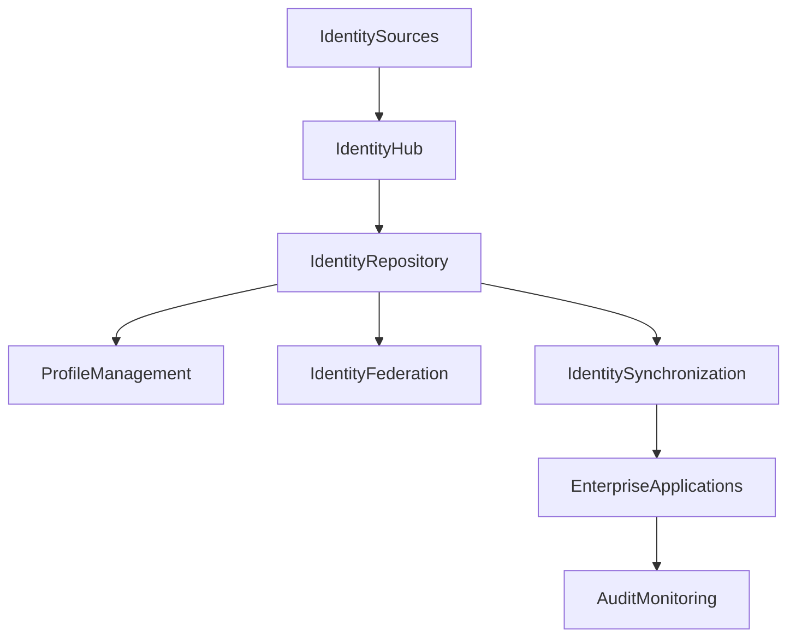

# ARCH-124 — Enterprise Identity Architecture

> Référentiel officiel de l'**Architecture de l'Identité d'Entreprise (Enterprise Identity Architecture)** de la plateforme **EduWeb Planner**.

---

# Sommaire

1. Vision
2. Objectifs
3. Principes fondamentaux
4. Définition de l'identité numérique
5. Architecture globale
6. Référentiel des identités
7. Cycle de vie des identités
8. Types d'identités
9. Identité unique (Single Digital Identity)
10. Fédération des identités
11. Gestion des profils
12. Gestion des attributs
13. Synchronisation des identités
14. Qualité des données d'identité
15. Gouvernance des identités
16. Intégration avec les services d'entreprise
17. API conceptuelle
18. Bonnes pratiques
19. Anti-patterns
20. KPI
21. Règles d'architecture

---

# 1. Vision

L'identité numérique constitue le fondement de tous les services numériques d'EduWeb Planner.

Chaque utilisateur, organisation, établissement, service, équipement ou application doit disposer d'une **identité unique**, fiable, durable et gouvernée.

Cette architecture permet d'assurer :

- la cohérence des référentiels ;
- la sécurité des accès ;
- la traçabilité des actions ;
- l'interopérabilité entre les plateformes.

---

# 2. Objectifs

Cette architecture vise à :

- garantir l'unicité des identités ;
- éviter les doublons ;
- centraliser la gestion des identités ;
- faciliter l'interopérabilité ;
- améliorer la sécurité ;
- soutenir les services d'IA.

---

# 3. Principes fondamentaux

L'architecture repose sur les principes suivants :

- One Identity
- Identity by Design
- Privacy by Design
- Security by Design
- Federation First
- Least Privilege
- Identity Lifecycle Management

---

# 4. Définition de l'identité numérique

Une identité numérique représente une entité reconnue par le système d'information.

Elle comprend notamment :

- un identifiant unique ;
- des attributs descriptifs ;
- un statut ;
- des droits associés ;
- un historique ;
- des relations avec d'autres identités.

---

# 5. Architecture globale

```text
Sources d'identité

↓

Identity Hub

↓

Identity Repository

↓

Identity Services

↓

Applications

↓

Audit & Monitoring
```

---

# 6. Référentiel des identités

Le référentiel central regroupe l'ensemble des identités de l'écosystème.

Exemples :

- élèves ;
- enseignants ;
- parents ;
- personnels administratifs ;
- inspecteurs ;
- établissements ;
- ministères ;
- applications ;
- agents IA ;
- objets connectés.

Chaque identité possède un identifiant pérenne.

---

# 7. Cycle de vie des identités

```text
Création

↓

Validation

↓

Activation

↓

Modification

↓

Suspension

↓

Archivage

↓

Suppression réglementée
```

Toutes les étapes sont historisées.

---

# 8. Types d'identités

## Personnes physiques

- élèves ;
- enseignants ;
- parents ;
- administrateurs.

---

## Organisations

- écoles ;
- universités ;
- ministères ;
- partenaires.

---

## Services

- API ;
- microservices ;
- plateformes.

---

## Objets

- terminaux ;
- équipements ;
- IoT.

---

## Agents IA

- assistants virtuels ;
- agents spécialisés ;
- orchestrateurs.

---

# 9. Identité unique (Single Digital Identity)

Chaque entité possède :

- un identifiant global unique ;
- un identifiant métier ;
- un identifiant technique.

Cette unicité évite les incohérences entre applications.

---

# 10. Fédération des identités

L'architecture permet l'intégration avec :

- Microsoft Entra ID ;
- Google Identity ;
- FranceConnect ou équivalents ;
- services nationaux d'identité numérique ;
- annuaires LDAP ;
- Active Directory.

Les mécanismes SSO simplifient l'expérience utilisateur.

---

# 11. Gestion des profils

Chaque identité peut disposer :

- d'un ou plusieurs profils ;
- de rôles ;
- de responsabilités ;
- de contextes d'utilisation.

Les profils évoluent selon le parcours de l'utilisateur.

---

# 12. Gestion des attributs

Les attributs sont classés en plusieurs catégories :

- identité civile ;
- coordonnées ;
- informations professionnelles ;
- informations académiques ;
- préférences ;
- données techniques.

Chaque attribut possède une source de référence.

---

# 13. Synchronisation des identités

Les référentiels sont synchronisés avec :

- systèmes RH ;
- plateformes pédagogiques ;
- systèmes administratifs ;
- annuaires institutionnels.

Les conflits sont détectés et résolus automatiquement ou par validation humaine.

---

# 14. Qualité des données d'identité

Les contrôles portent sur :

- unicité ;
- complétude ;
- cohérence ;
- validité ;
- actualité.

Des mécanismes de détection des doublons sont mis en œuvre.

---

# 15. Gouvernance des identités

La gouvernance définit :

- les propriétaires des référentiels ;
- les règles de création ;
- les procédures de validation ;
- les politiques de conservation ;
- les contrôles de conformité.

Les responsabilités sont clairement attribuées.

---

# 16. Intégration avec les services d'entreprise

Le référentiel des identités est utilisé par :

- l'authentification ;
- l'autorisation ;
- les workflows ;
- les signatures électroniques ;
- les notifications ;
- les tableaux de bord ;
- les agents IA.

Il constitue un service transverse à l'ensemble de la plateforme.

---

# 17. API conceptuelle

```typescript
EnterpriseIdentityArchitecture {

    IdentityRepository

    IdentityLifecycle

    IdentityFederation

    IdentitySynchronization

    ProfileManagement

    AttributeManagement

    IdentityQuality

    Governance

}
```

---

# 18. Bonnes pratiques

✔ Utiliser un identifiant unique et pérenne.

✔ Éviter la duplication des référentiels.

✔ Définir une source de vérité pour chaque attribut.

✔ Synchroniser automatiquement les annuaires.

✔ Journaliser toutes les modifications d'identité.

✔ Réviser régulièrement les données.

---

# 19. Anti-patterns

✘ Multiples identifiants pour une même personne.

✘ Référentiels d'identité non synchronisés.

✘ Données d'identité obsolètes.

✘ Création manuelle sans validation.

✘ Profils incohérents entre applications.

✘ Absence d'historique des modifications.

---

# Diagramme Mermaid



---

# KPI

| KPI | Objectif |
|------|----------|
|Identités uniques|100 %|
|Doublons détectés et résolus|100 %|
|Synchronisation des référentiels|≥ 99,9 %|
|Identités avec propriétaire défini|100 %|
|Temps moyen de propagation des mises à jour|< 5 minutes|
|Conformité des données d'identité|≥ 99 %|

---

# Règles d'architecture

## RA-ARCH124-001

Toute entité du système d'information possède un identifiant numérique unique, pérenne et gouverné.

---

## RA-ARCH124-002

Les référentiels d'identité sont centralisés et synchronisés afin d'éviter les incohérences entre applications.

---

## RA-ARCH124-003

Chaque attribut d'identité possède une source officielle de référence et un propriétaire clairement identifié.

---

## RA-ARCH124-004

Le cycle de vie des identités est entièrement tracé, depuis leur création jusqu'à leur archivage ou leur suppression réglementée.

---

## RA-ARCH124-005

Les services d'authentification, d'autorisation, d'audit et d'intelligence artificielle s'appuient exclusivement sur le référentiel officiel des identités.

---

# Documents liés

- ARCH-108 — Enterprise Security Architecture
- ARCH-111 — Enterprise Data Architecture
- ARCH-120 — Enterprise Knowledge Architecture
- ARCH-121 — Enterprise Information Architecture
- ARCH-122 — Enterprise Integration Governance Architecture
- SEC-001 — Identity and Access Management
- SEC-002 — Authentication Standards
- DATA-101 — Master Data Management
- GOV-102 — Identity Governance Framework

---

# Conclusion

L'**Enterprise Identity Architecture** fournit le socle de confiance de l'écosystème EduWeb Planner. En centralisant la gestion des identités numériques, en assurant leur unicité, leur qualité et leur gouvernance, elle garantit une base fiable pour les mécanismes d'authentification, d'autorisation, d'interopérabilité et d'intelligence artificielle. Cette architecture contribue directement à la sécurité, à la cohérence des données et à l'efficacité opérationnelle de l'ensemble de la plateforme.

# Fin du document
