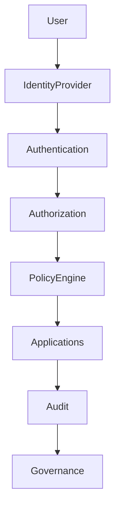

# ARCH-125 — Enterprise Access Management Architecture

> Référentiel officiel de l'**Architecture de Gestion des Accès (Enterprise Access Management Architecture)** de la plateforme **EduWeb Planner**.

---

# Sommaire

1. Vision
2. Objectifs
3. Principes fondamentaux
4. Définition de la gestion des accès
5. Architecture globale
6. Authentification
7. Autorisation
8. Gestion des rôles (RBAC)
9. Gestion des attributs (ABAC)
10. Contrôle d'accès contextuel
11. Authentification forte (MFA)
12. Single Sign-On (SSO)
13. Gestion des sessions
14. Gestion des accès privilégiés (PAM)
15. Audit des accès
16. Gouvernance des accès
17. API conceptuelle
18. Bonnes pratiques
19. Anti-patterns
20. KPI
21. Règles d'architecture

---

# 1. Vision

La gestion des accès garantit que **chaque utilisateur, service, application ou agent d'intelligence artificielle accède uniquement aux ressources qui lui sont autorisées**, au moment opportun et dans les conditions définies par les politiques de sécurité.

Elle constitue l'un des piliers de la confiance numérique au sein d'EduWeb Planner.

---

# 2. Objectifs

Cette architecture vise à :

- protéger les ressources sensibles ;
- appliquer le principe du moindre privilège ;
- simplifier l'expérience utilisateur ;
- assurer la traçabilité des accès ;
- répondre aux exigences réglementaires ;
- sécuriser les interactions entre utilisateurs, applications et agents IA.

---

# 3. Principes fondamentaux

L'architecture repose sur les principes suivants :

- Zero Trust
- Least Privilege
- Need to Know
- Default Deny
- Continuous Verification
- Identity First
- Security by Design

---

# 4. Définition de la gestion des accès

La gestion des accès regroupe l'ensemble des mécanismes permettant de :

- authentifier une identité ;
- vérifier ses droits ;
- autoriser ou refuser une action ;
- tracer les accès ;
- réviser périodiquement les autorisations.

---

# 5. Architecture globale

```text
Utilisateur / Service / Agent IA

↓

Identity Provider (IdP)

↓

Authentication Service

↓

Authorization Engine

↓

Policy Engine

↓

Applications

↓

Audit & Monitoring
```

---

# 6. Authentification

Les méthodes supportées comprennent :

- identifiant et mot de passe ;
- authentification biométrique ;
- certificat numérique ;
- clés de sécurité (FIDO2/WebAuthn) ;
- authentification fédérée ;
- authentification sociale (si autorisée).

Toutes les méthodes sont conformes aux politiques de sécurité de l'organisation.

---

# 7. Autorisation

Après authentification, l'autorisation détermine les actions permises.

Les décisions tiennent compte notamment :

- du rôle ;
- des attributs ;
- du contexte ;
- de la politique de sécurité ;
- des ressources demandées.

---

# 8. Gestion des rôles (RBAC)

Les autorisations sont principalement attribuées via des rôles.

Exemples :

- Élève ;
- Parent ;
- Enseignant ;
- Censeur ;
- Proviseur ;
- Inspecteur ;
- Administrateur ;
- Superviseur national ;
- Agent IA.

Les rôles sont hiérarchisés et documentés.

---

# 9. Gestion des attributs (ABAC)

Des attributs complémentaires peuvent être utilisés :

- établissement ;
- région ;
- académie ;
- ministère ;
- niveau scolaire ;
- discipline ;
- statut ;
- type d'appareil ;
- localisation.

Les politiques combinent RBAC et ABAC pour une granularité accrue.

---

# 10. Contrôle d'accès contextuel

Les décisions d'accès peuvent dépendre de :

- l'heure ;
- la localisation ;
- le niveau de risque ;
- le réseau utilisé ;
- le terminal ;
- le niveau de confiance.

Un accès peut être accordé, restreint ou refusé selon le contexte.

---

# 11. Authentification forte (MFA)

Les ressources critiques exigent une authentification multifacteur.

Exemples :

- mot de passe + application OTP ;
- certificat + biométrie ;
- clé FIDO2 + code PIN.

Le niveau de protection est adapté au niveau de sensibilité.

---

# 12. Single Sign-On (SSO)

Le SSO permet un accès unifié à l'ensemble des plateformes EduWeb.

Exemples :

- EduWeb Planner ;
- EduWeb Governance ;
- EduWeb E-School ;
- EduWeb Booking ;
- EduWeb Family.

L'utilisateur s'authentifie une seule fois pour accéder aux applications autorisées.

---

# 13. Gestion des sessions

Chaque session comprend :

- un identifiant unique ;
- une durée maximale ;
- une durée d'inactivité ;
- un niveau de confiance ;
- des journaux d'activité.

Les sessions à risque peuvent être interrompues automatiquement.

---

# 14. Gestion des accès privilégiés (PAM)

Les comptes à privilèges élevés font l'objet de mesures renforcées :

- comptes nominatifs ;
- authentification forte obligatoire ;
- élévation temporaire des privilèges ;
- journalisation détaillée ;
- validation préalable des accès critiques.

---

# 15. Audit des accès

Tous les accès sont enregistrés :

- authentifications ;
- refus ;
- changements de rôle ;
- élévations de privilèges ;
- accès sensibles ;
- révocations.

Les journaux sont protégés contre toute altération.

---

# 16. Gouvernance des accès

La gouvernance définit :

- les politiques d'accès ;
- les propriétaires des rôles ;
- les procédures de validation ;
- les revues périodiques ;
- les mécanismes de révocation.

Les droits sont régulièrement réévalués.

---

# 17. API conceptuelle

```typescript
EnterpriseAccessManagementArchitecture {

    IdentityProvider

    Authentication

    Authorization

    PolicyEngine

    RBAC

    ABAC

    MFA

    SSO

    SessionManagement

    PrivilegedAccessManagement

    Audit

    Governance

}
```

---

# 18. Bonnes pratiques

✔ Appliquer le principe du moindre privilège.

✔ Utiliser le MFA pour tous les comptes sensibles.

✔ Réviser régulièrement les droits d'accès.

✔ Journaliser toutes les actions critiques.

✔ Utiliser le SSO pour améliorer l'expérience utilisateur.

✔ Désactiver immédiatement les comptes devenus inactifs ou non autorisés.

---

# 19. Anti-patterns

✘ Comptes partagés.

✘ Mots de passe faibles.

✘ Comptes administrateurs permanents.

✘ Droits excessifs.

✘ Absence de journalisation.

✘ Révocation tardive des accès.

---

# Diagramme Mermaid



---

# KPI

| KPI | Objectif |
|------|----------|
|Comptes protégés par MFA|100 % des comptes sensibles|
|Révisions périodiques des droits|100 %|
|Suppression des accès après départ|< 24 heures|
|Disponibilité du service d'authentification|≥ 99,99 %|
|Tentatives d'accès non autorisées détectées|100 %|
|Traçabilité des accès critiques|100 %|

---

# Règles d'architecture

## RA-ARCH125-001

Toute demande d'accès est précédée d'une authentification fiable et d'une autorisation fondée sur les politiques de sécurité en vigueur.

---

## RA-ARCH125-002

Les autorisations sont attribuées selon les principes du moindre privilège, de la séparation des responsabilités et du besoin d'en connaître.

---

## RA-ARCH125-003

Les comptes disposant de privilèges élevés sont protégés par une authentification multifacteur et font l'objet d'une journalisation renforcée.

---

## RA-ARCH125-004

Les droits d'accès sont révisés périodiquement et révoqués sans délai lorsqu'ils ne sont plus justifiés.

---

## RA-ARCH125-005

Toutes les décisions d'accès sont traçables, auditables et conformes aux politiques de gouvernance et de sécurité de l'entreprise.

---

# Documents liés

- ARCH-108 — Enterprise Security Architecture
- ARCH-124 — Enterprise Identity Architecture
- ARCH-122 — Enterprise Integration Governance Architecture
- SEC-001 — Identity and Access Management
- SEC-003 — Privileged Access Management
- SEC-005 — Zero Trust Security Model
- GOV-102 — Identity Governance Framework
- API-101 — API Governance Framework
- OPS-103 — Security Monitoring

---

# Conclusion

L'**Enterprise Access Management Architecture** définit le cadre de gestion des accès d'EduWeb Planner en s'appuyant sur une authentification robuste, des mécanismes d'autorisation granulaires, une gouvernance des rôles et des politiques de sécurité fondées sur le modèle **Zero Trust**. En combinant RBAC, ABAC, SSO, MFA et PAM, cette architecture garantit que chaque accès est justifié, contrôlé, traçable et conforme aux exigences de sécurité, de conformité et de gouvernance de la plateforme.

# Fin du document
