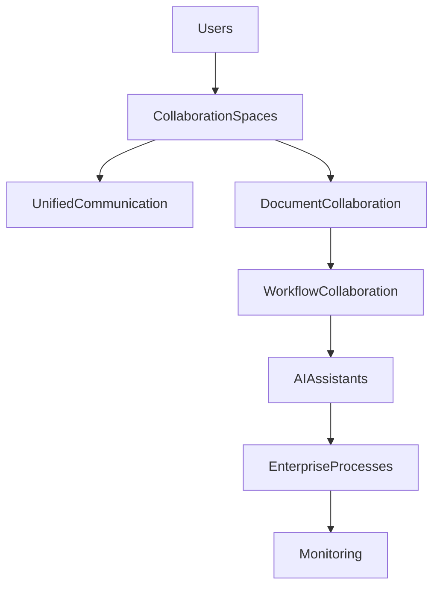

# ARCH-126 — Enterprise Collaboration Architecture

> Référentiel officiel de l'**Architecture de Collaboration d'Entreprise (Enterprise Collaboration Architecture)** de la plateforme **EduWeb Planner**.

---

# Sommaire

1. Vision
2. Objectifs
3. Principes fondamentaux
4. Définition de la collaboration d'entreprise
5. Architecture globale
6. Acteurs de la collaboration
7. Espaces collaboratifs
8. Communication unifiée
9. Collaboration documentaire
10. Gestion des tâches collaboratives
11. Collaboration autour des processus
12. Collaboration avec les agents IA
13. Collaboration interinstitutionnelle
14. Gouvernance de la collaboration
15. Indicateurs de collaboration
16. API conceptuelle
17. Bonnes pratiques
18. Anti-patterns
19. KPI
20. Règles d'architecture

---

# 1. Vision

EduWeb Planner place la **collaboration** au cœur de son fonctionnement.

La plateforme doit permettre aux différents acteurs de travailler ensemble de manière fluide, sécurisée et efficace, indépendamment :

- de leur localisation ;
- de leur établissement ;
- de leur ministère ;
- de leur pays ;
- de leur fuseau horaire.

La collaboration devient ainsi un levier de performance institutionnelle.

---

# 2. Objectifs

Cette architecture poursuit les objectifs suivants :

- améliorer le travail collectif ;
- faciliter le partage d'informations ;
- accélérer les prises de décision ;
- réduire les silos organisationnels ;
- renforcer la coopération entre institutions ;
- intégrer l'intelligence artificielle dans les activités collaboratives.

---

# 3. Principes fondamentaux

La collaboration repose sur les principes suivants :

- Open Collaboration
- Digital Workplace
- Knowledge Sharing
- Transparency
- Traceability
- Security by Design
- Human-Centered Collaboration

---

# 4. Définition de la collaboration d'entreprise

La collaboration d'entreprise désigne l'ensemble des interactions organisées entre :

- personnes ;
- équipes ;
- établissements ;
- administrations ;
- partenaires ;
- applications ;
- agents d'intelligence artificielle.

Elle vise la réalisation d'objectifs communs grâce à des outils numériques intégrés.

---

# 5. Architecture globale

```text
Utilisateurs

↓

Espaces collaboratifs

↓

Services collaboratifs

↓

Processus métiers

↓

Gestion documentaire

↓

IA collaborative

↓

Observabilité
```

---

# 6. Acteurs de la collaboration

Les principaux acteurs comprennent :

## Acteurs humains

- élèves ;
- enseignants ;
- chefs d'établissement ;
- inspecteurs ;
- administrateurs ;
- responsables ministériels ;
- partenaires.

---

## Acteurs numériques

- applications ;
- workflows ;
- services automatisés ;
- assistants IA ;
- agents spécialisés.

---

# 7. Espaces collaboratifs

Les espaces sont organisés selon plusieurs niveaux :

- personnel ;
- équipe ;
- établissement ;
- direction ;
- projet ;
- ministère ;
- communauté nationale ;
- communauté internationale.

Chaque espace possède ses propres règles d'accès.

---

# 8. Communication unifiée

La plateforme intègre plusieurs moyens de communication :

- messagerie interne ;
- notifications ;
- visioconférences ;
- forums ;
- commentaires ;
- discussions contextualisées ;
- annonces institutionnelles.

Toutes les communications sont historisées selon les politiques définies.

---

# 9. Collaboration documentaire

Les utilisateurs peuvent :

- coéditer des documents ;
- annoter ;
- commenter ;
- partager ;
- approuver ;
- versionner ;
- archiver.

Chaque modification est traçable.

---

# 10. Gestion des tâches collaboratives

Les équipes disposent d'outils permettant :

- l'affectation des tâches ;
- le suivi de l'avancement ;
- la gestion des échéances ;
- les validations ;
- les rappels automatiques.

Les tâches peuvent être intégrées aux workflows métiers.

---

# 11. Collaboration autour des processus

Les processus métier favorisent la coopération entre plusieurs acteurs.

Exemples :

- validation d'une décision administrative ;
- création d'un emploi du temps ;
- affectation d'un enseignant ;
- inscription d'un élève ;
- préparation d'une inspection.

Chaque acteur intervient selon son rôle.

---

# 12. Collaboration avec les agents IA

Les agents IA assistent les équipes pour :

- rechercher des informations ;
- produire des synthèses ;
- générer des documents ;
- proposer des recommandations ;
- automatiser des tâches répétitives ;
- faciliter la coordination.

L'IA agit comme un collaborateur numérique sous contrôle humain.

---

# 13. Collaboration interinstitutionnelle

EduWeb Planner facilite la collaboration entre :

- établissements ;
- académies ;
- DRE ;
- ministères ;
- universités ;
- organismes partenaires ;
- organisations internationales.

Les échanges respectent les politiques de sécurité et de confidentialité.

---

# 14. Gouvernance de la collaboration

La gouvernance définit :

- les règles de partage ;
- les droits d'accès ;
- les espaces autorisés ;
- les politiques de conservation ;
- les responsabilités des animateurs.

Les pratiques collaboratives sont harmonisées à l'échelle de la plateforme.

---

# 15. Indicateurs de collaboration

Les principaux indicateurs concernent :

- participation ;
- coédition ;
- partage documentaire ;
- délais de validation ;
- taux d'utilisation des espaces collaboratifs ;
- satisfaction des utilisateurs.

Ces indicateurs permettent d'améliorer en continu les pratiques.

---

# 16. API conceptuelle

```typescript
EnterpriseCollaborationArchitecture {

    CollaborationSpaces

    UnifiedCommunication

    DocumentCollaboration

    TaskManagement

    WorkflowCollaboration

    AIAssistants

    Governance

    Monitoring

}
```

---

# 17. Bonnes pratiques

✔ Favoriser le partage des connaissances.

✔ Utiliser des espaces collaboratifs structurés.

✔ Définir des responsabilités claires.

✔ Tracer les contributions importantes.

✔ Intégrer les outils collaboratifs aux processus métier.

✔ Utiliser les agents IA comme assistants, sans supprimer la validation humaine.

---

# 18. Anti-patterns

✘ Multiplication des canaux de communication non maîtrisés.

✘ Documents dupliqués dans plusieurs espaces.

✘ Absence de gouvernance des espaces collaboratifs.

✘ Décisions prises hors des processus officiels.

✘ Informations critiques échangées sans traçabilité.

✘ Utilisation d'outils externes non homologués.

---

# Diagramme Mermaid



---

# KPI

| KPI | Objectif |
|------|----------|
|Utilisation des espaces collaboratifs|> 90 % des équipes|
|Documents coédités|Progression continue|
|Réduction des délais de validation|≥ 30 %|
|Taux d'adoption des outils collaboratifs|> 95 %|
|Satisfaction des utilisateurs|> 90 %|
|Traçabilité des contributions|100 %|

---

# Règles d'architecture

## RA-ARCH126-001

Toute activité collaborative s'effectue dans un espace officiellement gouverné, sécurisé et associé à un contexte métier clairement identifié.

---

## RA-ARCH126-002

Les échanges, commentaires, validations et contributions sont historisés afin d'assurer la traçabilité des décisions et des travaux collectifs.

---

## RA-ARCH126-003

Les outils de collaboration sont intégrés aux processus métier et au système documentaire afin d'éviter les ruptures d'information.

---

## RA-ARCH126-004

Les agents d'intelligence artificielle interviennent comme assistants collaboratifs et ne remplacent pas les validations ou décisions relevant des acteurs humains.

---

## RA-ARCH126-005

La gouvernance définit les règles de création, d'administration, de conservation et de suppression des espaces collaboratifs, dans le respect des politiques de sécurité et de conformité.

---

# Documents liés

- ARCH-107 — Enterprise AI & Multi-Agent Architecture
- ARCH-120 — Enterprise Knowledge Architecture
- ARCH-121 — Enterprise Information Architecture
- ARCH-123 — Enterprise Platform Architecture
- ARCH-124 — Enterprise Identity Architecture
- ARCH-125 — Enterprise Access Management Architecture
- BPM-101 — Collaborative Business Processes
- DOC-101 — Enterprise Document Management
- GOV-106 — Digital Workplace Governance
- UX-107 — Collaboration Experience Design

---

# Conclusion

L'**Enterprise Collaboration Architecture** fournit le cadre de référence pour les interactions entre les acteurs humains, les applications et les agents d'intelligence artificielle au sein d'EduWeb Planner. En intégrant les espaces collaboratifs, la communication unifiée, la coédition documentaire, les workflows et les assistants IA dans une gouvernance cohérente, cette architecture favorise une coopération efficace, sécurisée et traçable. Elle contribue à la transformation d'EduWeb Planner en une véritable **Digital Education & Governance Workplace**, capable de soutenir durablement la collaboration à l'échelle des établissements, des administrations et des partenaires.

# Fin du document
