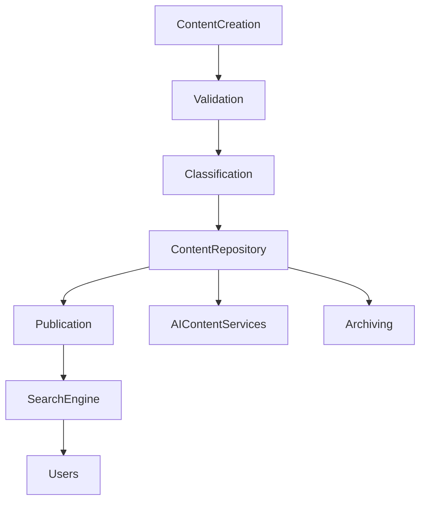

# ARCH-127 — Enterprise Content Management Architecture

> Référentiel officiel de l'**Architecture de Gestion des Contenus d'Entreprise (Enterprise Content Management Architecture - ECM)** de la plateforme **EduWeb Planner**.

---

# Sommaire

1. Vision
2. Objectifs
3. Principes fondamentaux
4. Définition du contenu d'entreprise
5. Architecture globale
6. Typologie des contenus
7. Cycle de vie des contenus
8. Gestion documentaire
9. Classification et taxonomie
10. Métadonnées
11. Versionnement
12. Publication multicanale
13. Recherche intelligente
14. Collaboration autour des contenus
15. Gouvernance des contenus
16. Archivage
17. IA et gestion des contenus
18. API conceptuelle
19. Bonnes pratiques
20. Anti-patterns
21. KPI
22. Règles d'architecture

---

# 1. Vision

EduWeb Planner considère le contenu numérique comme un **actif stratégique**.

L'architecture ECM fournit un cadre unifié pour créer, organiser, diffuser, partager, gouverner et conserver l'ensemble des contenus produits par les établissements, les administrations et les utilisateurs.

Elle garantit que chaque contenu est :

- accessible ;
- fiable ;
- versionné ;
- sécurisé ;
- réutilisable ;
- traçable.

---

# 2. Objectifs

Cette architecture vise à :

- centraliser les contenus ;
- améliorer leur qualité ;
- faciliter leur diffusion ;
- éviter les doublons ;
- favoriser leur réutilisation ;
- soutenir les usages de l'intelligence artificielle.

---

# 3. Principes fondamentaux

Les contenus doivent respecter les principes suivants :

- Single Source of Truth
- Content by Design
- Metadata First
- Version Controlled
- Security by Default
- Open Standards
- Lifecycle Management

---

# 4. Définition du contenu d'entreprise

Un contenu représente toute information produite ou exploitée par l'organisation.

Exemples :

- documents ;
- formulaires ;
- images ;
- vidéos ;
- présentations ;
- rapports ;
- contenus pédagogiques ;
- modèles administratifs ;
- contenus générés par IA.

Chaque contenu est identifié de manière unique.

---

# 5. Architecture globale

```text
Création

↓

Validation

↓

Classification

↓

Content Repository

↓

Publication

↓

Recherche

↓

Archivage
```

---

# 6. Typologie des contenus

Les contenus sont regroupés en plusieurs familles.

## Contenus administratifs

- décisions ;
- arrêtés ;
- circulaires ;
- contrats ;
- procès-verbaux.

---

## Contenus pédagogiques

- cours ;
- évaluations ;
- vidéos ;
- exercices ;
- ressources numériques.

---

## Contenus institutionnels

- actualités ;
- communiqués ;
- rapports ;
- statistiques.

---

## Contenus techniques

- documentation ;
- API ;
- procédures ;
- guides d'exploitation.

---

## Contenus collaboratifs

- commentaires ;
- annotations ;
- discussions ;
- comptes rendus.

---

# 7. Cycle de vie des contenus

```text
Création

↓

Révision

↓

Validation

↓

Publication

↓

Utilisation

↓

Mise à jour

↓

Archivage

↓

Suppression réglementée
```

Chaque étape est historisée.

---

# 8. Gestion documentaire

Le système documentaire assure :

- stockage sécurisé ;
- indexation ;
- contrôle des accès ;
- versionnement ;
- diffusion ;
- conservation.

Tous les contenus critiques sont gérés dans le référentiel documentaire officiel.

---

# 9. Classification et taxonomie

Les contenus sont organisés selon :

- domaine ;
- établissement ;
- ministère ;
- type de document ;
- niveau scolaire ;
- discipline ;
- année ;
- langue ;
- niveau de confidentialité.

Cette classification facilite les recherches transversales.

---

# 10. Métadonnées

Chaque contenu possède des métadonnées normalisées.

Exemples :

- identifiant ;
- auteur ;
- propriétaire ;
- date de création ;
- version ;
- statut ;
- mots-clés ;
- langue ;
- durée de conservation.

Les métadonnées sont exploitables par les moteurs de recherche et les services IA.

---

# 11. Versionnement

Chaque modification entraîne la création d'une nouvelle version.

Le système conserve :

- l'historique ;
- l'auteur ;
- la date ;
- les différences majeures ;
- le motif de modification.

Les versions antérieures restent consultables selon les droits accordés.

---

# 12. Publication multicanale

Un même contenu peut être publié sur plusieurs canaux :

- portail web ;
- application mobile ;
- plateforme e-learning ;
- tableau de bord ;
- API ;
- messagerie ;
- notification.

Le contenu est maintenu dans une source unique.

---

# 13. Recherche intelligente

Les mécanismes de recherche combinent :

- recherche plein texte ;
- recherche sémantique ;
- recherche vectorielle ;
- filtres ;
- navigation par taxonomie ;
- recommandations basées sur l'IA.

Les résultats sont personnalisés selon les droits d'accès.

---

# 14. Collaboration autour des contenus

Les utilisateurs peuvent :

- commenter ;
- annoter ;
- proposer des modifications ;
- coéditer ;
- approuver.

Toutes les contributions sont historisées.

---

# 15. Gouvernance des contenus

La gouvernance définit :

- les propriétaires ;
- les responsables éditoriaux ;
- les règles de publication ;
- les politiques de conservation ;
- les contrôles qualité.

Chaque contenu est placé sous la responsabilité d'un domaine métier.

---

# 16. Archivage

Les contenus archivés sont :

- conservés conformément aux obligations réglementaires ;
- protégés contre toute altération ;
- consultables selon les droits ;
- restaurables si nécessaire.

L'archivage garantit la pérennité du patrimoine documentaire.

---

# 17. IA et gestion des contenus

Les services d'intelligence artificielle permettent notamment :

- la classification automatique ;
- l'extraction de métadonnées ;
- le résumé documentaire ;
- la traduction ;
- la détection des doublons ;
- les recommandations ;
- l'alimentation des bases RAG.

Toute production IA est identifiable et soumise à validation lorsque cela est requis.

---

# 18. API conceptuelle

```typescript
EnterpriseContentManagementArchitecture {

    ContentRepository

    DocumentManagement

    MetadataManagement

    TaxonomyManagement

    VersionControl

    PublicationEngine

    SearchEngine

    CollaborationServices

    Archiving

    AIContentServices

    Governance

}
```

---

# 19. Bonnes pratiques

✔ Définir un propriétaire pour chaque contenu.

✔ Utiliser des métadonnées normalisées.

✔ Versionner systématiquement les contenus officiels.

✔ Éviter les copies multiples d'un même document.

✔ Automatiser la classification lorsque cela est pertinent.

✔ Réviser périodiquement les contenus publiés.

---

# 20. Anti-patterns

✘ Documents sans propriétaire.

✘ Multiplication de copies divergentes.

✘ Métadonnées incomplètes.

✘ Publication sans validation.

✘ Archivage non maîtrisé.

✘ Contenus IA publiés sans contrôle humain lorsque celui-ci est requis.

---

# Diagramme Mermaid



---

# KPI

| KPI | Objectif |
|------|----------|
|Contenus avec propriétaire identifié|100 %|
|Contenus versionnés|100 % des contenus officiels|
|Métadonnées complètes|≥ 98 %|
|Temps moyen de recherche|< 3 secondes|
|Doublons détectés|Réduction continue|
|Contenus révisés selon le planning|100 %|

---

# Règles d'architecture

## RA-ARCH127-001

Tout contenu d'entreprise est enregistré dans un référentiel officiel, identifié de manière unique et associé à un propriétaire clairement défini.

---

## RA-ARCH127-002

Les contenus sont décrits par des métadonnées normalisées, classifiés selon une taxonomie commune et versionnés tout au long de leur cycle de vie.

---

## RA-ARCH127-003

La publication d'un contenu officiel est précédée des validations prévues par les règles de gouvernance documentaire.

---

## RA-ARCH127-004

Les mécanismes de recherche exploitent les métadonnées, la recherche sémantique et les services d'intelligence artificielle afin d'améliorer l'accès aux contenus.

---

## RA-ARCH127-005

Les contenus archivés sont conservés conformément aux exigences réglementaires, tout en garantissant leur intégrité, leur traçabilité et leur accessibilité selon les droits définis.

---

# Documents liés

- ARCH-120 — Enterprise Knowledge Architecture
- ARCH-121 — Enterprise Information Architecture
- ARCH-123 — Enterprise Platform Architecture
- ARCH-126 — Enterprise Collaboration Architecture
- DOC-101 — Enterprise Document Management
- DATA-104 — Metadata Management
- AI-003 — Knowledge Base Architecture
- AI-004 — Retrieval-Augmented Generation (RAG)
- GOV-105 — Knowledge Governance Framework
- SEC-002 — Information Security Classification

---

# Conclusion

L'**Enterprise Content Management Architecture** fournit le cadre de gouvernance des contenus numériques d'EduWeb Planner. En unifiant la gestion documentaire, les métadonnées, la classification, le versionnement, la publication multicanale et les capacités d'intelligence artificielle, elle garantit que chaque contenu constitue un actif numérique fiable, sécurisé et réutilisable. Cette architecture renforce la qualité de l'information, facilite la collaboration et soutient durablement les missions éducatives, administratives et décisionnelles de la plateforme.

# Fin du document
