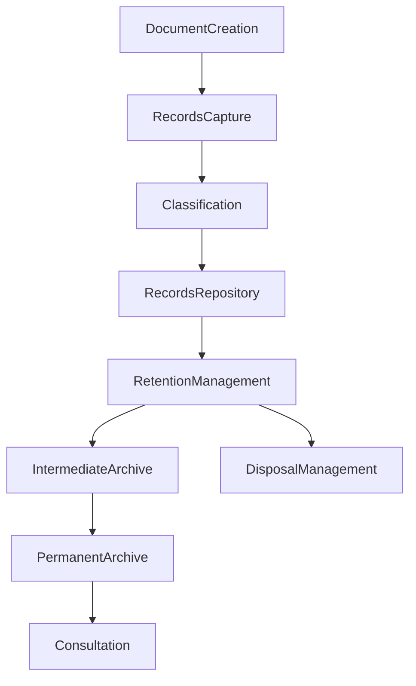

# ARCH-128 — Enterprise Records Management Architecture

> Référentiel officiel de l'**Architecture de Gestion des Archives et Documents à Valeur Probante (Enterprise Records Management Architecture)** de la plateforme **EduWeb Planner**.

---

# Sommaire

1. Vision
2. Objectifs
3. Principes fondamentaux
4. Définition d'un record
5. Architecture globale
6. Typologie des records
7. Cycle de vie des records
8. Capture des records
9. Classification et plan de classement
10. Métadonnées des records
11. Intégrité et valeur probante
12. Conservation
13. Archivage intermédiaire
14. Archivage définitif
15. Élimination réglementée
16. Gouvernance des records
17. Intelligence artificielle et records
18. API conceptuelle
19. Bonnes pratiques
20. Anti-patterns
21. KPI
22. Règles d'architecture

---

# 1. Vision

EduWeb Planner considère les **records** (documents à valeur probante) comme des éléments essentiels du patrimoine administratif, juridique et historique de l'organisation.

Cette architecture garantit que chaque record est :

- authentique ;
- fiable ;
- intègre ;
- traçable ;
- accessible ;
- conservé conformément aux exigences réglementaires.

Elle assure la continuité institutionnelle et la préservation de la mémoire organisationnelle.

---

# 2. Objectifs

Cette architecture vise à :

- garantir la valeur juridique des documents ;
- assurer leur conservation ;
- protéger leur intégrité ;
- faciliter leur consultation ;
- appliquer les politiques d'archivage ;
- répondre aux exigences de conformité.

---

# 3. Principes fondamentaux

Les records sont gérés selon les principes suivants :

- Authenticity by Design
- Integrity by Default
- Traceability
- Lifecycle Management
- Compliance First
- Controlled Retention
- Secure Preservation

---

# 4. Définition d'un record

Un **record** est un document produit ou reçu dans le cadre d'une activité officielle et conservé comme preuve d'une décision, d'une action ou d'une obligation.

Contrairement à un document de travail, un record possède une valeur :

- administrative ;
- juridique ;
- financière ;
- pédagogique ;
- historique.

---

# 5. Architecture globale

```text
Production documentaire

↓

Capture officielle

↓

Classification

↓

Records Repository

↓

Conservation

↓

Consultation

↓

Archivage définitif

↓

Élimination autorisée
```

---

# 6. Typologie des records

Les principaux records comprennent :

## Records administratifs

- décisions ;
- arrêtés ;
- notes de service ;
- procès-verbaux.

---

## Records pédagogiques

- procès-verbaux d'examens ;
- relevés de notes ;
- diplômes ;
- attestations ;
- rapports d'inspection.

---

## Records RH

- dossiers du personnel ;
- nominations ;
- évaluations ;
- sanctions.

---

## Records financiers

- budgets ;
- factures ;
- contrats ;
- marchés publics.

---

## Records techniques

- journaux de sécurité ;
- configurations officielles ;
- rapports d'exploitation.

---

# 7. Cycle de vie des records

```text
Création

↓

Validation

↓

Capture

↓

Classification

↓

Conservation

↓

Archivage

↓

Élimination réglementée
```

Chaque transition est historisée.

---

# 8. Capture des records

La capture officielle comprend :

- l'identification du document ;
- l'affectation d'un identifiant unique ;
- la génération des métadonnées ;
- la signature numérique (si applicable) ;
- l'enregistrement dans le référentiel officiel.

La capture rend le document immuable selon les règles définies.

---

# 9. Classification et plan de classement

Les records sont organisés selon un plan de classement institutionnel.

Critères possibles :

- ministère ;
- direction ;
- établissement ;
- domaine ;
- fonction ;
- activité ;
- type de document ;
- année.

Le plan de classement est gouverné au niveau de l'entreprise.

---

# 10. Métadonnées des records

Chaque record possède notamment :

- identifiant unique ;
- titre ;
- auteur ;
- propriétaire ;
- date de création ;
- date de validation ;
- niveau de confidentialité ;
- durée de conservation ;
- statut d'archivage ;
- empreinte numérique (hash).

Ces métadonnées garantissent l'identification et la traçabilité.

---

# 11. Intégrité et valeur probante

Les records doivent être protégés contre toute altération.

Les mécanismes utilisés peuvent inclure :

- signatures électroniques qualifiées ;
- empreintes cryptographiques ;
- horodatage fiable ;
- journalisation des accès ;
- contrôle d'intégrité périodique.

Toute modification postérieure est détectable.

---

# 12. Conservation

La durée de conservation dépend :

- des obligations légales ;
- des exigences réglementaires ;
- des politiques internes ;
- de la valeur historique.

Les politiques sont documentées dans un calendrier de conservation.

---

# 13. Archivage intermédiaire

Les records peu consultés mais toujours soumis à conservation sont transférés vers un espace d'archivage intermédiaire.

Ils restent accessibles selon les droits autorisés tout en optimisant les performances du système.

---

# 14. Archivage définitif

Les records présentant une valeur historique, patrimoniale ou juridique permanente sont conservés dans un dépôt d'archives définitives.

Ces archives bénéficient de mécanismes renforcés de préservation numérique.

---

# 15. Élimination réglementée

À l'issue de leur durée de conservation, certains records peuvent être éliminés.

Cette opération est :

- autorisée ;
- documentée ;
- tracée ;
- irréversible ;
- conforme aux politiques institutionnelles.

Un certificat d'élimination peut être généré.

---

# 16. Gouvernance des records

La gouvernance définit :

- les propriétaires des records ;
- les responsabilités archivistiques ;
- les politiques de conservation ;
- les règles de destruction ;
- les procédures d'audit.

Les décisions sont validées par les autorités compétentes.

---

# 17. Intelligence artificielle et records

Les services d'IA peuvent assister :

- la classification automatique ;
- l'extraction de métadonnées ;
- la détection des doublons ;
- l'identification des durées de conservation ;
- la recherche documentaire.

Les décisions relatives à la conservation, à l'archivage définitif ou à la destruction demeurent sous responsabilité humaine.

---

# 18. API conceptuelle

```typescript
EnterpriseRecordsManagementArchitecture {

    RecordsRepository

    RecordsCapture

    ClassificationEngine

    MetadataManagement

    IntegrityManagement

    RetentionManagement

    Archiving

    DisposalManagement

    AIRecordsServices

    Governance

}
```

---

# 19. Bonnes pratiques

✔ Identifier officiellement les records dès leur création.

✔ Utiliser un plan de classement unique.

✔ Conserver les métadonnées complètes.

✔ Vérifier régulièrement l'intégrité des archives.

✔ Appliquer systématiquement les calendriers de conservation.

✔ Journaliser toute consultation ou opération sensible.

---

# 20. Anti-patterns

✘ Modifier un record validé sans procédure officielle.

✘ Conserver plusieurs versions concurrentes d'un même record.

✘ Détruire un record sans autorisation.

✘ Omettre les métadonnées essentielles.

✘ Archiver sans plan de classement.

✘ Confondre document de travail et record officiel.

---

# Diagramme Mermaid



---

# KPI

| KPI | Objectif |
|------|----------|
|Records capturés officiellement|100 %|
|Records avec métadonnées complètes|≥ 99 %|
|Contrôles d'intégrité réalisés|100 %|
|Conformité aux calendriers de conservation|100 %|
|Traçabilité des accès aux records|100 %|
|Éliminations conformes aux procédures|100 %|

---

# Règles d'architecture

## RA-ARCH128-001

Tout document reconnu comme record est capturé dans un référentiel officiel, identifié de manière unique et protégé contre toute altération non autorisée.

---

## RA-ARCH128-002

Les records sont classifiés selon un plan de classement institutionnel et enrichis de métadonnées normalisées garantissant leur traçabilité.

---

## RA-ARCH128-003

Les politiques de conservation, d'archivage et d'élimination sont appliquées conformément aux exigences réglementaires, juridiques et institutionnelles.

---

## RA-ARCH128-004

L'intégrité et la valeur probante des records sont assurées par des mécanismes de signature, d'horodatage, de contrôle d'intégrité et de journalisation.

---

## RA-ARCH128-005

Les capacités d'intelligence artificielle peuvent assister la gestion des records, sans se substituer aux décisions humaines concernant leur conservation, leur archivage définitif ou leur destruction.

---

# Documents liés

- ARCH-120 — Enterprise Knowledge Architecture
- ARCH-121 — Enterprise Information Architecture
- ARCH-127 — Enterprise Content Management Architecture
- DOC-101 — Enterprise Document Management
- DATA-104 — Metadata Management
- GOV-105 — Knowledge Governance Framework
- SEC-002 — Information Security Classification
- AI-003 — Knowledge Base Architecture
- LEG-101 — Legal Compliance Framework
- OPS-104 — Digital Preservation Standards

---

# Conclusion

L'**Enterprise Records Management Architecture** fournit le cadre de gouvernance des documents à valeur probante au sein d'EduWeb Planner. En intégrant la capture officielle, la classification, les métadonnées, la conservation, l'archivage et les mécanismes de préservation numérique, elle garantit l'authenticité, l'intégrité et la traçabilité des records tout au long de leur cycle de vie. Cette architecture contribue à la conformité réglementaire, à la continuité institutionnelle et à la préservation durable du patrimoine documentaire de la plateforme.

# Fin du document
