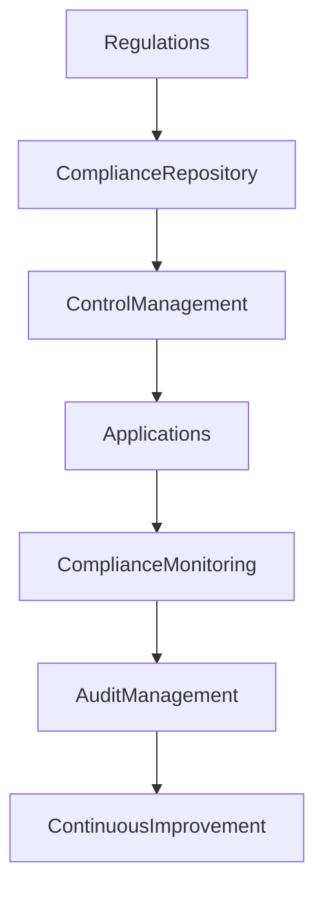

# ARCH-129 — Enterprise Compliance Architecture

> Référentiel officiel de l'**Architecture de Conformité d'Entreprise (Enterprise Compliance Architecture)** de la plateforme **EduWeb Planner**.

---

# Sommaire

1. Vision
2. Objectifs
3. Principes fondamentaux
4. Définition de la conformité
5. Architecture globale
6. Domaines de conformité
7. Cadres réglementaires
8. Gestion des exigences
9. Contrôles de conformité
10. Évaluation des risques de non-conformité
11. Gestion des preuves
12. Conformité continue
13. Intelligence artificielle et conformité
14. Gouvernance de la conformité
15. Audit et amélioration continue
16. API conceptuelle
17. Bonnes pratiques
18. Anti-patterns
19. KPI
20. Règles d'architecture

---

# 1. Vision

EduWeb Planner est conçu pour être une plateforme **nativement conforme** aux exigences :

- légales ;
- réglementaires ;
- contractuelles ;
- institutionnelles ;
- éthiques ;
- techniques.

La conformité ne constitue pas une activité ponctuelle, mais un processus continu intégré à l'ensemble du cycle de vie des systèmes d'information.

---

# 2. Objectifs

Cette architecture vise à :

- garantir le respect des obligations réglementaires ;
- réduire les risques juridiques ;
- protéger les données ;
- renforcer la confiance des utilisateurs ;
- faciliter les audits ;
- automatiser les contrôles lorsque cela est possible.

---

# 3. Principes fondamentaux

Les principes directeurs sont :

- Compliance by Design
- Privacy by Design
- Security by Design
- Traceability
- Accountability
- Continuous Compliance
- Risk-Based Compliance

---

# 4. Définition de la conformité

La conformité désigne l'aptitude de l'organisation à respecter l'ensemble des exigences qui lui sont applicables.

Ces exigences peuvent provenir :

- des lois ;
- des règlements ;
- des normes ;
- des contrats ;
- des politiques internes ;
- des référentiels d'architecture.

---

# 5. Architecture globale

```text
Exigences réglementaires

↓

Catalogue des exigences

↓

Contrôles de conformité

↓

Applications

↓

Surveillance continue

↓

Audit

↓

Amélioration continue
```

---

# 6. Domaines de conformité

La conformité couvre notamment :

## Juridique

- droit de l'éducation ;
- droit administratif ;
- droit du travail ;
- propriété intellectuelle.

---

## Protection des données

- confidentialité ;
- consentement ;
- conservation ;
- droits des personnes.

---

## Cybersécurité

- authentification ;
- contrôle d'accès ;
- journalisation ;
- gestion des incidents.

---

## Gouvernance

- séparation des responsabilités ;
- validation ;
- traçabilité ;
- contrôle interne.

---

## Qualité

- documentation ;
- processus ;
- référentiels ;
- amélioration continue.

---

# 7. Cadres réglementaires

L'architecture peut être adaptée selon les juridictions concernées.

Exemples :

- réglementations nationales ;
- textes ministériels ;
- normes ISO ;
- référentiels d'archivage électronique ;
- exigences de cybersécurité ;
- politiques internes EduWeb.

Les exigences sont centralisées dans un référentiel unique.

---

# 8. Gestion des exigences

Chaque exigence comprend :

- un identifiant ;
- une description ;
- sa source ;
- son niveau de criticité ;
- son domaine ;
- son propriétaire ;
- les contrôles associés.

Cette approche facilite la traçabilité.

---

# 9. Contrôles de conformité

Les contrôles peuvent être :

- préventifs ;
- détectifs ;
- correctifs ;
- automatisés ;
- manuels.

Chaque contrôle possède une fréquence d'exécution et un responsable.

---

# 10. Évaluation des risques de non-conformité

Chaque risque est évalué selon :

- sa probabilité ;
- son impact ;
- son niveau de criticité ;
- les mesures de maîtrise existantes ;
- le risque résiduel.

Les plans d'action sont priorisés selon ces évaluations.

---

# 11. Gestion des preuves

Les preuves de conformité comprennent notamment :

- journaux d'audit ;
- rapports ;
- validations ;
- signatures électroniques ;
- certificats ;
- captures d'écran ;
- historiques de traitement.

Les preuves sont conservées conformément aux politiques d'archivage.

---

# 12. Conformité continue

Des mécanismes automatisés surveillent en permanence :

- les écarts ;
- les anomalies ;
- les dérives ;
- les violations de politiques.

Les alertes sont transmises aux responsables concernés.

---

# 13. Intelligence artificielle et conformité

L'IA peut assister :

- l'analyse réglementaire ;
- la détection des écarts ;
- le classement des exigences ;
- l'analyse documentaire ;
- la production de rapports.

Les décisions engageant la responsabilité juridique demeurent sous validation humaine.

---

# 14. Gouvernance de la conformité

La gouvernance repose notamment sur :

- le comité de conformité ;
- le RSSI ;
- le DPO (si applicable) ;
- les responsables métiers ;
- les architectes d'entreprise ;
- les auditeurs internes.

Les responsabilités sont documentées.

---

# 15. Audit et amélioration continue

Les audits permettent :

- d'évaluer la conformité ;
- d'identifier les écarts ;
- de définir des actions correctives ;
- de mesurer les progrès.

Les enseignements sont intégrés aux évolutions de la plateforme.

---

# 16. API conceptuelle

```typescript
EnterpriseComplianceArchitecture {

    ComplianceRepository

    RegulatoryCatalog

    ControlManagement

    RiskAssessment

    EvidenceManagement

    ComplianceMonitoring

    AuditManagement

    AIComplianceServices

    Governance

}
```

---

# 17. Bonnes pratiques

✔ Maintenir un catalogue unique des exigences.

✔ Associer chaque exigence à un contrôle.

✔ Automatiser les vérifications lorsque cela est possible.

✔ Conserver les preuves de conformité.

✔ Réaliser des audits réguliers.

✔ Intégrer la conformité dès la conception des projets.

---

# 18. Anti-patterns

✘ Traiter la conformité uniquement avant un audit.

✘ Absence de propriétaire des exigences.

✘ Contrôles non documentés.

✘ Preuves dispersées.

✘ Gestion manuelle systématique des contrôles.

✘ Non-prise en compte des évolutions réglementaires.

---

# Diagramme Mermaid



---

# KPI

| KPI | Objectif |
|------|----------|
|Exigences documentées|100 %|
|Contrôles exécutés selon le planning|100 %|
|Écarts corrigés dans les délais|≥ 95 %|
|Preuves de conformité disponibles|100 %|
|Audits réalisés|100 % du programme annuel|
|Taux de conformité global|≥ 98 %|

---

# Règles d'architecture

## RA-ARCH129-001

Toute exigence réglementaire ou institutionnelle applicable est enregistrée dans un référentiel officiel, identifiée de manière unique et associée à un propriétaire.

---

## RA-ARCH129-002

Chaque exigence de conformité est reliée à un ou plusieurs contrôles documentés, permettant de démontrer son respect de manière objective et vérifiable.

---

## RA-ARCH129-003

Les preuves de conformité sont conservées de façon sécurisée, traçable et conforme aux politiques de conservation et d'archivage de l'organisation.

---

## RA-ARCH129-004

Les mécanismes de surveillance continue détectent les écarts de conformité et déclenchent les alertes ou actions correctives appropriées.

---

## RA-ARCH129-005

Les capacités d'intelligence artificielle peuvent assister l'analyse et le suivi de la conformité, sans se substituer aux décisions humaines engageant la responsabilité juridique ou réglementaire.

---

# Documents liés

- ARCH-108 — Enterprise Security Architecture
- ARCH-115 — Enterprise Architecture Governance
- ARCH-121 — Enterprise Information Architecture
- ARCH-127 — Enterprise Content Management Architecture
- ARCH-128 — Enterprise Records Management Architecture
- GOV-101 — Enterprise Governance Framework
- GOV-105 — Knowledge Governance Framework
- SEC-002 — Information Security Classification
- LEG-101 — Legal Compliance Framework
- RISK-101 — Enterprise Risk Management

---

# Conclusion

L'**Enterprise Compliance Architecture** fournit le cadre de référence permettant à EduWeb Planner de satisfaire durablement aux exigences légales, réglementaires, contractuelles et institutionnelles. En structurant la gestion des exigences, des contrôles, des preuves et des audits dans une démarche de conformité continue, cette architecture réduit les risques, renforce la confiance des parties prenantes et favorise une gouvernance transparente. L'intégration raisonnée de l'intelligence artificielle permet d'améliorer l'efficacité des contrôles tout en préservant la responsabilité des décideurs humains.

# Fin du document
