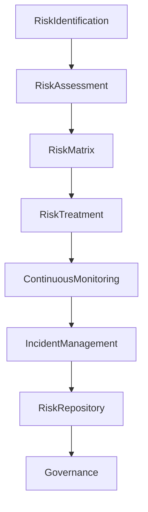

# ARCH-130 — Enterprise Risk Architecture

> Référentiel officiel de l'**Architecture de Gestion des Risques d'Entreprise (Enterprise Risk Architecture)** de la plateforme **EduWeb Planner**.

---

# Sommaire

1. Vision
2. Objectifs
3. Principes fondamentaux
4. Définition du risque
5. Architecture globale
6. Typologie des risques
7. Cycle de vie des risques
8. Identification des risques
9. Analyse et évaluation
10. Traitement des risques
11. Appétence au risque
12. Surveillance continue
13. Gestion des incidents
14. Intelligence artificielle et gestion des risques
15. Gouvernance des risques
16. API conceptuelle
17. Bonnes pratiques
18. Anti-patterns
19. KPI
20. Règles d'architecture

---

# 1. Vision

EduWeb Planner adopte une approche **proactive et intégrée de la gestion des risques**, afin de protéger durablement :

- les utilisateurs ;
- les établissements ;
- les données ;
- les processus ;
- les infrastructures ;
- les actifs numériques ;
- la réputation de l'organisation.

La gestion des risques est intégrée à toutes les décisions stratégiques, métiers et techniques.

---

# 2. Objectifs

Cette architecture vise à :

- identifier les risques de manière anticipée ;
- réduire leur probabilité ;
- limiter leurs impacts ;
- améliorer la résilience de la plateforme ;
- soutenir la prise de décision ;
- garantir la continuité des activités.

---

# 3. Principes fondamentaux

Les principes directeurs sont :

- Risk by Design
- Continuous Risk Assessment
- Defense in Depth
- Prevention First
- Transparency
- Accountability
- Continuous Improvement

---

# 4. Définition du risque

Un risque est un **événement incertain** susceptible d'affecter les objectifs de l'organisation.

Chaque risque est caractérisé par :

- une cause ;
- un événement ;
- une probabilité ;
- un impact ;
- un niveau de criticité ;
- un plan de traitement.

---

# 5. Architecture globale

```text
Identification

↓

Analyse

↓

Évaluation

↓

Décision

↓

Traitement

↓

Surveillance

↓

Révision continue
```

---

# 6. Typologie des risques

## Risques stratégiques

- évolution réglementaire ;
- changement politique ;
- dépendance à un partenaire ;
- évolution du marché.

---

## Risques opérationnels

- erreur humaine ;
- indisponibilité d'un service ;
- rupture de processus ;
- défaut organisationnel.

---

## Risques technologiques

- panne informatique ;
- dette technique ;
- obsolescence ;
- vulnérabilités.

---

## Risques cybersécurité

- intrusion ;
- ransomware ;
- fuite de données ;
- compromission d'identité.

---

## Risques liés aux données

- perte ;
- corruption ;
- duplication ;
- mauvaise qualité.

---

## Risques liés à l'IA

- hallucinations ;
- biais algorithmiques ;
- décisions non explicables ;
- dérive des modèles ;
- empoisonnement des données.

---

## Risques juridiques

- non-conformité ;
- litiges ;
- non-respect des contrats.

---

## Risques financiers

- dépassement budgétaire ;
- fraude ;
- défaut de paiement ;
- mauvaise prévision.

---

## Risques réputationnels

- perte de confiance ;
- mauvaise communication ;
- incident médiatique.

---

# 7. Cycle de vie des risques

```text
Identification

↓

Qualification

↓

Évaluation

↓

Priorisation

↓

Traitement

↓

Suivi

↓

Clôture
```

Le cycle est continu.

---

# 8. Identification des risques

Les risques sont identifiés à partir :

- des projets ;
- des audits ;
- des incidents ;
- des analyses métiers ;
- des retours d'expérience ;
- des évolutions réglementaires ;
- des analyses IA.

Chaque risque reçoit un identifiant unique.

---

# 9. Analyse et évaluation

Chaque risque est évalué selon :

- probabilité ;
- impact ;
- détectabilité ;
- criticité ;
- niveau de maîtrise.

Une matrice de criticité est utilisée.

| Impact / Probabilité | Faible | Moyen | Élevé |
|----------------------|:------:|:-----:|:------:|
| Faible | 🟢 | 🟢 | 🟡 |
| Moyen  | 🟢 | 🟡 | 🟠 |
| Élevé  | 🟡 | 🟠 | 🔴 |

---

# 10. Traitement des risques

Quatre stratégies principales sont retenues :

### Éviter

Supprimer la source du risque.

---

### Réduire

Mettre en place des mesures de prévention.

---

### Transférer

Assurance, contrat ou sous-traitance.

---

### Accepter

Lorsque le risque est inférieur au seuil défini.

Chaque décision est documentée.

---

# 11. Appétence au risque

L'organisation définit un niveau acceptable de risque selon :

- le domaine ;
- la criticité ;
- les enjeux financiers ;
- les enjeux humains ;
- les enjeux réglementaires.

Les risques dépassant ce seuil doivent être traités ou faire l'objet d'une décision formelle.

---

# 12. Surveillance continue

Les risques sont suivis au moyen de :

- tableaux de bord ;
- alertes automatiques ;
- indicateurs ;
- audits ;
- revues périodiques.

Les évolutions sont historisées.

---

# 13. Gestion des incidents

Les incidents permettent :

- de détecter de nouveaux risques ;
- d'améliorer les contrôles ;
- d'alimenter les analyses de causes racines ;
- de renforcer les plans de prévention.

Chaque incident est relié au registre des risques.

---

# 14. Intelligence artificielle et gestion des risques

L'IA peut contribuer à :

- détecter les anomalies ;
- prédire certains risques ;
- analyser les tendances ;
- recommander des mesures de réduction ;
- surveiller les indicateurs.

Toute décision stratégique relative aux risques demeure sous responsabilité humaine.

---

# 15. Gouvernance des risques

La gouvernance implique :

- le Conseil de Gouvernance ;
- le Comité des Risques ;
- les responsables métiers ;
- les architectes ;
- le RSSI ;
- le DPO ;
- les responsables de projets.

Chaque risque possède un propriétaire clairement identifié.

---

# 16. API conceptuelle

```typescript
EnterpriseRiskArchitecture {

    RiskRepository

    RiskAssessment

    RiskMatrix

    RiskTreatment

    IncidentManagement

    ContinuousMonitoring

    AIRiskAnalysis

    Governance

}
```

---

# 17. Bonnes pratiques

✔ Maintenir un registre central des risques.

✔ Réévaluer régulièrement les risques.

✔ Associer chaque risque à un propriétaire.

✔ Définir des plans d'action mesurables.

✔ Intégrer la gestion des risques dans tous les projets.

✔ Exploiter les retours d'expérience.

---

# 18. Anti-patterns

✘ Identifier les risques uniquement après un incident.

✘ Ne pas documenter les décisions.

✘ Sous-estimer les risques liés à l'IA.

✘ Absence de suivi des plans d'action.

✘ Confondre incident et risque.

✘ Traiter tous les risques avec le même niveau de priorité.

---

# Diagramme Mermaid



---

# KPI

| KPI | Objectif |
|------|----------|
|Risques documentés dans le registre|100 %|
|Risques critiques avec plan de traitement|100 %|
|Révisions périodiques réalisées|100 %|
|Incidents reliés à un risque identifié|≥ 95 %|
|Réduction annuelle des risques critiques|Progression continue|
|Plans d'action réalisés dans les délais|≥ 95 %|

---

# Règles d'architecture

## RA-ARCH130-001

Tout risque identifié est enregistré dans un registre officiel, associé à un propriétaire, évalué selon une méthodologie commune et régulièrement révisé.

---

## RA-ARCH130-002

Les décisions de traitement des risques sont documentées, justifiées et alignées sur l'appétence au risque définie par la gouvernance de l'organisation.

---

## RA-ARCH130-003

Les risques critiques disposent obligatoirement d'un plan de traitement, d'indicateurs de suivi et d'un calendrier de réévaluation.

---

## RA-ARCH130-004

Les incidents, audits, évolutions réglementaires et retours d'expérience alimentent en continu le processus d'identification et de mise à jour des risques.

---

## RA-ARCH130-005

Les capacités d'intelligence artificielle peuvent assister la détection, l'analyse et la surveillance des risques, sans se substituer aux décisions humaines engageant la responsabilité de l'organisation.

---

# Documents liés

- ARCH-108 — Enterprise Security Architecture
- ARCH-109 — High Availability, Scalability & Resilience Architecture
- ARCH-114 — Enterprise Disaster Recovery & Business Continuity Architecture
- ARCH-115 — Enterprise Architecture Governance
- ARCH-129 — Enterprise Compliance Architecture
- GOV-101 — Enterprise Governance Framework
- RISK-101 — Enterprise Risk Management
- SEC-005 — Zero Trust Security Model
- BCM-101 — Business Continuity Management
- AI-006 — Responsible AI Governance

---

# Conclusion

L'**Enterprise Risk Architecture** fournit le cadre de référence pour identifier, évaluer, traiter et surveiller les risques susceptibles d'affecter EduWeb Planner. En intégrant la gestion des risques aux processus métier, aux projets, à la gouvernance et aux technologies, cette architecture renforce la résilience de la plateforme et soutient une prise de décision éclairée. Associée aux mécanismes de conformité, de cybersécurité, de continuité d'activité et d'intelligence artificielle responsable, elle contribue à assurer un développement durable, maîtrisé et sécurisé de l'ensemble de l'écosystème EduWeb.

# Fin du document
