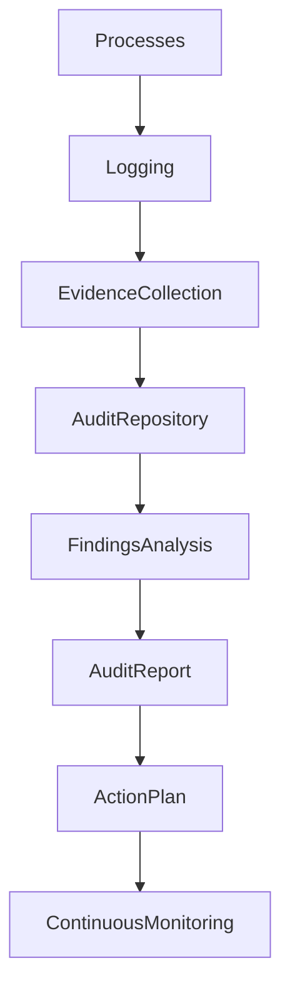

# ARCH-131 — Enterprise Audit Architecture

> Référentiel officiel de l'**Architecture d'Audit d'Entreprise (Enterprise Audit Architecture)** de la plateforme **EduWeb Planner**.

---

# Sommaire

1. Vision
2. Objectifs
3. Principes fondamentaux
4. Définition de l'audit
5. Architecture globale
6. Domaines d'audit
7. Cycle de vie de l'audit
8. Planification des audits
9. Collecte des preuves
10. Analyse des constats
11. Gestion des recommandations
12. Traçabilité et journalisation
13. Audit continu
14. Intelligence artificielle et audit
15. Gouvernance de l'audit
16. API conceptuelle
17. Bonnes pratiques
18. Anti-patterns
19. KPI
20. Règles d'architecture

---

# 1. Vision

L'audit constitue un pilier essentiel de la gouvernance d'EduWeb Planner.

L'architecture d'audit permet d'assurer :

- la transparence ;
- la responsabilité ;
- la conformité ;
- l'amélioration continue ;
- la confiance des parties prenantes.

Elle fournit des mécanismes fiables permettant de vérifier que les activités réalisées sont conformes aux politiques, aux réglementations et aux objectifs de l'organisation.

---

# 2. Objectifs

Cette architecture vise à :

- garantir la traçabilité complète des activités ;
- faciliter les audits internes et externes ;
- détecter les écarts ;
- renforcer la maîtrise des risques ;
- soutenir la conformité réglementaire ;
- améliorer les processus décisionnels.

---

# 3. Principes fondamentaux

Les audits reposent sur les principes suivants :

- Independence
- Objectivity
- Traceability
- Integrity
- Accountability
- Continuous Improvement
- Evidence-Based Assessment

---

# 4. Définition de l'audit

L'audit est une évaluation méthodique visant à vérifier qu'une activité, un processus ou un système respecte des exigences prédéfinies.

Il s'appuie sur :

- des preuves ;
- des observations ;
- des contrôles ;
- des analyses ;
- des recommandations.

---

# 5. Architecture globale

```text
Processus

↓

Journalisation

↓

Collecte des preuves

↓

Audit Repository

↓

Analyse

↓

Rapport

↓

Plan d'actions

↓

Suivi
```

---

# 6. Domaines d'audit

L'architecture couvre notamment :

## Audit métier

- processus pédagogiques ;
- processus administratifs ;
- qualité des services.

---

## Audit informatique

- infrastructures ;
- applications ;
- API ;
- microservices.

---

## Audit cybersécurité

- authentification ;
- gestion des accès ;
- journalisation ;
- vulnérabilités.

---

## Audit des données

- qualité ;
- intégrité ;
- confidentialité ;
- gouvernance.

---

## Audit réglementaire

- conformité ;
- archivage ;
- protection des données ;
- obligations légales.

---

## Audit de l'intelligence artificielle

- transparence ;
- explicabilité ;
- biais ;
- qualité des modèles ;
- gouvernance.

---

# 7. Cycle de vie de l'audit

```text
Planification

↓

Préparation

↓

Collecte

↓

Analyse

↓

Constats

↓

Rapport

↓

Plan d'actions

↓

Suivi

↓

Clôture
```

Chaque étape est documentée.

---

# 8. Planification des audits

Le programme annuel précise :

- objectifs ;
- périmètre ;
- calendrier ;
- ressources ;
- méthodes ;
- critères d'évaluation.

Les audits sont priorisés selon les risques.

---

# 9. Collecte des preuves

Les preuves peuvent être :

- documents ;
- journaux d'événements ;
- rapports ;
- captures ;
- entretiens ;
- mesures techniques ;
- historiques d'activité.

Chaque preuve est associée à son origine et à son niveau de fiabilité.

---

# 10. Analyse des constats

Les constats sont classés selon leur criticité :

| Niveau | Description |
|---------|-------------|
|Faible|Amélioration mineure|
|Moyen|Écart nécessitant une correction|
|Élevé|Non-conformité importante|
|Critique|Risque majeur pour l'organisation|

Chaque constat donne lieu à une analyse des causes.

---

# 11. Gestion des recommandations

Chaque recommandation comprend :

- un identifiant ;
- une priorité ;
- un responsable ;
- un délai ;
- un indicateur de suivi.

Les recommandations restent ouvertes jusqu'à leur validation.

---

# 12. Traçabilité et journalisation

Tous les événements audités sont historisés :

- authentifications ;
- modifications ;
- validations ;
- décisions ;
- accès sensibles ;
- actions administratives.

Les journaux sont horodatés et protégés contre toute altération.

---

# 13. Audit continu

Des contrôles automatisés surveillent en permanence :

- les écarts ;
- les anomalies ;
- les violations de politiques ;
- les risques émergents.

Cette approche complète les audits périodiques.

---

# 14. Intelligence artificielle et audit

L'IA peut contribuer à :

- détecter les anomalies ;
- analyser les journaux ;
- identifier des tendances ;
- produire des synthèses ;
- proposer des recommandations.

Les conclusions officielles restent validées par les auditeurs.

---

# 15. Gouvernance de l'audit

La gouvernance implique :

- Comité d'Audit ;
- Direction Générale ;
- RSSI ;
- DPO ;
- Architectes d'entreprise ;
- Auditeurs internes ;
- Responsables métiers.

Les responsabilités sont clairement définies.

---

# 16. API conceptuelle

```typescript
EnterpriseAuditArchitecture {

    AuditRepository

    AuditPlanning

    EvidenceManagement

    FindingsManagement

    RecommendationManagement

    AuditMonitoring

    AIAuditServices

    Governance

}
```

---

# 17. Bonnes pratiques

✔ Définir un programme annuel d'audit.

✔ Conserver des preuves fiables.

✔ Prioriser les audits selon les risques.

✔ Suivre systématiquement les recommandations.

✔ Automatiser les contrôles récurrents.

✔ Garantir l'indépendance des auditeurs.

---

# 18. Anti-patterns

✘ Audits réalisés uniquement après un incident.

✘ Recommandations sans suivi.

✘ Journaux incomplets.

✘ Absence de preuves.

✘ Audits limités aux aspects techniques.

✘ Rapports non exploités pour améliorer les processus.

---

# Diagramme Mermaid



---

# KPI

| KPI | Objectif |
|------|----------|
|Audits réalisés selon le programme|100 %|
|Recommandations mises en œuvre|≥ 95 %|
|Constats critiques traités dans les délais|100 %|
|Événements critiques journalisés|100 %|
|Temps moyen de clôture des audits|Réduction continue|
|Amélioration du taux de conformité|Progression continue|

---

# Règles d'architecture

## RA-ARCH131-001

Toute activité critique du système fait l'objet d'une journalisation fiable, horodatée et protégée contre toute altération.

---

## RA-ARCH131-002

Les audits sont planifiés selon une approche fondée sur les risques et couvrent les domaines métiers, techniques, réglementaires et de sécurité.

---

## RA-ARCH131-003

Chaque constat d'audit est documenté, justifié par des preuves objectives et associé à un plan d'actions comportant un responsable et une échéance.

---

## RA-ARCH131-004

Les mécanismes d'audit continu complètent les audits périodiques afin de détecter rapidement les écarts et les anomalies.

---

## RA-ARCH131-005

Les outils d'intelligence artificielle peuvent assister les activités d'audit, sans se substituer aux analyses, conclusions et validations relevant des auditeurs habilités.

---

# Documents liés

- ARCH-108 — Enterprise Security Architecture
- ARCH-112 — Enterprise Observability Architecture
- ARCH-115 — Enterprise Architecture Governance
- ARCH-129 — Enterprise Compliance Architecture
- ARCH-130 — Enterprise Risk Architecture
- GOV-101 — Enterprise Governance Framework
- SEC-004 — Security Monitoring Standards
- OPS-102 — Enterprise Monitoring Framework
- RISK-101 — Enterprise Risk Management
- AI-006 — Responsible AI Governance

---

# Conclusion

L'**Enterprise Audit Architecture** fournit le cadre permettant de contrôler, d'évaluer et d'améliorer en continu les activités d'EduWeb Planner. En combinant journalisation, collecte de preuves, audits périodiques, surveillance continue et assistance par l'intelligence artificielle, cette architecture renforce la gouvernance, la maîtrise des risques, la conformité et la confiance des parties prenantes. Elle constitue un élément essentiel de l'amélioration continue et de la résilience de l'écosystème EduWeb.

# Fin du document
